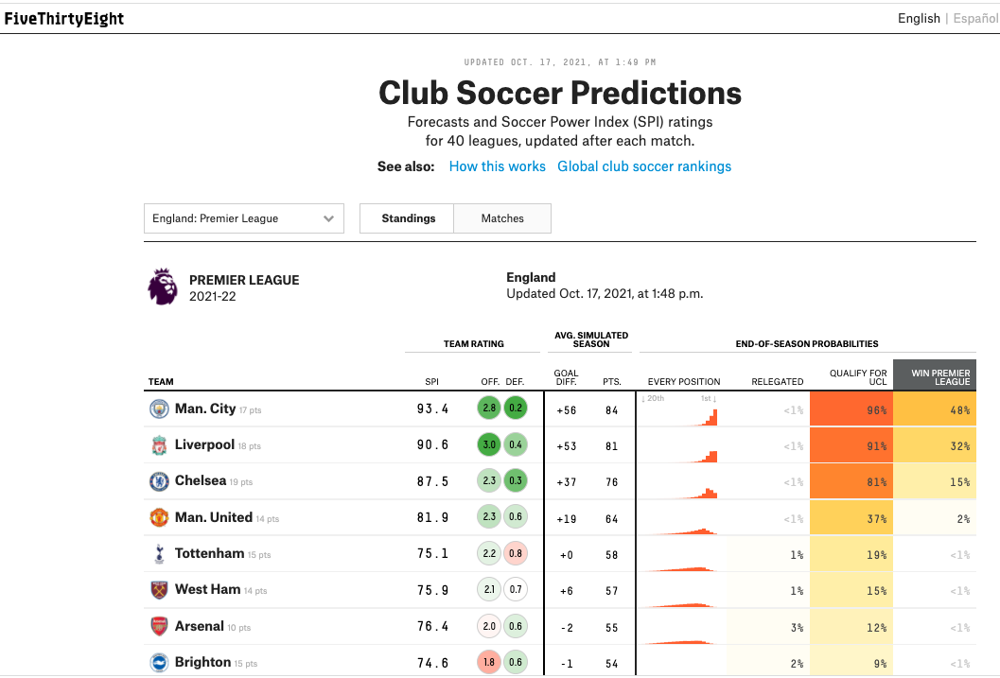
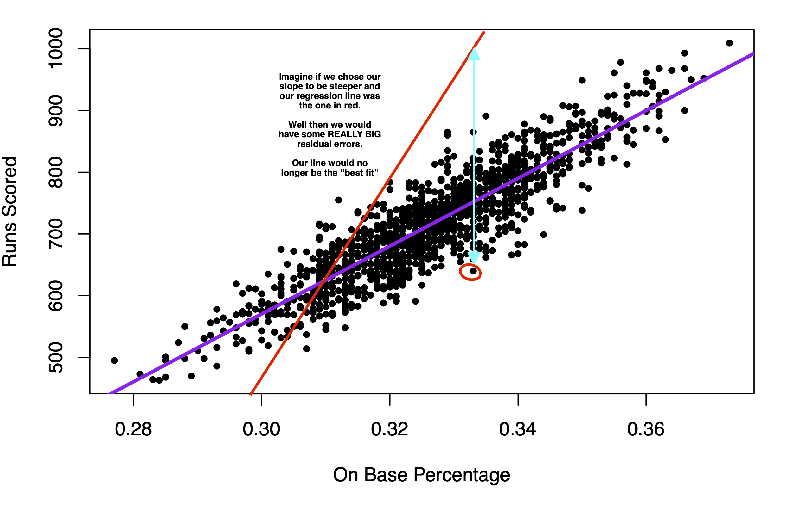

# Prediction with Regression {#regression}


We are continuing our topic of prediction, this time adding a new tool: linear regression.

Recall that we predict (estimate/guess) some unknown using information we have -- and do so as accurately and precisely as possible.

  1. Choose an approach
      - Using an observed (known) measure as a direct proxy to predict an outcome
      - ***Using one or more observed (known) measures in a regression model to predict an outcome***
      - (Beyond the course) Using a statistical model to select the measures to use for predicting an outcome
  2. Assess accuracy and precision
  3. Iterate to improve the prediction/classification
      - Often, we repeat steps 1-3 until we are confident in your method for predicting.

Eventually, after you have tested the approach and are satisfied with the accuracy, you may start applying it to new data for which you do not know the right answer.


## Regression in the wild.

Regression is used across many domains for prediction and classification, from fantasy football to making club soccer predictions, or even predicting how far a contestant will go on *The Bachelor* or *The Bachelorette*.


Club Soccer Predictions on FiveThirtyEight

{width=70%}

Using data to predict reality TV outcomes.

{width=40%} {width=40%}


In politics, we might use regression to build campaign models-- predicting which voters are persuadable, which supporters will volunteer at campaign events, which supporters will turn out to vote, etc.


## Application: Baseball Predictions


For our first example, we will stay outside of politics and use regression to predict the success of a baseball team.


[Moneyball](https://www.youtube.com/watch?v=-4QPVo0UIzc) is a \$100 million Hollywood movie that is all about linear regression... and some baseball... and Brad Pitt, but really... it's MOSTLY about linear regression


The movie describes the Oakland A's shift to start using data to build their team. They may two observations 1) To win baseball games, you need runs. 2) To score runs, you need to get on base. We can estimate what on base percentage we would need as a team to score enough runs to make the playoffs in a typical season.

We will use regression to make these predictions.


We use `baseball.csv` data

  - `RS`: runs scored;
  - `RA`: runs allowed; 
  - `W`: wins; 
  - `Playoffs`: whether team made playoffs; 
  - `OBP`: on base percentage; 
  - `BA`: batting average; 
  - `SLG`: Slugging Percentage

```{r, include=FALSE}
baseball <- read.csv("data/baseball.csv")
```

```{r, eval=FALSE}
baseball <- read.csv("baseball.csv")
```

```{r}
head(baseball)
```

Below we can see the first observation made: Runs scored are highly correlated with team wins
```{r, echo=F}
plot(x=baseball$RS, 
     y=baseball$W,
     xlab = "Runs Scored",
     ylab =  "Wins",
     main="Wins by Runs Scored",
     pch=20)
```


What the A's noticed is that a team's On Base Percentage is also highly correlated with runs scored. This aligns with conventional wisdom. Players get a lot of hype when they achieve a high OBP.


Hernandez is hitting .500 (16-for-32) with five homers, four doubles, nine RBI, nine runs scored and a .514 on-base percentage in seven postseason games.- NBC Boston


This correlation shows up in our data, too.

```{r, echo=F}
fit <- lm(RS ~ OBP, data = baseball)
plot(x=baseball$OBP, 
     y=baseball$RS,
     ylab = "Runs Scored",
     xlab =  "On Base Percentage",
     main="Runs Scored by On Base Percentage",
     pch=20)
```


## Step 1: Approach- Regression in R


A regression draws a "best fit line" between the points. This allows us -- for any given OBP -- to estimate the number of runs scored. 

  - Our best prediction of the number of runs scored would be the spot on the purple line directly above a given OBP.

```{r, echo=F}
fit <- lm(RS ~ OBP, data = baseball)
plot(x=baseball$OBP, 
     y=baseball$RS,
     ylab = "Runs Scored",
     xlab =  "On Base Percentage",
     main="Runs Scored by On Base Percentage",
     pch=20)
abline(fit, col="purple", lwd=3)
```


The regression model is $Y = \alpha + \beta X + \epsilon$. Let's demystify this.

  - A regression model describes the relationship between one or more independent variables $X$ (explanatory variables) and an outcome variable $Y$ (dependent variable)
      + For example, the relationship between our independent variable, On Base Percentage, and our dependent variable, Runs Scored
  - We want to know what happens with our dependent variable $Y$ if our independent variable $X$ increases.
      + As we increase our On Base Percentage, a regression model will help us estimate how much we should expect our Runs Scored to increase (or decrease)
  - $\alpha$ and $\beta$ are considered "parameters" -- things we don't know but want to estimate. These two numbers will define exactly how we think $X$ and $Y$ are related. 
  - No two variables are perfectly related, so we also have the $\epsilon$ term, which describes the error in the model

When we have data, we estimate $Y$, $\alpha$, and $\beta$: $\hat Y = \hat \alpha + \hat \beta X$. 

  - The ${\hat{hat}}$ over the letters means those are our estimated values.

In  R, the regression syntax is `fit <- lm(y ~ x, data = mydata)`  

  - `fit` is just whatever you want to call the output of the model, 
  - `y` is the name of the dependent variable, 
  - `x` is the name of the independent variable, and 
  - `mydata` is whatever you have called your dataframe. E.g.:


```{r}
fit <- lm(RS ~ OBP, data = baseball)
```


When we have data, we estimate $Y$, $\alpha$, and $\beta$: $\hat Y = \hat \alpha + \hat \beta X$. 

  - Our model gives us the "coefficient" estimates for  $\hat \alpha$ and $\hat \beta$.

```{r}
coef(fit)
```

The first coefficient is $\hat \alpha$, this represents the intercept -- the estimated value our dependent variable will take if our independent variable is 0. 

  - The value the estimated runs scored would be if a team had a 0.000 on base percentage. In our case, this value is estimated to be negative, which is impossible (but it would also be unusual for a team to have a 0.000 on base percentage). Therefore, the intercept isn't inherently substantively interesting to us.

The second coefficient is $\hat \beta$ is the slope This represents the expected change in our dependent variable for a 1-unit increase in our independent variable.

  - For example, if we go from a 0.000 on base percentage to a 1.000 on base percentage, we would expect a 5490.4 increase in runs scored.
  - Note: slope can be positive or negative similar to correlation.
  - Note: slope is in the units of the dependent variable (e.g., runs). It is not constrained to be between -1 and 1.
  - It is telling us that the greater the OBP, the better!

### Visualizing a regression

We can plot the regression using a scatterplot and `abline()`.

```{r}
plot(x=baseball$OBP, y=baseball$RS, 
     ylab = "Runs Scored",
     xlab =  "On Base Percentage", 
     main="Runs Scored by On Base Percentage",
     pch=20)

## Add regression line
abline(fit, lwd=3, col = "purple") # add line
```


### Making predictions with regression

A regression model allows us to estimate or "predict" values of our dependent variable for a given value of our independent variable.

```{r, echo=F}
fit <- lm(RS ~ OBP, data = baseball)
plot(x=baseball$OBP, 
     y=baseball$RS,
     ylab = "Runs Scored",
     xlab =  "On Base Percentage",
          main="Runs Scored by On Base Percentage",
     pch=20)
abline(fit, lwd=3, col = "purple")
points(.300, predict(fit, data.frame(OBP=.300)), col=  "red", cex=3, pch=15)
lines(x = c(.3, .3), y = c(0,predict(fit, data.frame(OBP=.300)) ), lwd=3, col="red")
lines( c(0, .3), y = c(predict(fit, data.frame(OBP=.300)) ,
                         predict(fit, data.frame(OBP=.300)) ), lwd=3, col="red")
text(.285, 600, "Predicted Runs Scored \n if OBP = .3", cex=.7) 
```

The red dot represents our estimate (best prediction) of the number of runs scored if a team has an on base percentage of .300. In R, we can calculate this value using `predict()`.

  -  The syntax is `predict(fit, data.frame(x = value))` where `fit` is the name of the model, `x` is the name of the independent variable, and `value` represents the value for the independent variable for which you want to predict your outcome (e.g., .300).

```{r}
predict(fit, data.frame(OBP=.300))
```


Under the hood, this is just using the regression formula described above. For example, to estimate the number of runs scored for a .300 on base percentage, we take $\hat \alpha + \hat \beta * .300$

  - Note that below we compare the output of the predict function to our output if we manually calculated the estimated value.
 
```{r}
predict(fit, data.frame(OBP=.300))

# a + b*.300
coef(fit)[1] +  coef(fit)[2]*.300
```

Let's say a team thought they needed about 900 runs scored to get to the playoffs, and they were pretty sure they could get a team on base percentage of .500. How many runs would they be expected to score with that OBP? Do you think they will make the playoffs?


<details> <summary>Try on your own, then expand for the solution.</summary>

```{r}
predict(fit, data.frame(OBP=.500))
```

It's greater than 900, so we should feel good about our chances.

</details>


## Step 2: Checking accuracy of model

Understanding prediction error: Where do $\hat \alpha$ and $\hat \beta$ come from? Recall that a regression tries to draw a "best fit line" between the points of data.

Under the hood of the regression function, we are searching for the values  of $\hat \alpha$ and $\hat \beta$ that try to minimize the distance between the individual points and the regression line.


{width=80%}

This distance is called the residual: $\hat \epsilon_i = Y_i - \hat Y_i$.
  
  - This is our ***prediction error***: How far off our estimate of Y is ($\hat Y_i$) from the true value of Y ($Y_i$)
  - Linear regressions choose  $\hat \alpha$ and $\hat \beta$ to minimize the "squared distance" of this error (think of this as the magnitude of the distance). This is why we tend to call this type of linear regression ordinary least squares (OLS regression).
  
If instead we chose the red line in the image below to be the regression line, you can see that the typical prediction error would be much larger. That's why we end up with the purple line.

{width=80%}


### Root Mean Squared Error

Just like we had root mean squared error in our poll predictions, we can calculate this for our regression.

  - Just like with the polls, this is the square root of the mean of our squared prediction errors, or "residuals" in the case of regression
      + R will give us this output automatically for a regression using `sigma()`
      
```{r}
sigma(fit)
```

  - In our case, using on based percentage to predict runs scored, our estimates are off typically, by about 40 runs scored. 
  - On the graph, this means that the typical distance between a black point and the purple line is about 40.

## Step 3: Iterate and Compare Models

When building  predictive models, often researchers want to minimize this Root-Mean Squared Error -- minimizing the magnitude of the typical prediction error (the distance between the actual value of our outcome, and the true value)

Example: Let's compare the RMSE from two different models:


```{r}
## Predicting Runs Scored with OBP
fit <- lm(RS ~ OBP, data = baseball)
sigma(fit)

## Predicting Runs Scored with Batting Average
fit2 <- lm(RS ~ BA, data = baseball)
sigma(fit2)
```

The Oakland A's noticed that OBP was a more precise predictor than BA, and RMSE gives us one way to assess this.


### Regression with Multiple Predictors

You can also add more than 1 predictor to a regression using the `+` sign.


```{r}
## Predicting Runs Scored with OBP and Slugging Percentage
fit3 <- lm(RS ~ OBP + SLG, data = baseball)
sigma(fit3)
```

Look how the RMSE dropped again, improving our prediction.


## Application: Predicting Campaign Donations

Can we predict campaign donations?


Data from Barber, Michael J., Brandice Canes‐Wrone, and Sharece Thrower. "Ideologically sophisticated donors: Which candidates do individual contributors finance?." American Journal of Political Science 61.2 (2017): 271-288


```{r, include=F}  
load("data/donationdata.RData")
```

```{r, eval=FALSE}
load("donationdata.RData")
```

Variables

  - `donation`: 1=made donation to senator, 0=no donation made
  - `total_donation`: Dollar amount of donation made by donor to Senator
  - `sameparty`: 1=self-identifies as being in the candidate's party; 0 otherwise
  - `NetWorth`: Donor's net worth. 1=less than 250k, 2=250-500k; 3=500k-1m; 4=1-2.5m; 5=2.5-5m; 6=5-10m; 7=more than 10m
  - `IncomeLastYear`: Donor's household annual income in 2013. 1=less than 50k; 2=50-100k; 3=100-125k; 4=125-150k; 5=150-250k; 6=250-300k; 7=300-350k; 8=350-400k; 9=400-500k; 10=more than 500k
  - `peragsen`: percent issue agreement between donor and senator
  - `per2agchal`: percent issue agreement between donor and the senator's challenger
  - `cook`: Cook competitiveness score for the senator's race. 1 = Solid Dem or Solid Rep; 2 = Likely
  - `matchcommf`: 1=Senator committee matches donor's profession as reported in FEC file; 0=otherwise
  - `Edsum`: Donor's self-described educational attainment. 1=less than high school; 2=high school; 3=some college; 4=2-year college degree; 5=4-year college degree; 6=graduate degree

Data represent information on past donors to campaigns across different states. The key dependent variable that we want to predict is `total_donation`: the total dollar amount a particular person in the data gave to their senator in the 2012 election campaign.


Can we predict how much someone donates to a U.S. Senate campaign?

  1. Choose approach: regression of donations on donor characteristics
  2. Check accuracy: calculate root-mean-squared error
  3. Iterate: try different regression model specifications


Let's try a prediction based on a person's income.

```{r}
fit <- lm(total_donation ~ IncomeLastYear, data = donationdata)
```

From this, we can

  - Plot the relationship
  - Make specific predictions at different levels of income
  - Check accuracy by calculating the prediction errors and RMSE

### Visualizing the results

Note that the correlation is a bit weaker here.

```{r}
plot(x=donationdata$IncomeLastYear, 
     y=donationdata$total_donation,
     ylab= "Total Donation ($)",
     xlab = "Income Last Year",
     main = "Predicting Total Donations Using Income")
abline(fit, col="green4", lwd=2)
```


### Step 1: Calculate Predictions

We can calculate predictions based on a level of income. Example: Level 5 of income represents an income of \$150k-250k. What level of donation would we expect?

```{r}
predict(fit, data.frame(IncomeLastYear = 5))

## alternative using coef()
coef(fit)[1] + coef(fit)["IncomeLastYear"]*5
```


### Step 2: Check Accuracy

We can calculate the Root Mean Squared Error

```{r}
sigma(fit)
```

### Step 3: Iterate

YOUR TURN: Change the model and see if it improves the prediction using RMSE using `sigma`.


### Adding Model Predictors

New Model Example

```{r}
fitnew <- lm(total_donation ~ IncomeLastYear + NetWorth + sameparty, 
             data=donationdata)
```

New Predictions: note how we add more variables

```{r}
predict(fitnew, data.frame(IncomeLastYear = 5, NetWorth = 4, sameparty = 1))

## alternative using coef()
coef(fitnew)[1] + coef(fitnew)["IncomeLastYear"]*5 + 
  coef(fitnew)["NetWorth"]*4 + coef(fitnew)["sameparty"]*1
```


Root Mean Squared Error

```{r}
sigma(fitnew)
```


When we have multiple predictors, this changes our interpretation of the coefficients slightly.

  - We now interpret the slope as the change in the outcome expected with a 1-unit change in the independent variable-- holding all other variables constant (or ``controlling" for all other variables)
  - For example, for a 1-unit change in Income, we would expect about a \$68 increase in estimated donations, holding constant Net Worth and whether the person shared partisanship with the senator.

```{r}
coef(fitnew)
```

Think of this like a set of light switches. How does adjusting one light switch affect the light in the room-- holding constant all other switches.

{width=60%}


When we make predictions with multiple variables, we have to tell R where we want to set each variable's value.

```{r}
predict(fitnew, data.frame(IncomeLastYear = 5, NetWorth = 4, sameparty = 1))
```

See how the prediction changes if you shift `IncomeLastYear` but keep Net Worth and partisanship where they are. That's the idea of "controlling" for the other variables!


How could we keep improving the predictions? 

Eventually, we would want to apply this prediction model in a real-world setting.

  - How could campaigns use these types of prediction models?


