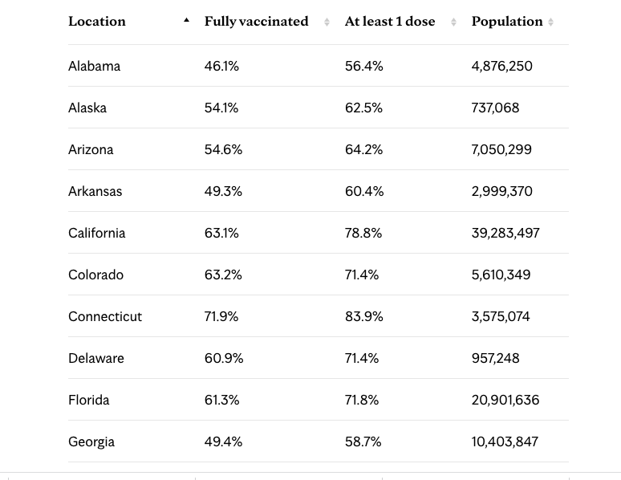
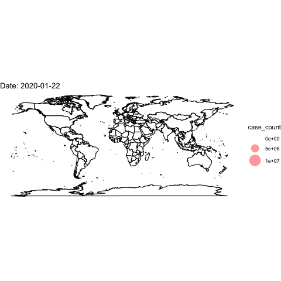

# Mapping {#maps}


In this section, we continue with the goal of discovery, this time using maps to visualize data.

  - **Describe** and measure
      + Has the U.S. population increased?
  - **Explain**, evaluate, and recommend (study of causation)
      + Does expanding Medicaid improve health outcomes?
  - **Predict**
      + Who will win the next election?
  - **Discover**
      + How do policies diffuse across states?


Our goals

  - Visually communicate social science information using maps
  - Learn how to use the `library(maps)` package with `library(ggplot)` (QSS 5.3.2)
      + Our code also builds on Kieran Healy's [book](https://socviz.co/maps.html#maps) and the tidyverse version of QSS from Jeffrey Arnold [here](https://jrnold.github.io/qss-tidy/discovery.html)
  - Discover patterns in our spatial world!!

Along the way, we will learn to merge data and use the `%in%` function.


## Why maps

How might maps be useful for political scientists? What are examples of questions maps can help answer?


"The visualization of spatial data through maps enables researchers to discover previously unknown patterns and present their findings in a convincing manner." - Kosuke Imai, Chap 5 QSS

{width=70%}

*National Geographic. Mapping fatal cholera cases helped John Snow uncover the source of a cholera outbreak in London to an infected water pump in 1854.*


Why are maps used in political science

  - Show diffusion of a disease, policies, political power
  - Show demographic patterns
  - Examine clustering, regional patterns of different policies, events, etc.
  - Shift analysis away from an individual person or political unit to instead think about the broader social and political context
  - Convey a lot of information efficiently, and in an engaging way, using intuitive heuristics of commonly known geographic locations


Most maps are also inherently political! (e.g., historical trends in political boundaries, which geographic entities are recognized, etc.)


Maps themselves may be the subject of interest. For example, we are currently in redistricting to determine the boundaries used for different elections in the U.S. 

{width=70%}


### To map or not to map?

If I wanted to track COVID vaccinations by state, what are the pros and cons of using a table vs. a map? See this example from the Mayo Clinic.

{width=40%} {width=40%}


Can maps be misleading? See this discussion from Kieran Healy in [Chap. 7](https://socviz.co/maps.html#maps): Each of these maps shows data for the same event, but the impressions they convey are very different ... Often, a map is like a weird grid that you are forced to conform to even though you know it systematically misrepresents what you want to show."


{width=70%}


## Mapping in R 


Install maps package. You only need to do this one time.

```{r, eval=F}
install.packages("maps")
```

All subsequent times, you just need to use `library()`

```{r, warning=F, message=F}
library(maps)
```


The map command is like a plot. It maps a particular entry from a database. Below are a few examples of types of maps that come readymade in the package.

```{r}
map(database = "world")
```


```{r}
map(database = "usa")
```

```{r}
map(database = "state")
```

```{r}
map(database="county")
```

You can also map particular regions within a database.

```{r}
map(database = "state", regions= c("New Jersey", "New York" ))
```

```{r}
map(database="county", regions = "Nebraska")
```

```{r}
map(database = "world", regions= "Italy")
```


### Using ggplot2 with maps

We may want to embed `map` in another plotting device that more easily adds informative labels, colors, and other information. 

  - While the plotting tools we have worked with before can do this, the function `ggplot` has a better interface that will more easily help us avoid mistakes, such as putting a label in the wrong place.

```{r, eval=F}
install.packages("ggplot2")
```

Open the packages each time you want to use them.

```{r, warning=F, message=F}
library(ggplot2)
```

The "gg" stands for "grammar of graphics." The `ggplot2` package has a very general function `ggplot()` that provides another system of visualizing data in R.

  - It can be used to plot all kinds of visuals, including scatterplots, barplots, histograms, etc.
  - We are going to focus on its utility for plotting maps, as many new developments in mapping and GIS (geographic information systems) in R use this interface.
  - In `ggplot()` you add layers to a plot by using `+` between lines
  - While `ggplot()` can be applied very widely, we will focus on a more narrow set of applications for mapping.


We will create a map of New Jersey. Similar to before, we will first use a function to pull up map data about U.S. states. The `map_data` function pulls up just the data instead of making the map itself.

```{r}
nj_map <- map_data("state",regions= c("New Jersey"))
```

We also directly integrate the data into the plotting function

```{r}
## Begin plot
ggplot() + #Note the use of the + sign between each line

  geom_polygon(nj_map, mapping=aes(x=long, y=lat, group=group), 
               colour="black")+
  
  ## add title
  ggtitle("Map of New Jersey")+
  
  ## adjust projection
  coord_quickmap() +
  
  ## remove background
  theme_void() # note: last line does not end with a +
```

## Choropleth Maps


Sometimes maps use shading of polygons to display quantitative information about a geographic unit or qualitative information about what geographical units belong to different categories of a variable. We provide an example of this here.

  - We are going to add a variable to our mapping data that we want to visualize
  - We `fill` the plot using `geom_polygon` and can (optionally) indicate specific colors


```{r}
usmap <- map_data("state")
usmap$nj <- ifelse(usmap$region == "new jersey", "Cannot turn left", 
                   "Can turn left")
usmap$nj <- as.factor(usmap$nj)

ggplot()+
  ## Note the fill= nj
  geom_polygon(data=usmap, aes(x=long, y=lat, group=group, fill=nj))+
  ## we can indicate colors for each category of the nj variable
  scale_fill_manual(values = c("gray", "red3"), name="Left Turns")+
  theme_void() +
  ggtitle("Geography of Left Turns")+
  coord_quickmap()
```


## Application: 2021 NJ Election Results

We sometimes get data from an outside source. We then need to figure out how to connect it to the mapping data.

```{r}
njcounties <- map_data("county", region="New Jersey")

## 2021 county election results
murphyvote <- data.frame(county = unique(njcounties$subregion),
           murphy = c(43.92, 52.52, 53.28, 61.69, 36.69, 43.64, 
                      73.96, 44.63, 73.56, 40.19, 65.09,
                      55.74, 40.31, 44.06, 31.79, 51.47, 
                      35.01, 51.54, 31.93, 61.56, 34.56))
```

We can use `merge()` to do so by indicating a shared unique identifier that the dataframes have in common. Note that `subregion` is the name of the county variable in the first dataframe (the x) and `county` is the name of the county variable in the second dataframe (the y). For this to work, we had to first make sure the county names are formatted exactly the same way in both dataframes. For example, R won't known "camden" and "Camden" are the same. They have to **exactly** match for R to be able to properly join the data together. With messier data, you might have to rename some variable values prior to joining data in a merge, such as by changing the case of letters or adjusting punctuation, etc.

  - For more information on merging, see QSS chapter 4.2.5 or this [explainer](https://sejdemyr.github.io/r-tutorials/statistics/tutorial5.html).

```{r}
njcounties <- merge(njcounties, murphyvote, 
                    by.x="subregion", by.y = "county", 
                    all.x=TRUE, all.y=F)
```


Now that the data are merged, we can add Murphy's vote share as a color.

```{r}
ggplot()+
  
  ## create an nj county-level plot
  geom_polygon(data=njcounties, aes(x=long, y=lat, 
                                    group=group, 
                                    fill=murphy),
               colour="white")+
  ## Shade the map according to the vote share
  scale_fill_gradient(name="Murphy's Vote Share %", low="red", high="blue")+
  
  ## remove background
  theme_void()+
  
  #borders("county", region="New Jersey", colour="white", size=1)+
  ggtitle("2021 NJ Governor Results by County")+
  coord_quickmap()
```


## Application: Voter Identification Laws

According to the NCSL, 35 states have laws requesting or requiring voters to show some form of identification at the polls. 

  - The presence of voter ID laws and the strictness of these laws has accelerated over the past decade.
  - We will look at the geography of these laws to see if there are regional or other political patterns to these 
  

{width=65%}


### Using the `%in%` function

Detecting if something is contained within a vector: The function `%in%` asks: is this contained in the vector? Yes/No

```{r}
"new jersey" %in% c("new jersey", "california", "nebraska")

"florida" %in% c("new jersey", "california", "nebraska")

(! "florida" %in% c("new jersey", "california", "nebraska")) # not in

```

We will augment our map data with a new variable that classifies states according to their voter ID laws.

```{r}
usmap <- map_data("state")

head(usmap)

## create variable as NA
usmap$photoidlaws <- NA

## Fill in vaariable with state categories
usmap$photoidlaws[usmap$region %in% c("arkansas","georgia", "indiana", "kansas","mississippi", "tennessee", "wisconsin")] <- "Strict Photo ID"

usmap$photoidlaws[usmap$region %in% c("alabama", "florida", "idaho", "louisiana", 
                                      "michigan", "montana", "rhode island", "south carolina", 
                                      "south dakota", "texas")] <- "Non-Strict Photo ID"

usmap$photoidlaws[usmap$region %in% c("arizona", "north dakota", 
                                      "ohio", "wyoming")]<- "Strict Non-Photo ID"

usmap$photoidlaws[usmap$region %in% c("alaska", "colorado", "connecticut", 
                                      "delaware", "hawaii", "iowa", "kentucky", "missouri", 
                                      "new hampshire", "oklahoma", "utah", "virginia", 
                                      "washington", "west virginia")] <- "Non-Strict Non-Photo ID"

usmap$photoidlaws[usmap$region %in% c("oregon", "nevada","california", 
                                      "new mexico", "nebraska", "minnesota", 
                                      "illinois", "north carolina", "pennsylvania", 
                                      "new york", "new jersey", "massachusetts",
                                      "vermont", "maryland", "north carolina", 
                                      "district of columbia", 
                                      "maine")] <- "No Document Required"

## Make it a factor categorical variable
usmap$photoidlaws <- as.factor(usmap$photoidlaws)
```


Let's create a map of the U.S. We will then annotate the map with information about voter identification laws.


```{r}
ggplot()+
  geom_polygon(data=usmap, aes(x=long, y=lat, group=group, 
                               fill=photoidlaws),
               colour="black")+
  ## palette lets you pick a color scheme without specifics
  scale_fill_brewer(palette="Greens", name="Photo ID Laws")+

  theme_void() +
  ggtitle("Map of U.S. Voter ID Laws")+
  coord_quickmap()
```


## Your turn to map

Make a choropleth plot of the United States or some other geographic unit.

  - Create a map of a geographic area of interest (e.g., a map of U.S. states)
  - Shade the states according to a numeric or categorical variable you add to the data
      + Has a particular state/set of states adopted a policy?
      + Does a particular state/set of states embody a certain characteristic?
  - Share the map on Piazza
  
  

## Animating Data

With R, we can go a step further to make our maps more interactive. RStudio and R allow for the ability to turn graphics into interactive applications, as well as animate visualizations to reveal or change the visual over the course of different frames. We will take a brief look at these applications.

We will use the package `gganimate` for this. Install and load the package.

```{r, eval=F}
install.packages("gganimate")
```

```{r}
library(gganimate)
```


## Application: Spread of Coronavirus

We are going to map the spread of confirmed COVID cases based on data from [John Hopkins University](https://github.com/CSSEGISandData/COVID-19).

```{r, eval=F}
load("covidlongfmt.RData")
```

```{r, include=FALSE}
load("data/covidlongfmt.RData")
```

To animate a ggplot, we just add an argument to indicate the variable that dictates the transition between different states, in this case, the date variable, `date_fmt`. The other parts of the plot stay very similar to before.

To illustrate this, let's create a plot for just one day: 2020-03-01.

```{r}
covidmarch <- subset(covidlongfmt, date_fmt == "2020-03-01")
```

We create a world map and add points to indicate the case count, with the size proportionate to the count. We include `alpha` to make the points transparent.
```{r}
world <- map_data("world")

ggplot()+
  
  ## create the world map
  geom_polygon(data=world, aes(x=long, y=lat, group=group), colour="black", fill="white")+
  
  ## add points
  geom_point(data=covidmarch, aes(x=Long, y=Lat, size=case_count), alpha=.4, colour="red")+
  scale_size(range = c(-1,10)) +
  
  ## aesthetics
  ggtitle("COVID-19 Confirmed Cases on March 1, 2020")+
  coord_quickmap()+
  theme_void()
```


Now, we use the full data and transition through the date variable. We then "render" and save the animation.


```{r, eval=F}
world <- map_data("world")

ggplot()+
  
  ## create the world map
  geom_polygon(data=world, aes(x=long, y=lat, group=group), colour="black", fill="white")+
  
  ## add points
  geom_point(data=covidlongfmt, aes(x=Long, y=Lat, size=case_count), alpha=.4, colour="red")+
  scale_size(range = c(-1,15)) +
  
  ## aesthetics
  ggtitle("COVID-19 Confirmed Cases")+
  coord_quickmap()+
  theme_void() +
  
  ## add the transition and a label for the plot
  transition_time(date_fmt)+
  labs(title="Date: {frame_time}")
## save animation as a gif
anim_save("covidplot.gif")
```





How could we improve this visualization?


