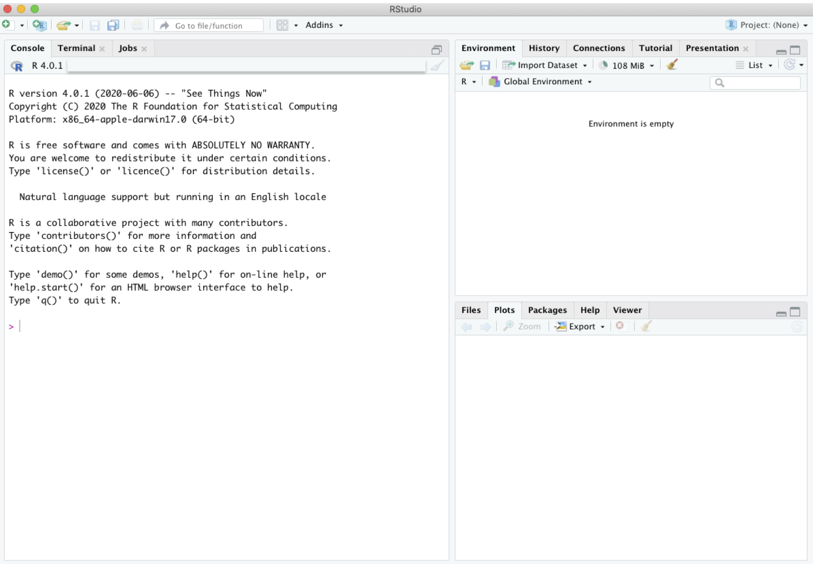
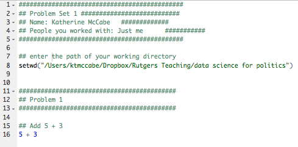
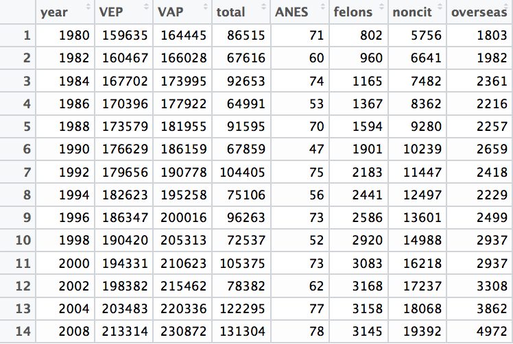
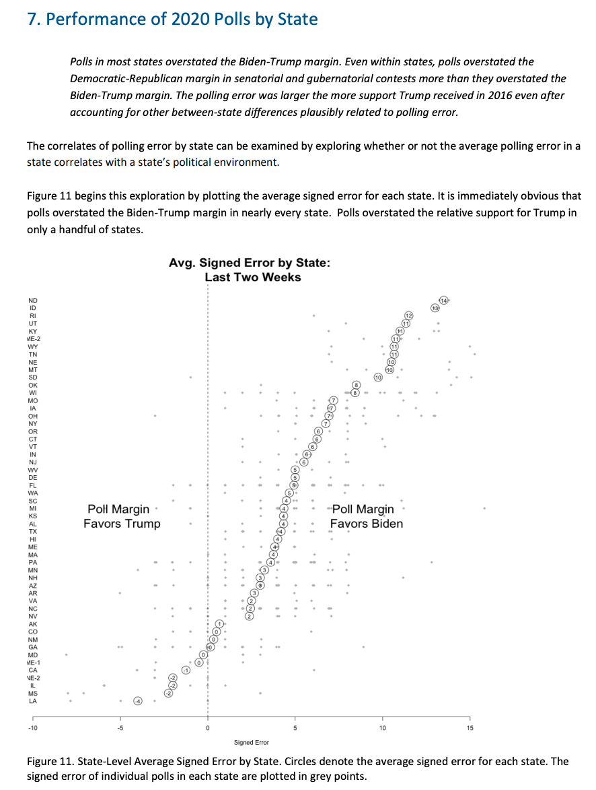
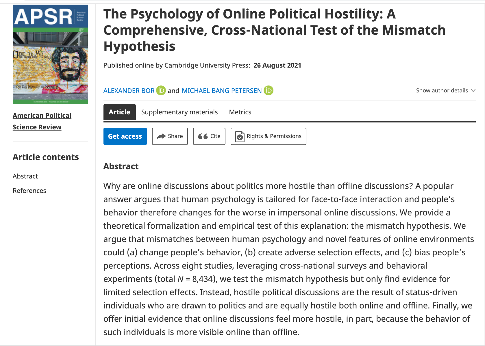

# Course Notes

This document will include important links and course notes for 01:790:391:01: Data Science for Political Science.

  - This site will be updated throughout the semester with new content. 
  - The Canvas modules will provide links to the relevant sections to review for a given week of the course.
  - The primary text for the course is [Quantitative Social Science: An Introduction](https://qss.princeton.press/qss-an-introduction/) by Kosuke Imai. We will refer to this as QSS in the notes.
  - This is a new and living document. If you spot errors or have questions or suggestions, please email me at k.mccabe@rutgers.edu or post to the course Piazza site.
  - Occasionally the notes are updated with embedded video explainers of the code in different sections. A list of these is [here](https://www.youtube.com/watch?v=80tbdiWuljc&list=PLx0unV_UpWcXDDBO2Bg5Cf6N4m0_LKULl&ab_channel=kt2mccabe).

<!-- If you need PDF output, uncomment bookdown::pdf_book above in YAML. You will need a LaTeX installation, e.g., https://yihui.name/tinytex/ -->

<!-- Instructions: https://ontheline.trincoll.edu/bookdown.html -->


## What have I signed up for?


First: What is Data Science?

  - Data Science involves a combination of math/statistics and programming/coding skills, which, for our purposes, we will combine with social science knowledge.
    + [Drew Conway](http://drewconway.com/zia/2013/3/26/the-data-science-venn-diagram) has a nice venn diagram of how these different skill sets intersect.
    + Note: This course will not assume prior familiarity with data science in general or coding, specifically. For those brand new to data science, the idea of learning to code may seem intimidating, but anyone can succeed with a bit of patience and an open mind.


  
Next: What is political science?
  
  - The science of politics, of course! Politics focuses on studying governance and the distribution of power in society, broadly conceived. 
      + How else might you define politics and political science? What do we study in political science?


### Data Science Can Help Social Scientists


***Example: Mapping poverty using mobile phone and satellite data***

Researchers used modern data sources, including mobile phone data, as a way to ***predict*** and ***describe*** poverty in different geographic regions. These tools helped social scientists come up with methods that are much more cost-effective and efficient, but still as accurate as traditional methods for this type of measurement.

  - How might measures of global poverty be useful to political scientists?


{width=90%}

*[Steele et al. 2017](https://royalsocietypublishing.org/doi/full/10.1098/rsif.2016.0690): Poverty is one of the most important determinants of adverse health outcomes globally, a major cause of societal instability and one of the largest causes of lost human potential. Traditional approaches to measuring and targeting poverty rely heavily on census data, which in most low- and middle-income countries (LMICs) are unavailable or out-of-date. Alternate measures are needed to complement and update estimates between censuses. This study demonstrates how public and private data sources that are commonly available for LMICs can be used to provide novel insight into the spatial distribution of poverty.* 


***Social Science Goals***

We have several goals in social science. Here are four that data science can help us pursue:

  - **Describe** and measure
      + Has the U.S. population increased?
  - **Explain**, evaluate, and recommend (study of causation)
      + Does expanding Medicaid improve health outcomes?
  - **Predict**
      + Who will win the next election?
  - **Discover**
      + How do policies diffuse across states?

What are other examples of these goals?


Note: In this course, we are exploiting the benefits of quantitative data to help achieve goals of social science. However, quantitative data have their shortcomings, too. We will also discuss the limitations of various applications of social science data, and we encourage you to always think critically about how we are using data.

### Course Goals

This course will provide you with a taste of each of these social science goals, and how the use of data can help achieve these goals. By the end of the course, you should be able to

  - Provide examples of how quantitative data may be used to help answer social science research questions.
  - Compare and contrast the goals of description, causation, prediction, and discovery in social science research.
  - Use the programming language R to import and explore social science data and conduct basic statistical analyses.
  - Interpret and describe visual displays of social science data, such as graphs and maps. 
  - Develop your own analyses and visualizations to understand social science phenomena.


If you are someone that loves data, we hope you will find this course engaging. If you are someone who loathes or finds the idea of working with data and statistics alarming, we hope you keep an open mind. We will meet you where you are. This course will not assume knowledge of statistical software, and there will be plenty of opportunities to ask questions and seek help from classmates and the instructor throughout the semester. 

The first section of course will walk people through how to use the statistical program-- R-- that we will employ this semester. 

***Will this course help me in the future?***

Even if you do not plan on becoming a social scientist or a data scientist, an introduction to these skills may prove helpful throughout your academic and professional careers.

  - To become an informed consumer of news articles and research involving quantitative analyses.
  - To practice analytical thinking to make informed arguments and decisions.
  - To expand your toolkit for getting a job that may involve consuming or performing some data analysis, even if that is not the traditional role.
    + Example: Journalism- [How 5 Data Dynamos Do Their Jobs](https://www.nytimes.com/2019/06/12/reader-center/data-reporting-spreadsheets.html) 


## Setup in R {#rsetup}

**Goal**

By the end of the first week of the course, you will want to have R and RStudio installed on your computer (both free) and feel comfortable using R as a calculator.

R is an application that processes the R programming language in a statistical computing environment. RStudio is also an application, which serves as a user interface that makes working in R easier. We will primarily open and use RStudio to work with R.   

In other classes, you may come across Stata, SPSS, Excel, or SAS, which are programs that also conduct data analysis. R has the advantage of being free and open-source. Even after you leave the university setting, you will be able to use R/RStudio for free. As an open-source program, it is very flexible, and a community of active R/RStudio users is constantly adding to and improving the program.   


**R and RStudio Installation**

This content follows and reinforces QSS 1.3. Additional resources are also linked below.

  - This [video](http://www.youtube.com/embed/ulIv0NiVTs4?rel=0) from Professor Christopher Bail explains why many social scientists use R and describes the R and RStudio installation process. This involves
    1. Going to [cran](https://cran.r-project.org/), select the link that matches your operating system, and
then follow the installation instructions, and 
    2. Visiting [RStudio](http://www.rstudio.com/) and follow the download and installation instructions. R is the statistical software and programming language used for analysis. RStudio provides a convenient user interface for running R code. 

```{r, echo=FALSE, warning=FALSE, message=FALSE}
library("vembedr")
library(knitr)

embed_url("https://www.youtube.com/watch?v=ulIv0NiVTs4")
```


 

## First Time Working in R and RStudio

This next section provides a few notes on using R and RStudio now that you have installed it. In this section, we cover the following materials:

  - Using R as a calculator and assigning objects using `<-`
  - Setting your working directory and the `setwd()` function.
  - Creating and saving an R script

This section highlights important concepts from QSS chapter 1.

### Open RStudio

RStudio is an open-source and free program that greatly facilitates the use of R, especially for users new to programming. Once you have downloaded and installed R and RStudio, to work in R, all you need to do now is ***open RStudio*** (it will open R). It should look like this, though your version numbers will be different:



**Note:** The first time you open RStudio, you likely only have the three windows above. We will want to create a fourth window by **opening an R script** to create the fourth window. 

  - To do this, in RStudio, click on File -> New -> R script in your computer's toolbar. This will open a blank document for text editing in the upper left of the RStudio window. We will return to this window in a moment.
      + You can alternatively click on the green + sign indicator in the top-left corner of the RStudio window, which should give you the option to create a new R script document.

Now you should have something that looks like this, similar to Figure 1.1. in QSS:


  
  - The upper-left window has our script document that will contain code.
  - The lower-left window is the console. This will show the output of the code we run. We will also be able to type directly in the console.
  - The upper-right window shows the environment (and other tabs, such as the history of commands). When we load and store data in RStudio, we will see a summary of that in the environment.
  - The lower-right window will enable us to view plots and search help files, among other things.


### Using R as a Calculator

The *bottom left* window in your RStudio is the Console. You can type in this window to use R as a calculator or to try out commands. It will show the raw output of any commands you type. For example, we can try to use R as a calculator. Type the following in the Console (the bottom left window) and hit "enter" or "return" on your keyboard:

```{r}
5 + 3

5 - 3

5^2

5 * 3

5/3

(5 + 3) * 2
```

In the other RStudio windows, the upper right will show a history of commands that you have sent from the text editor to the R console, along with other items. The lower right will show graphs, help documents and other features. These will be useful later in the course.

### Working in an R Script

Earlier, I asked you to open an R script in the upper left window by doing File, then New File, then R Script. Let's go back to working in that window.

**Set your working directory `setwd()`**

(Almost) every time you work in RStudio, the first thing you will do is set your working directory. This is a designated folder in your computer where you will save your R scripts and datasets.

There are many ways to do this.

  - An easy way is to go to Session -> Set Working Directory -> Choose Directory. I suggest choosing a folder in your computer that you can easily find and that you will routinely use for this class. Go ahead and create/select it. 
  - Note: when you selected your directory, code came out in the bottom left Console window. This is the `setwd()` command which can also be used directly to set your working directory in the future.
  - If you aren't sure where your directory has been set, you can also type `getwd()` in your Console. Try it now


```{r, eval=F}
## Example of where my directory was
getwd()
```


If I want to  change the working directory, I can go to the top toolbar of my computer and use Session -> Set Working Directory -> Choose Directory or just type my file pathway using the `setwd()` below:

```{r, eval=FALSE}
## Example of setting the working directory using setwd().
## Your computer will have your own file path.
setwd("/Users/ktmccabe/Dropbox/Rutgers Teaching/")
```


**Saving the R Script**

Let's now save our R script to our working directory and give it an informative name. To do so, go to File, then Save As, make sure you are in the same folder on your computer as the folder you chose for your working directory.

Give the file an informative name, such as: "McCabeWeek1.R". Note: all of your R scripts will have the .R extension.


### Preparing your R script

Now that we have saved our R script, let's work inside of it. Remember, we are in the top-left RStudio window now.

  - Just like the beginning of a paper, you will want to title your R script. In R, any line that you start with a \# will not be treated as a programming command. You can use this to your advantage to write titles/comments. Below is a screenshot example of a template R script.
  - You can specify your working directory at the top, too. Add your own filepath inside `setwd()`


  - Then you can start answering problems in the rest of the script.
  - Think of the R script as where you write the final draft of your paper. In the Console (the bottom-left window), you can mess around and try different things, like you might when you are taking notes or outlining an essay. Then, write the final programming steps that lead you to your answer in the R script. For example, if I wanted to add 5 + 3, I might try different ways of typing it in the Console, and then when I found out `5 + 3` is the right approach, I would type that into my script.


### Executing Commands in your R script

The last thing we will note in this initial handout is how to execute commands in your R script.

To run / execute a command in your R script (the upper left window), you can

  1. Highlight the code you want to run, and then hold down "command + return" on a Mac or "control + enter" on Windows
  2. Place your cursor at the end of the line of code (far right), and hit "command + return" on a Mac or "control + return" on Windows, or
  3. Do 1 or 2, but instead of using the keyboard to execute the commands, click "Run" in the top right corner of the upper-left window.

Try it: Type `5 + 3` in the R script. Then, try to execute `5 + 3`. It should look something like this:




After you executed the code, you should see it pop out in your Console:
```{r}
5 + 3
```

{width=90%}

Note: The symbol \# also allows for annotation behind commands or on a separate line. Everything that follows \# will be ignored by R. You can annotate your own code so that you and others can understand what each part of the code is designed to do.

```{r}
## Example
sum53 <- 5 + 3 # example of assigning an addition calculation
```

### Objects

Sometimes we will want to store our calculations as "objects" in R. We use `<-` to assign objects by placing it [to the left](https://www.youtube.com/watch?v=vLZA67L7gIo&ab_channel=BeyonceSasha1) of what we want to store. For example, let's store the calculation `5 + 3` as an object named `sum53`:

```{r}
sum53 <- 5 + 3
```

After we execute this code, `sum53 now stores the calculation. This means, that if we execute a line of code that just has `sum53`, it will output 8. Try  it:

```{r}
sum53
```

Now we no longer have to type `5 + 3`, we can just type `sum53`. For example, let's say we wanted to subtract 2 from this calculation. We could do:

```{r}
sum53 - 2
```

Let's say we wanted to divide two stored calculations:
```{r}
ten <- 5 + 5
two <- 1 + 1
ten / two
```

The information stored does not have to be numeric. For example, it can be a word, or what we would call a character string, in which case you need to use quotation marks.

```{r}
mccabe <- "professor for this course"
mccabe
```


*Note:* Object names cannot begin with numbers and no spacing is allowed. Avoid using special characters such as \% and \$, which have specific meanings in R. Finally, use concise and intuitive object names.

  - GOOD CODE: `practice.calc <- 5 + 3`
  - BAD CODE: `meaningless.and.unnecessarily.long.name <- 5 + 3`

While these are simple examples, we will use objects all the time for more complicated things to store (e.g., like full datasets!) throughout the course.

We can also store an array or "vector" of information using `c()`

```{r}
somenumbers <- c(3, 6, 8, 9)
somenumbers
```

**Importance of Clean Code**

Ideally, when you are done with your R script, you should be able to highlight the entire script and execute it without generating any error messages. This means your code is clean. Code with typos in it may generate a red error message in the Console upon execution. This can happen when there are typos or commands are misused.

For example, R is case sensitive. Let's say we assigned our object like before:
```{r}
sum53 <- 5 + 3
```

However, when we went to execute `sum53`, we accidentally typed `Sum53`:
```{r, error=TRUE}
Sum53
```

Only certain types of objects can be used in mathematical calculations. Let's say we tried to divide `mccabe` by 2:

```{r, error=TRUE}
mccabe / 2
```

A big part of learning to use R will be learning how to troubleshoot and detect typos in your code that generate error messages.

{width=80%}


## Assignment 1 

Below is an exercise that will demonstrate you are able to use R as a calculator and create R scripts, as well as locate important course platforms.

We will walk through this assignment together during class, but you are welcome to try to do this ahead of time on your own. You will submit, on Canvas, two documents prior to the deadline.

  - An R script (.R) file with your code. Follow the best practices by titling your script and using \# comments to explain your steps. This code should be clean. I should be able to run your code to verify that the code produces the answers you write down.
  - A Word document / Google Docs document or pdf with answers to the written questions (Problems 3-6 below). This document should also have a title with your name on it.
      + You may also alternatively submit a compiled RMarkdown document. We will discuss what RMarkdown is during class.

***Assignment Exercises***

  1. Create an R script saved as ``LastnameSetup1.R" (use your last name). Within the R script, follow the example from  this handout and title the script.
  2. Set your working directory, and include the file pathway (within `setwd()`) at the top of your .R script.
  3. Do the calculation 8 + 3 - 2 in R. Store it as an object with an informative name. Report the answer.
  4. Do the calculation 5 x 3 in R. Store it as an object with an informative name. Report the answer.
  5. Add these two calculations together. Note: do this by adding together the objects you created, not the underlying raw calculations. Report the answer.
  6.  Write down how you will complete your R assignments this semester. For example, if you have a personal laptop with R and RStudio on it, you will simply write "I will use my personal laptop." If you don't have a personal computer or laptop, please indicate where on campus or off-campus you will have regular access to a computer with R/RStudio to do your work. It is essential that you have regular access to a computer so that you will not fall behind in this course.
  7. Navigate to the course Piazza site and post a message. This can be as simple as "hello" or a reply to another person's post. (No need to report this in your submission.)

## R Markdown

An R Markdown document, which you can create in RStudio, allows you to weave together regular text, R code, and the output of R code in the same document. This can be very convenient when conducting data analysis because it allows you more space to explain what you are doing in each step. It can also be an effective platform for writing a report on a data analysis, similar to what you do when you write up a problem set.

***Note: RMarkdown is not required for this course. It is up to you if you would like to write your problem sets in RMarkdown***

R Markdown documents can be "compiled" into html, pdf, or docx documents. Below is an example of what a compiled html file looks like.

  - Note that the image has both written text and a gray chunk, within which there is some R code, as well as the output of the R code (e.g., the number 8 and the image of the histogram plot)

<center> {width=60%}</center>

We say this is a "compiled" RMarkdown document because it differs from the raw version of the file, which is a .Rmd file format. Below is an example of what the raw .Rmd version looks like, compared to the compiled html version.

{width=45%} {width=40%}


### How to get setup in RMarkdown

Just like with a regular R script, to work in RMarkdown, you will open up RStudio.

The **first time** you will be working in RMarkdown, you will want to install two packages: `rmarkdown` and `knitr`. You can do this in the Console window in RStudio.

Type the following into the Console window and hit enter/return.

```{r, eval=F}
install.packages("rmarkdown")
install.packages("knitr")
```

Once you have those installed, now, each time you want to create an RMarkdown document, you will open up a .Rmd R Markdown file and get to work.

  1. Go to File -> New File -> R Markdown in RStudio
      - Alternatively, you can click the green + symbol at the top left of your RStudio window
  2. This should open up a window with several options, similar to the image below
      - Create an informative title and change the author name to match your own
      - For now, we will keep the file type as html. In the future, you can create pdf or .doc documents. However, these require additional programs installed on your computer.


  3. After you hit "OK" a new .Rmd script file will open in your top-left window with some template language and code chunks, similar to the image below. 
  

  
  4. ***Save as .Rmd file.*** Save the file by going to "File -> Save as" in RStudio
      - Give the file an informative name like your LastnamePractice1.Rmd
  5. ***Key Components.*** Now you are ready to work within the Rmd script file. We will point to four basic components of this file, and you can build your knowledge of RMarkdown from there.
      1. The top part bracketed by `---` on top and bottom is the YAML component. This tells RStudio the pertinent information about how to "compile" the Rmd file. Most of the time you can leave this alone, but you can always edit the title, author, or date as you wish.
      2. The next component are the global options for the document. It is conveniently labeled "setup." By default what this is saying is that the compiled version will "echo" (i.e., display all code chunks and output) unless you specifically specify otherwise. For example, note that it says `include = FALSE` for the setup chunk. That setting means that this code chunk will "run" but it will not appear in the nicely compiled .html file. Most of the time you will not need to edit those settings.
      3. The third component I want to bring attention to is the body text. The \# symbol in RMarkdown is used to indicate that you have a new section of the document. For example, in the compiled images at the beginning, this resulted in the text being larger and bolded when it said "Problem 2." In addition to just using a single \#, using \#\# or \#\#\# can indicate subsections or subsubsections. Other than that symbol, you can generally write text just as you would in any word processing program, with some exceptions, such as how to make text bold or italicized. (See bottom of section for resources on the Markdown language.)
      4. The final component I want to call attention to are the other main body code chunks. These are specific parts of the document where you want to create a mini R script. To create these, you can simply click the + C symbol toward the top of the top left window of RStudio and indicate you want an R chunk.
      
      <center>
{width=20%}</center>
        - For example, in the image above, there is an R code chunk labeled `cars`. The `cars` component is just a label for the code chunk. Labeling code chunks is not necessary. By default, a new R code chunk will just have `r` in the brackets, and that is sufficient.
    
  6. ***Writing R Code.*** Within a code chunk, you can type R code just like you would in any R script. To run ("execute") the R code, you can run a single line the exact same way you do in a regular R script by moving the cursor to the end of a line of code or highlighting a portion of code and hitting "Run." However, in RMarkdown, you also have the option of running an entire code chunk at once by hitting the green triangle at the top-right of a given code chunk.
    
{width=70%}

  7. ***Knitting the document.*** Once you have added a code chunk and/or some text, you are ready to compile or "Knit" the document. This is what generates the .html document.
      - To do so, click on the Knit button toward the top of the top-left window of Rstudio. After a few moments, this should open up a preview window displaying the compiled html file. 
      - It will also save an actual .html file in your working directory (the same location on your computer where you have saved the .Rmd file)
      - Try to locate this compiled .html file on your computer and open it. For most computers, .html files will open in your default web browser, such as Google Chrome or Safari. 
      - This step is a common place where errors are detected and generated. Sometimes the compiling process fails due to errors in the R code in your code chunks or an error in the Markdown syntax. If your document fails to knit, the next step is to try to troubleshoot the error messages the compiling process generates. The best way to reduce and more easily detect errors is to "knit as you go." Try to knit your document after each chunk of code you create. 

### Additional RMarkdown resources

Here are a few additional resources for working with RMarkdown.

  - This [website](https://monashbioinformaticsplatform.github.io/2017-11-16-open-science-training/topics/rmarkdown.html) provides some basic syntax for the Markdown language, such as how to display bulleted lists and how to bold or italicize text.
  - This [page](https://rpubs.com/brandonkopp/RMarkdown) walks through the setup of RMarkdown documents similar to what the course notes just did. This provides a second set of instructions and additional examples of settings you can use to customize your RMarkdown output (e.g., how large figures are when they are displayed).
  - This [page](https://rmarkdown.rstudio.com/articles_intro.html) talks more about compiling aka rendering aka knitting Rmd documents into different formats, such as html, pdf, or Word doc files.
  

See the course Canvas page for additional templates for working with RMarkdown in problem sets.


## Wait a second why R?

R is a free and open-source program.

  - This means anyone can use R. In the future, if you are not at a university that provides licenses for software or at an organization that can afford to buy very expensive softwares (e.g., SPSS, Stata), you can still use R!!
  - This means anyone can access the underlying code to understand how different functions and capabilities work.
  
R has a very large community of users and developers.

  - People are constantly expanding R's capabilities. This means that as the tools and methods change, R will also adapt very quickly to expand with new capabilities.
  - Google will be your friend. Multiple websites are devoted to helping people troubleshoot R problems and providing tutorials for using R.
  

R is very versatile

  - R can 
      + Manage multiple datasets at once, subset, append, and merge data 
      + Be used for descriptive analyses, as well more complicated statistical methods, 
      + Employ APIs to communicate with external databases,
      + Map data, 
      + Conduct text analyses,
      + And create interactive visualizations, among other capabilities.
  - With RStudio, users can also directly integrate their R code and written text to automatically generate data reports, presentations, interactive dashboards, and more.
  - R also has a reputation of having terrific visualization tools, again with a lot of flexibility
  
  
R facilitates reproducibility

  - (While some other softwares also provide this ability), R encourages the use of scripts, which help researchers keep track of every modification they have made to data and every analysis they have run. This helps future researchers replicate, verify, and build on previous research.
      + Imagine if you accidentally enter the wrong number in a spreadsheet cell in Excel/google sheets. You may have no record you ever did that. In R, you can track all of the modifications you make so that months later you can review your steps to check them for accuracy.
  

R is popular

  - While there is no guarantee R will remain popular forever, it is commonly employed in many different industries and organizations. Learning R can be a useful skill when applying for jobs. Moreover, even if jobs don't require R, in learning R, it will be easier to learn how to use other statistical programs and languages, such as SPSS, Stata, or Python, as well as visualization tools like Tableau, or database tools like SQL.
  
R has some distinct advantages compared to other programs, but all programs have benefits and weaknesses

  - Here are a couple of articles comparing R to Excel [here](https://www.northeastern.edu/graduate/blog/r-vs-excel/) and [here](https://blog.revolutionanalytics.com/2014/10/why-r-is-better-than-excel.html)
  - Here is an article making a case for R over multiple other programs from [R Bloggers](https://www.r-bloggers.com/2019/07/whats-the-best-statistical-software-a-comparison-of-r-python-sas-spss-and-stata/)

Rgghhhh

  - With all this, R does come with a learning curve. It is a programming language. In other softwares, such as Stata or SPSS, there are more "point and click" capabilities.
  - Especially as you first work with R, you may find it is easier to do some tasks outside of R, such as with Excel or another spreadsheet software. That's fine. Ultimately, in political science, R is one tool we can use to pursue research goals. There are many other tools, and you may find each has their own strengths and weaknesses.
  - For this class, R provides a one-stop-shop for the wide range of types of data wrangling and analyses used across data science.
  
  

<!--chapter:end:index.Rmd-->


# Description {#description}

What are things we want to describe in political science?

  - Unemployment rate, GDP
  - Voter turnout, vote share for a party in an election 
  - Percentage of women in the labor force
  - Poverty rates over time

What else? What does description help us achieve?

  - Identify tendencies
  - Identify patterns or trends
  - Identify relationships between two or more factors
  - Help us generalize from anecdotes, what is common vs. what is uncommon?
  - Diagnose demand, needs, potential problems, likely outcomes 
  
Generate ideas for other goals, such as explanation and prediction

## Process of Describing

How do we go about a descriptive quantitative analysis?
  
  1. Substantive Expertise: Start with a topic, puzzle, or question (e.g., How is the economy doing?)
  2. Find outcome data relevant to that question (e.g., GDP)
      - Start from a concept: what we want to describe (i.e., health of the economy)
      - Move toward an "operationalization" (i.e., a way to measure it)
      - Easy! except... social science is messy. Our concepts are rich, while
our measures may be very narrow or concrete.
        + For example, GDP is one way to measure economic health, but is it
the only measure?
        + Choose measures based on validity, reliability, cost
  3. Find multiple relevant units or "data points"
      - E.g., Multiple years of data (e.g., U.S., from 1900 to 2020) 
      - E.g., Multiple countries from one year (e.g., U.S. to Germany to other
countries)
  4. Summarize the data to help answer the question 
  
### Example Process

  1. How is the economy doing?
  2. Find outcome data relevant to that question 
      - Let's ask people
  3. Find multiple relevant units or data points
      - We will ask several people. Each person will be a data point.
  4. Summarize the data
      - Let's take the mean

{width=50%}

How would you summarize information in explaining it to another person? You would probably want to describe how most people feel about the economy. In other words, you would describe the "central tendency" of people's responses (the central tendency of the data).

## Summarizing univariate data

For a video explainer of the code in this section, see below. The video only discusses the code. Use the notes and lecture discussion for additional context. (Via youtube, you can speed up the playback to 1.5 or 2x speed.)

```{r, echo=FALSE, warning=FALSE, message=FALSE}
library("vembedr")
library(knitr)

embed_url("https://www.youtube.com/watch?v=80tbdiWuljc")
```


Univariate data refers to data coming from one "variable," where a variable captures the values of a changing characteristic.

Our set of values is Outcome = \{0,0,0,0,1,1,0,1,0,1\}.

  - We will call this a vector of values, where a vector is just a collection of things.
  - Because our vector contains only numbers, we will call it a *numeric* vector.
  - Each value can be indexed by `i`, denoting the position of the value in the
  - For example, Jesse is in position `i=10` of the vector, and his value is 1

We can create vectors in R by using `c()` and assigning `<-` it to an object we will call `Outcome`.

```{r}
Outcome <- c(0,0,0,0,1,1,0,1,0,1) # Use commas to separate values
```


We can extract a particular value within our vector using brackets

```{r}
Outcome[10]
```

We can label our outcomes using `names()`

```{r}
names(Outcome) <-c("Joe","Sally", "Trevor", "Emily", "Mark",
                   "Sarah Jane", "Stacey", "Steve", "Phoebe", "Jesse")
Outcome[10]
```


We can overwrite whole vectors or values within a vector

```{r}
Outcome <- c(5,0,2, 6,1,1, 7, 8, 0, 1) # oops we put the wrong numbers
Outcome
Outcome <- c(0,0,0,0,1,1,0,1,0,1) # no problem, just overwrite it
Outcome
```

Oops we accidentally type a 0 for Jesse.

```{r}
Outcome <- c(0,0,0,0,1,1,0,1,0,0) # oops typo for Jesse
Outcome
Outcome[10] <- 1 # no prob bob. Assign a 1 in position 10
Outcome
```


Vectors do not have to be numeric. Character vectors contain a collection of words and phrases. In R, we use quotations around character values

Example: let's create a vector of names that we will call `People`.

```{r}
People <- c("Joe","Sally", "Trevor", "Emily", "Mark", "Sarah Jane", "Stacey", "Steve", "Phoebe", "Jesse")
People[10]
```

We can use the R function `class()` to tell us the type of object we have.

```{r}
class(Outcome)
class(People)
```

## Functions to summarize univariate data

For univariate data, often we are interested in describing the range of the values and their central tendency.

  - range: the minimum (`min()`) and maximum (`max()`) values
  - mean: the average value (`mean()`)

The average is the sum of the values divided by the number of values:

$\bar{X} = \frac{\text{sum of values}}{\text{number of values}} = \frac{x_1 + x_2 + ... + x_N}{N}=\frac{1}{N}\sum_{i=1}^{i=N} x_i$


Let's do this in R for our set of 10 values

```{r}
(0 + 0 + 0 + 0 + 1 + 1 + 0 + 1 + 0 + 1)/10
```

The average outcome is .4. Note: when a variable contains only 0's and 1's its mean is the proportion of 1's. 40\% of people think the economy is doing well. 


### Using functions in R (overview)

A function is an action(s) that you request R to perform on an object or set of objects. For example, we will use the `mean()` function to ask R to take the mean or "average" of a vector.

  - Inside the function you place inputs or "arguments."


```{r}
mean(Outcome)
```

R also has functions that take the sum `sum()` of a vector of values.

```{r}
sumofvalues <- sum(Outcome)
```

And that count the total number of values or "length" `length()` of the vector.

```{r}
numberofvalues <- length(Outcome)
```

Note that the below is also equivalent to the mean

```{r}
sumofvalues / numberofvalues
```

Returning to our example, we found that 40\% of people surveyed thought the economy was doing well. Surveying people about their opinions on how the country doing is a common way that social scientists use description. We could extend this exercise in many ways going forward, even with the same question.

  - Start with a question: How is the economy doing?
  - Let's find a measure: Ask people if the economy is doing well.
  - Find data points: Multiple people (we could stop there with the average!), or add more variables:
      + Across time: Survey people across multiple years
      + Across type of people: Survey different partisan groups

These types of survey trends are often used by news organizations and public opinion organizations like, Gallup.

{width=70%}


This was just a first example of description in political science. There are many other ways to describe how the economy is doing and many other topics we might want to describe in politics. 


## Loading data into R

For this section, our motivating example will be methods to measure voter turnout in the United States.

Describing voter turnout

  - What is a typical level of voter turnout?
  - How has turnout changed over time?
  - Is turnout higher in presidential years or in midterm years?

How can we measure turnout? Think about the validity, reliability, and cost of different approaches.

Example: Dataset on Voter Turnout in the U.S. across multiple years

{width=80%}

In this dataset, each row is an election year. Each column contains information about the population, potential voters, or voter turnout. These will help us compute the turnout rate in a given year. To work with this dataset, we need to load it into R.


### Working with datasets in R

For a video explainer of the code in this section, see below. The video only discusses the code. Use the notes and lecture discussion for additional context. (Via youtube, you can speed up the playback to 1.5 or 2x speed.)

```{r, echo=FALSE, warning=FALSE, message=FALSE}
library("vembedr")
library(knitr)

embed_url("https://www.youtube.com/watch?v=rm_g0rrglEQ")
```


Often the variables we care about are stored inside of rectangular datasets

  - These have a number of rows `nrow()` and columns `ncol()`
  - Each row is an "observation," representing the information collected from an individual or entity
  - Each column is a variable, representing a changing characteristic across multiple observations
  

When we import a dataset into R, we have a few options.

Option 1: Download dataset to your computer

  - Move the dataset to your working directory
  - Identify the file type (e.g., csv, dta, RData, txt)
  - Pick the appropriate R function to match the type (e.g., `read.csv(), read.dta(), load(), read.table()`)
  - Assign the dataset to an object. This object will now be `class()` of `data.frame`

```{r, eval=F}
turnout <- read.csv("turnout.csv")
```


Option 2: Read file from a url provided
  
  - Need an active internet connection for this to work
  - URL generally must be public
  - Include the url inside the function used to read the data

```{r}
turnout <- read.csv("https://raw.githubusercontent.com/ktmccabe/teachingdata/main/turnout.csv")
```

```{r}
class(turnout)
```

You can also open up a window to view the data:
```{r, eval=FALSE}
View(turnout)
```

### Measuring the Turnout in the US Elections


Relevant questions with voter turnout

  - What is a typical level of voter turnout? 
  - Is turnout higher in presidential years or in midterm years?
  - Is turnout higher or lower based on voting-eligible (VEP) or voting-age (VAP) populations? 
We have a lot of people who are citizens 18 and older who are ineligible to vote. This makes the VEP denominator smaller than the VAP.

Voter Turnout in the U.S.

  - Numerator: `total`: Total votes cast (in thousands)
  - Denominator:
      - VAP: (voting-age population) from Census
      - VEP (voting-eligible population) VEP = VAP + overseas voters - ineligible voters

  - Additional Variables and Descriptions
      - `year`: election year 
      - `ANES`: ANES self-reported estimated turnout rate 
      - `VEP`: Voting Eligible Population (in thousands) 
      - `VAP`: Voting Age Population (in thousands) 
      - `total`: total ballots cast for highest office (in thousands) 
      - `felons`: total ineligible felons (in thousands) 
      - `noncitizens`: total non-citizens (in thousands) 
      - `overseas`: total eligible overseas voters (in thousands)
      - `osvoters`: total ballots counted by overseas voters (in thousands) 


### Getting to know your data


```{r}
## How many observations (the rows)?
nrow(turnout)

## How many variables (the columns)?
ncol(turnout)

## What are the variable names?
names(turnout)

## Show the first six rows
head(turnout)
```


Extract a particular column (vector) from the data using the \$.
```{r}
turnout$year
```

Extract the 10th year. Just like before! We use 10 to indicate the value of the `year` column in position (row 10) of the data.

```{r}
turnout$year[10]
```


We can take the `mean()` of a particular column, too. Let's take it of the total number of voters.

```{r}
mean(turnout$total)
```

And get the `class()` (Note: integer is just a type of numeric variable)

```{r}
class(turnout$total)
```


We can also use brackets in the full data frame, but because our data frame has BOTH rows and columns, we cannot just supply one position `i`. Instead, we have to tell R which row AND which column by using a comma between the positions.

```{r}
turnout[1,2] # value in row 1, column 2
```

We can use the column name instead

```{r}
turnout[1, "VEP"]
```

If we leave the second entry blank, it will return all columns for the specified row

```{r}
turnout[1,] # All variable values for row 1
```

The opposite is true if we leave the first entry blank.
```{r}
turnout[,2] # VEP for all rows
```

## Comparing VEP and VAP turnout

### Creating new variables in R

Let's create a new variable that is VAP that adds overseas voters.

```{r}
# Use $ to add a new variable (i.e., column) to a dataframe
turnout$VAPplusoverseas <- turnout$VAP + turnout$overseas
```

Under the hood, what this is doing is taking each value of `turnout$VAP` and adding it to its corresponding values of `turnout$overseas`.

And, yes, this new variable shows up as a new column in `turnout`. Go ahead, `View()` it

```{r, eval=F}
View(turnout)
```

This does not change the underlying `turnout.csv` file, only the `turnout data.frame` we are working with in the current R session.

  - This is an advantage of using an R script. 
  - You don't have to worry about overwriting/messing up the raw data. 
  - You start from the original raw data when you load {\tt turnout.csv}, and then everything else is done within R.


This is our new denominator. Now we can calculate turnout based on this denominator.
```{r}
turnout$newVAPturnout <- turnout$total / turnout$VAPplusoverseas
```

Just like with adding two vectors, when we divide, each value in the first vector is divided by its corresponding value in the second vector.

```{r}
turnout$newVAPturnout
```


Let's calculate the VEP turnout rate and turn it into a percentage. This time, we do it in one step.

  -  (total votes / VEP) $\times$ 100:

```{r}
turnout$newVEPturnout <- (turnout$total / turnout$VEP) * 100
turnout$newVEPturnout
```

Let's change it from a proportion to a percentage. How? Multiply each value of `turnout$newVAP` by 100

```{r}
turnout$newVAPturnout <- turnout$newVAPturnout * 100
```

This multiplies each number within the vector by 100. 

```{r}
turnout$newVAPturnout
```


What is typical turnout?

```{r}
mean(turnout$newVAPturnout)

mean(turnout$newVEPturnout)
```

We find that turnout based on the voting age population is lower than turnout based on the voting eligible population. This is a pattern that political scientists have examined, going back several decades. For example, in a 2001 article McDonald and Popkin show that is it the ineligible population that grew from the 1970s onward and not the population of people who simply prefer not to vote. (See more [here](https://www.jstor.org/stable/3117725).)


## Comparing Presidential vs. Midterm turnout

How does turnout compare in presidential vs. midterm years? Sometimes using a single summary of turnout may obscure important underlying differences in the data. To detect these differences, we may want to summarize different parts of the data.

Oh dear. We need to extract specific years from the turnout data frame. Which rows contain the years we want?

```{r}
turnout$year
```

Ok: rows 1,3,5,7,9,11,13,14 are the presidential. And rows 2,4,6,8,10,12 are midterms.

```{r}
## we can extract all of these at once by using c()
turnout$year[c(1,3,5,7,9,11,13,14)] # presidential
```

Let's take the mean VEP turnout for presidential years.

```{r}
mean(turnout$newVEPturnout[c(1,3,5,7,9,11,13,14)])
```

Let's take the mean VEP turnout for midterm years.

```{r}
mean(turnout$newVEPturnout[c(2,4,6,8,10,12)])
```


Let's take the difference by storing each mean and then subtracting

```{r}
mean.VEP.pres <- mean(turnout$newVEPturnout[c(1,3,5,7,9,11,13,14)])
mean.VEP.mid <- mean(turnout$newVEPturnout[c(2,4,6,8,10,12)])
mean.VEP.pres -  mean.VEP.mid
```

Presidential turnout, on average, is higher than midterm turnout.

### R shortcut for writing vectors

Sometimes we write numbers that are in a predictable sequence (e.g., 1,2,3,4,5). In R, we have functions that prevent us from having to type each number when this is the case.

```{r}
c(1,2,3,4,5) # is equivalent to:
1:5 # is equivalent to:
seq(from = 1, to = 5, by = 1)
```

We can use the last one to our advantage to extract the midterm years, which go by 2

```{r}
mean(turnout$newVEPturnout[c(2,4,6,8,10,12)]) # is the same as

mean(turnout$newVEPturnout[seq(2, 12, 2)])
```

Not a big deal now, but imagine if you had to write 100 numbers or 1 MILLION NUMBERS!

In this section, we have described voter turnout using multiple measures and types of elections. There are several other questions that political scientists may be interested in when it comes to voter turnout.

For example, Texas and more than a dozen other states have passed new laws that change voting procedures in elections. What effect will these have on voter turnout? In the next section, we start to examine how to evaluate causal claims.

{width=60%}


<!--chapter:end:02-Description.Rmd-->

# Causation with Experiments {#causation1}

Recall that we said, four primary goals of social science include:

  - **Describe** and measure
      + Has the U.S. population increased?
  - **Explain**, evaluate, and recommend (study of causation)
      + Does expanding Medicaid improve health outcomes?
  - **Predict**
      + Who will win the next election?
  - **Discover**
      + How do policies diffuse across states?

In this section, we start to explore the goal of explanation--making causal claims.

## What separates causation from correlation?

Here's an example. In 2016, researchers at the [NY Times](https://www.nytimes.com/interactive/2016/12/26/upshot/duck-dynasty-vs-modern-family-television-maps.html) noticed that areas in the country where the television show *Duck Dynasty* was popular also tended to support Donald Trump at higher rates. 


If we put our social scientist hat on, we might want to distinguish whether this is a causal or, more likely, just a correlational relationship:

  - Correlation: Areas that watch Duck Dynasty are more likely to support Trump (degree to which two  variables "move together")
  - Causality: Watching Duck Dynasty (vs. not watching) increases your support of Trump. 

Causal Question: Does the manipulation of one factor (the treatment), (holding everything else constant), cause a change in an outcome?

### Potential Outcomes Framework

When studying causal relationships, we distinguish two concepts:

  - treatment: variable whose change may produce a change in the outcome 
  - outcome ($Y$): what may change as a result

We imagine two states of the world or "potential outcomes."

  - $Y(1)$: the outcome if the treatment is administered 
  - $Y(0)$: the outcome if the treatment is NOT administered (or maybe something else is)

Example: How does voter turnout ($Y$) change as a result of varying whether someone receives a mail-in ballot (the treatment)?

  - $Y(\text{sent a mail-in ballot})$: do you vote or not
  - $Y(\text{not sent a mail-in ballot})$: do you vote or not 
  
We compare your likelihood of turning out to vote in a world where you did receive a mail-in ballot vs. a counterfactual state of the world in which you did not receive a mail-in ballot, generally assuming that this is the only thing that is different between these two potential states of the world. 

In many cases in social science, we might start by observing some connection in the real world (a factual observation). To make a causal claim, we then have to imagine what that counterfactual state of the world would be. Examples:  

  - Causal Question: Does the minimum wage increase the unemployment rate?
      + (Hypothetical) Factual: An unemployment rate went up after the minimum wage increased
      + Implied Counterfactual: Would the unemployment rate have gone up, had the minimum wage increase not occurred?
  - Causal Question: Does race affect one's job prospects?
      + (Hypothetical) Factual: Jamal applied for a job but did not get it
      + Implied Counterfactual: Would Jamal have gotten a job if he were white?


We use causal logic all of the time outside of social science. 


For example, many viewers get angry after watching the movie [*Titanic*](https://www.youtube.com/watch?v=3gK_2XdjOdY) because they believe Jack did not have to die. We can place their claims in our causal framework: 


  - Outcome: Jack Surviving the Titanic
  - Potential Outcomes in two states of the world
      + Rose did not share the floating door, and Jack died.
      + Counterfactual question: If Rose had shared the floating door, would Jack have lived?


In [*Bit by Bit*](https://www.bitbybitbook.com/en/1st-ed/running-experiments/), Matt Salganik notes that sometimes cause-and-effect questions are implicit. For example, in more general questions about maximization of some performance metric, we might want to compare several alternatives: 

The question "What color should the donate button be on an NGO's website?" is really lots of questions about the effect of different button colors on donations.

  - Factual: A voter donates some amount with a black button
  - Counterfactual: What would a voter donate if the button were blue?
  - Counterfactual: What would a voter donate if the button were red?

What other causal questions might social scientists or data scientists ask?

### Causal Effects

When we are conducting a causal analysis, we will want to estimate a causal effect.

A causal effect is the change in the outcome Y that is caused by a change in the treatment variable.
  
  - $Y(1) - Y(0)$ = causal effect or "treatment effect"
      + e.g., Donation if contacted - Donation if not contacted


We often want to know the **average treatment effect** in some population, not just the causal effect for a single individual. Here, we might ask, on average, how much would our outcome change if our units were treated instead of untreated. To do so, we simply sum up all of the causal effects and divide them by the number of units in our population.

  - $\frac{1}{N} \sum_{i=1}^N (Y_i (1)-Y_i (0))$ = "average treatment effect" (ATE)
      + e.g., Average donations if contacted - Average donations if not contacted


### Fundamental Problem of Causal Inference

The problem: Fundamental Problem of Causal Inference

What makes the evaluation of causal claims difficult, is that in the real world, we suffer from the fundamental problem of causal inference:

  - For any individual, we only get to see (observe) the result from one state of the world
      + This makes that subtraction of potential outcomes impossible.

(Unless we are in [Groundhog Day](https://www.youtube.com/watch?v=5E0M6Rh9qpg) or *Russian Doll*)

## Randomized Controlled Trials

One approach for addressing the fundamental problem of causal inference is to simulate two potential states of the world through random assignment: Randomized Controlled Trials / Experiments

Experiments approximate factual vs. counterfactual comparison
  
  - We randomly assign one group to receive a "treatment" and another not to receive a treatment (the control)
  - When treatment assignment is **randomized**, the only thing that distinguishes the treatment group from the control group, besides the treatment itself, is chance.

This allows us to compare the average outcomes between groups in order to estimate our causal effects (more on this below).

### Experiments: Why Randomize?

Randomization is essential for being able to "identify" and isolate the causal effect of the treatment on the outcome. Without randomization, there may be several reasons why two groups differ beyond the treatment of interest.

For example, if we randomly assigned half of Rutgers seniors to watch the movie *Groundhog Day* and half to watch *Parasite* we would expect the groups to have about equal proportions of female students, average age, racial composition, majors, etc.
  
  - (If we didn't randomly assign, and just let people "select" into watching a particular movie, the groups could look very different.)

But because we randomized assignment, on average, we'd expect the two groups to be identical except for the treatment-- in this case, which movie they watched.

  - Great news! This means any differences in the outcomes between the two groups can be attributed to the treatment. So if we wanted to see if *Parasite* leads people to have nightmares about people living in their basements, we could compare the average number of reported nightmares between the seniors that watched *Parasite* vs. *Groundhog Day* 
  

### Experiments: How to Analyze

Difference in Means: We compare each group's average outcome by subtracting one from the other to estimate the average treatment effect (ATE) aka the average causal effect of the treatment.

  - $\widehat{ATE} = \bar{Y}(treatment) - \bar{Y}(control)$

This is an estimate of, on average, how much our outcome would change if units went from being untreated to treated. 

  - E.g., on average how much a person donates to a campaign if contacted by phone compared to if not contacted by phone.


### Ingredients of an Experiment

From [*Bit by Bit*](https://www.bitbybitbook.com/en/1st-ed/running-experiments/)


For every experiment, you should be able to

  - State the causal question or relationship of interest
  - Describe how the experiment will be implemented (e.g., recruitment of subjects)
  - Identify and describe the randomization into treatment group(s) and control group and what happens in each group
  - Identify the outcome of interest, how it is measured
  - Evaluate the relevant comparison

We will turn to an example in the next section.

## Application: Is there racial discrimination in the labor market?

Marianne Bertrand and Sendhil Mullainathan. 2004. "Are Emily and Greg more
employable than Lakisha and Jamal? A field experiment on labor market discrimination."


"We perform a field experiment to measure racial discrimination in the labor market. We respond with fictitious resumes to help-wanted ads in Boston and Chicago newspapers." 

  - Recruitment: Construct resumes to send to ads 
  - Randomization:  To manipulate perception of race, each resume is (randomly) assigned
  - Treatment: either a very African American sounding name 
  - Control: or a very White sounding name
  - Outcome: Does the resume receive a callback?
  - Comparison: Callback rates for African American (sounding) names vs. White (sounding) names (the difference in means between groups)

*For a video explainer of the code in this section, see below. The video only discusses the code. Use the notes and lecture discussion for additional context. (Via youtube, you can speed up the playback to 1.5 or 2x speed.)*

```{r, echo=FALSE, warning=FALSE, message=FALSE}
library("vembedr")
library(knitr)

embed_url("https://www.youtube.com/watch?v=LeJkRydMruM")
```

Let's load the data. Note: When we have variables that are text-based categories, we may want to tell R to treat these "strings" of text information as factor variables, a particular type of variable that represents data as a set of nominal (unordered) or ordinal (ordered) categories. We do this with the `stringsAsFactors` argument.

```{r, eval=F}
resume <- read.csv("resume.csv", stringsAsFactors = T)
```

```{r}
resume <- read.csv("https://raw.githubusercontent.com/ktmccabe/teachingdata/main/resume.csv",
                   stringsAsFactors = T)
```

Variables and Description
  
  - `firstname`: first name of the fictitious job applicant 
  - `sex`: sex of applicant (female or male) 
  - `race`:  race of applicant (black or white) 
  - `call`: whether a callback was made (1 = yes, 0 = no) 
  

The data contain 4870 resumes and 4 variables.
```{r}
nrow(resume) # number of rows
ncol(resume) # number of columns
dim(resume) # number of rows and columns
```


Note: These data look a little different from what we used last week. For example, the `sex` and `race` variables contain words, not numbers.

```{r}
head(resume)
```

### Variable classes

We can check the class of each variable: Look, we have a new type, a "factor" variable.

```{r}
class(resume$firstname)
class(resume$sex)
class(resume$race)
class(resume$call)
```


We have now encountered `numeric, character`, and `factor` vectors and/or variables in R. Note: This is simply how R understands them. Sometimes R can get it wrong. For example, if we write:

```{r}
somenumbers <- c("1", "3", "4")
class(somenumbers)
```

Because we put our numbers in quotation marks, R thinks the values in `somenumbers` are text. The number "3" might as well be the word "blue" for all R knows. Fortunately, we can easily switch between classes.

```{r}
somenumbers <- as.numeric(somenumbers)
class(somenumbers)
```

Here,  we used `as.numeric()` to overwrite and change the character vector into a numeric vector. 

Rules of Thumb
  
  - Usually, we want `character` variables to store text (e.g., open-ended survey responses)
  - We want `numeric` variables to store numbers.
  - Usually, we want `factor` variables to store categories. 
      + Within R, factor variables assign a number to each category, which is given a label or `level` in the form of text.
      + Categories might be ordinal or "ordered" (e.g., Very likely, Somewhat likely, Not likely) or
      + Unordered (e.g., "male", "female")
      + R won't know if a factor variable is ordered or unordered. Alas, we have to be smarter than R.
      + R might think you have a character variable when you want it to be a factor or the reverse. 
          - That's when `as.factor()` and `as.character()` are useful. 
  - Always check `class()` to find out the variable type


## Making tables

A nice thing about numeric and factor variables is we can use the `table` command to see how many observations in our data fall into each category or numerical value.

```{r}
## Example: how many black vs. white sounding resumes
table(resume$race)
```

As mentioned, `factor` variables have levels:

```{r}
levels(resume$race)
```

### Crosstabulation

We can also use the `table` command to show a crosstabulation: a table that displays the frequency of observations across two variables.

```{r}
## Example: how many black vs. white sounding resumes by call backs
## We can label the two dimensions of the table with the =
table(calledback = resume$call, race = resume$race)
```


Sometimes we will want to show the proportion instead of the frequency using `prop.table`

```{r}
## Example: proportion black vs. white sounding resumes by call backs
## Convert to proportion
prop.table(table(calledback = resume$call, race = resume$race), margin = 2) # 1 for row sum, 2 for col
```

***How can we interpret this crosstabulation? It should let us see the causal effect-- the callback rate for each group***

## Conditional Means

Another thing we can do with factor variables is to find how the average of one variable (e.g., our outcome- the callback rate) varies across different categories of our factor variable. For this, we use `tapply()`.

```{r}
## take the mean of input1 by categories of input2
## mean of call by race
tapply(resume$call, INDEX=resume$race, mean)
```


## Relational Operators in R

Goal: Compare callback rates for white sounding names to black sounding names, so we need to be able to filter by race. 

Good news: We have several relational operators in R that evaluate logical statements:
  
  -  `==, <, >, <=, >=, !=`
  - We have a statement and R evaluates it as `TRUE` or `FALSE`

```{r, eval=F}
## for each observation, does the value of race equal "black"?
resume$race == "black"
```

By putting this logical statement within `[ ]`, we are asking R to take the `mean()` of the variable `resume$call` for the subset of observations for which this logical statement is `TRUE`.

```{r}
mean(resume$call[resume$race == "black"])
```


Ultimately, each of these paths has led us to a place where we can estimate the average treatment effect by calculation the difference in means: the difference in callback rates for black and white applicants.

We said the ATE = $\bar{Y}(treatment) - \bar{Y}(control)$ 

```{r}
ate <- mean(resume$call[resume$race == "black"]) - 
  mean(resume$call[resume$race == "white"])
ate
```

How can we interpret this? Do white applicants have an advantage?

## Subsetting data in R

Subsetting Dataframes in R

Maybe we are interested in differences in callbacks for females. One approach for looking at the treatment effect for female applicants, only, is to subset our data to include only female names.

  - To do this, we will  assign a new `data.frame` object that keeps only those rows where `sex == "female"` and retains all columns 
  - Below are two approaches for this subsetting, one that uses brackets and one that uses the `subset` function

```{r}
## option one
females <- resume[resume$sex == "female", ]
## option two using subset()- preferred
females <- subset(resume, sex == "female")
```

Now that we have subset the data, this simplifies estimating the ATE for female applicants only.

We said the ATE = $\bar{Y}(treatment) - \bar{Y}(control)$

```{r}
ate.females <- mean(females$call[females$race == "black"]) -
  mean(females$call[females$race == "white"])
ate.females
```


### Getting Booooooooolean

We can make this slightly more complex by adding more criteria. Let's say we wanted to know the callback rates for just female black (sounding) names.

  - R allows use to use `&` (and) and `|` (or)

```{r}
femaleblack <- subset(resume, sex == "female" & race == "black")
```

We could now find the callback rate for Black females using the tools from above:

```{r}
mean(femaleblack$call)
```


## Creating New Variables using Conditional statements

We can instead create a new variable in our main dataframe. Let's make a variable that takes the value 1 if a name is female and black sounding and 0, otherwise

```{r}
# Initialize a new variable called femaleblackname
resume$femaleblackname <- NA
# Assign a 1 to our new variable where sex is female and race is black
resume$femaleblackname[resume$sex == "female" & resume$race == "black"] <- 1
# Assign a 0 if sex is not female OR if race is not black
resume$femaleblackname[resume$sex != "female" | resume$race != "black"] <- 0
```


We can check our work
```{r}
table(name = resume$firstname, femaleblack = resume$femaleblackname)
```


Let's say we wanted to  know the callback rates for just female black (sounding) names.

```{r}
mean(femaleblack$call)

mean(resume$call[resume$femaleblackname == 1])

```
BINGO: two ways to do the same thing.

### ifelse statements

Remember how we created the variable `femaleblack`, well there is another way to do that in R using what are called conditional statements with `ifelse()`.

  - Can be read: If this relational statement is `TRUE`, I assign you A, otherwise I assign you B

```{r}
resume$femaleblackname <- ifelse(resume$sex == "female" &
                                   resume$race == "black", 1, 0)
```

Can be read: If sex is female and race is black, give the observation in the new variable a 1, otherwise give it a 0.


Like most things, we can also get more complicated here. Let's say we wanted to create a variable that indicated both race and sex.

  - Can be read: If this relational statement is `TRUE`, I assign you A, 
  - Otherwise if this second relational statement is `TRUE`, I assign you B,
  - Otherwise if this third relational statement is `TRUE`, I assign you  C,
  - Otherwise I assign you D

```{r}
resume$racesex <- ifelse(resume$sex == "female" &
                                   resume$race == "black", "FemaleBlack", 
                         ifelse(resume$sex == "female" &
                                   resume$race == "white", "FemaleWhite",
                                ifelse(resume$sex == "male" &
                                   resume$race == "white", "MaleWhite", "MaleBlack")))
```
Note: what you assign can be numeric or text.


## Types of Experiments

Experiments can vary:

  - Setting: Lab, Survey, Field
  - Mode: Analog vs. Digital
  - And in Validity
      + Internal: were the processes conducted in a correct, reliable way?
      + External: can we generalize from the experiment to the real world, or would the results change?
      + Context: Would people act the same way outside of the experiment?
      + Recruitment: Are the people in our experiment representative of the people we care about?
      + Construct
          - Treatment: Is the experimental treatment similar to what people see in the real world?
          - Outcome: Is the outcome something we care about in the real world? Are we measuring it in a realistic, accurate way?


Review [*Bit by Bit*](https://www.bitbybitbook.com/en/1st-ed/running-experiments/) chapter 4 for more examples of social science experiments.


<!--chapter:end:03-CausalityI.Rmd-->

# Visualization {#visualization}

In this section, we discuss a set of tools for data visualization in R.

Goals of data visualization

  - Communicate information
      + Transparently (show me the data!)
      + Quickly
      + Simply
      + Accurately
      + And with a little work: beautifully
 
There are many resources for ideas and best practices for data visualization. See [here](https://www.tableau.com/learn/articles/best-data-visualization-blogs) and [here](https://serialmentor.com/dataviz/index.html).

We will cover many types of visuals, each typically designed for a different purpose.

What to communicate?

  - Data summary
      + Central tendency (e.g., mean, median)
      + Spread (e.g., standard deviation, IQR)
  - Comparison
      + e.g., Callback rates for black vs. white sounding names
  - Trend
      + e.g., Economic confidence over time
  - Relationship
      + e.g., Correlation 


## Application: Social Status and Economic Views

We are going to explore different types of visualizations through different social science examples. The first application we visit is a survey experiment.

Thal, A. (2020). The desire for social status and economic conservatism among affluent Americans. American Political Science Review, 114(2), 426-442.

In the experiment, affluent Americans are randomly assigned to encounter Facebook posts in which others broadcast their economic success. These posts are designed in a way that encourages affluent respondents to view economic success as a means of achieving social status.

Causal claims

  - "I expect that exposure to these posts will cause affluent Americans to become more supportive of conservative economic policies." 
  - "I also expect that exposure to these posts will cause especially large increases in economic conservatism among affluent men."


The experiment includes a sample of 2010 affluent Americans-- people who report household incomes in the top 10 percent of the U.S. income distribution.

Experiment Ingredients:

  - Causal Question: Does desire for social status influence economic views of affluent Americans?
  - Recruitment: Ask affluent Americans to take a survey online
  - Randomization: Randomly assign respondents to view different fictional Facebook posts designed to signal different motivations
  - Outcome: an index based on respondents' support for decreasing "taxes on households making \$150,000 or more a year," support for decreasing the "taxes on money people make from selling investments, also referred to as capital gains," and support for decreasing "government regulation of business and industry."
  - Comparison: Average economic views between experimental conditions.

Snapshot of status conditions

{width=70%}


Snapshot of Concrete and Placebo comparison conditions

{width=70%}


**Can you put this into the potential outcomes framework?**

## Boxplots

For a video explainer of the code for boxplots and barplots, see below. The video only discusses the code. Use the notes and lecture discussion for additional context. (Via youtube, you can speed up the playback to 1.5 or 2x speed.)

```{r, echo=FALSE, warning=FALSE, message=FALSE}
library("vembedr")
library(knitr)

embed_url("https://www.youtube.com/watch?v=QmQr4lfrmUc")
```


Let's load the data! Here, note that the data file is in a .RData format instead of .csv. This means that instead of using `read.csv`, we should use a function to load the data that is suitable for the .RData format. This will be `load`. That function works the following way:


```{r, eval=T, echo=FALSE, include=FALSE}
load("data/status.RData")
```

```{r,eval=F}
load("status.RData")
```

After running the above code, an object will show up in your R environment.

```{r}
head(status)
```

The data include the following variables

  - `condition`: Placebo, Concrete, Self-Esteem, Social Approval, Conspicuous Consumption
  - `gender`: 1= male; 0= otherwise
  - `econcon`: Economic views. Numeric variable from 0 to 1, with higher values reflecting more conservative views


### Data Summary: Boxplot
  
Characterize the distributions of continuous numeric variables at once

  - Features: box, whiskers, outliers
  - We will supply the function with a column in our data, and the boxplot displays the distribution of that variable.

{width=80%}

*Figure from Will Lowe*

Here is an example of the `boxplot` using our `econcon` variable. 

  - We have added a title and y-axis label to the plot through the `main` and `ylab` arguments. Play around with changing the words in those arguments.
  
```{r}
boxplot(status$econcon,
        main="Economic Views in the Survey Sample",
        ylab="Economic Views")
```

After you  execute the plot code, a preview of the plot should appear in the bottom-right window of RStudio.

Boxplots are also useful for data summary across multiple distribution: `boxplot(y ~ x, data = d)`

```{r, fig.width=11}
boxplot(econcon ~ condition, data=status,
        main="Economic Views by Experimental Condition",
        ylab="Economic Views",
        names = c("Placebo", "Concrete", "Conspicuous", 
                  "Self-Esteem", "Social"),
        xlab = "Experimental Condition",
        col = c("red3", rep("dodgerblue", 4)))
```

The additional arguments are just aesthetics. Play around with different settings. 

  - For example, can you change the code to make the first two boxes red? Colors are supplied as a vector using the `col =` argument.
      + To explore colors in R, run this function `colors()` in your R console.


How should we interpret these results? Does status or social approval motivation, specifically, influence economic views? What about other potential motivations?

## Barplots

Comparing frequencies (raw N), proportions, and/or means across categories

```{r, eval=T, echo=F}
valuesbar <- c(20, 40, 50, 10, 60)

namesbar <- c("Car rides \n to Malibu",
              "Strawberry ice cream,\n One spoon for two",
              "Trading jackets",
              "Watching reruns \n of Glee",
              "Being annoying \n Singing in harmony")

barplot(valuesbar,
        names=namesbar,
        cex.names = .6,
        main="Level of deja vu",
        ylab="Avg. Feeling of deja vu",
        cex.lab = .7, 
        col="purple3")
```

We will use the `barplot()` function.

  - In contrast to the boxplot, the barplot function takes a vector of values that will serve as the top of the bars in the plot-- it does not summarize a variable from within the function
      + E.g., we could supply it a set of means to plot, not a raw variable 
  - Many of the other arguments are aesthetics that will give you [deja vu](https://www.youtube.com/watch?v=cii6ruuycQA&ab_channel=OliviaRodrigoVEVO) after working with boxplot.
  - This means that barplots are pretty easy to create in R. We can supply it a short vector of any values (e.g., `valuesbar <- c(20, 40, 50, 10, 60)`), and we could also supply it a vector of any names to label those values. 
      + For real applications, this means we could supply a barplot with the output of a `tapply()` function, a `table()` summarizing a single variable, or a set of `mean()` values we have combined into a vector.


For example, in experiments, we may use barplots to compare the mean from the treatment group(s) $\bar{Y}(1)$ to the control $\bar{Y}(0)$ on some outcome. Let's do it!

  - First, we need the means. Let's find the conditional means of economic views.

```{r}
condmeans <- tapply(status$econcon, status$condition, mean)
condmeans # save as object to supply to the barplot function
```


The first input is the vector of means/proportions/frequency you want to plot.

```{r}
barplot(condmeans,
        ylim =  c(0,1), # y-axis dimensions
        names = c("Placebo", "Concrete", "Conspicuous", 
                  "Self-Esteem", "Social"),
        col = "black", # color of bars
        main = "Mean Economic Views by Condition", # plot title
        cex.main = .8, # size of plot title
        cex.names = .8, # size of name labels
        ylab = "Mean Views", # yaxis label
        cex.lab = .8,# size of yaxis label
        las = 1) # controls angle of axis labels
```

The remaining arguments alter the look of the plot to make it more informative.

  - How could we improve this plot to make the interpretation easier?

### Saving Plots

You can save an image of your plot as a `png()` to your working directory. Place `png()` just before your plot with a name in quotations, and then specify the dimensions. Place `dev.off()` at the bottom.

```{r, eval=F}
png("mybarplot.png", width = 7, height = 4, res=300, units="in")
barplot(condmeans,
        ylim =  c(0,1), # y-axis dimensions
        names = c("Placebo", "Concrete", "Conspicuous", 
                  "Self-Esteem", "Social"),
        col = "black", # color of bars
        main = "Mean Economic Views by Condition", # plot title
        cex.main = .8, # size of plot title
        cex.names = .8, # size of name labels
        ylab = "Mean Views", # yaxis label
        cex.lab = .8,# size of yaxis label
        las = 1) # controls angle of axis labels
dev.off()
```


### Creating New Variables

The author theorizes that social approval, self-esteem, and conspicuous consumption are all elements of "status motivation." We could analyze the results by collapsing them into a single category called "status motivation" and compare it to the other experimental groups.

  - Create a new variable `conditionnew`
  - Code the variable into new categories based on the values in the original `condition` variable
  - Check the class of the new variable and convert if necessary
  - Verify new variable by exploring values


```{r}
status$conditionnew <- NA # create new variable
## Code new variable
status$conditionnew[status$condition == "Placebo"] <- "Placebo"
status$conditionnew[status$condition == "Concrete"] <- "Concrete"
status$conditionnew[status$condition == "Conspicuous Consumption" |
                     status$condition == "Self-Esteem" |  
                      status$condition == "Social Approval"] <- "Status"

# class(status$conditionnew) check the class
status$conditionnew <- as.factor(status$conditionnew) # convert
```


An alternative way to create the new variable is through an `ifelse` statement. 

  - Can be read: If this relational statement is  `TRUE`, I assign you A, otherwise I assign you B
  - This often works best when we change factor variables to character

```{r}
status$conditionnew2 <- as.character(status$condition)
status$conditionnew2 <- ifelse(status$condition == "Conspicuous Consumption" |
                     status$condition == "Self-Esteem" |  
                      status$condition == "Social Approval", 
                     "Status", status$conditionnew2)
status$conditionnew2 <- as.factor(status$conditionnew2)
table(status$conditionnew2)
```


Note: Barplots don't have to display means. We could also display frequencies. For example, let's make a plot of the number of people in each condition using our new variable.

```{r}
freqobs <- table(status$conditionnew)


barplot(freqobs,
        ylim = c(0, 1200),
        col = "black", # color of bars
        main = "Number of People per Condition", # plot title
        cex.main = .8, # size of plot title
        cex.names = .8, # size of name labels
        ylab = "N of Observations", # yaxis label
        cex.lab = .8,# size of yaxis label
        las = 1) # controls angle of axis labels
```


## Application: Changing Minds on Gay Marriage


We now turn to a study that asks the question

  - Research Question Can we effectively persuade people to change their minds?
      + *Contact Hypothesis*: outgroup hostility diminishes through extended positive contact

The authors conduct two randomized control trials in Los Angeles

  - *Target population*: voters in Los Angeles 
  - *Recruitment*: select people from a registered voter list 
  - *Randomized treatment conditions*: 
      + Canvassers have a conversation about same-sex marriage vs. 
      + Recycling scripts (placebo)
      + Control group: no canvassing
  - *Outcome measures*: 
      + Feeling towards gay couples (survey responses over multiple waves)
  - *Comparison*
      + Compare average change in feelings between treatment conditions


Let's load the data. Data available through QSS. See QSS Chapter 2 for additional discussion.

  - `study`: Which study is the data from (`1` = Study1, `2` = Study2)
  - `treatment`: Five possible treatment assignment options
  - `therm1`: Survey thermometer rating of feeling towards gay couples in waves 1 (0--100) (asked before people were canvassed)
  - `therm2`: Survey thermometer rating of feeling towards gay couples in waves 2 (0--100) (asked after people were canvassed)

```{r, echo=F}
marriage <- read.csv("data/gayreshaped.csv", stringsAsFactors = T)
```

```{r, eval=F}
marriage <- read.csv("gayreshaped.csv", stringsAsFactors = T)
```

```{r}
## How many rows and columns
dim(marriage)

## How many observations in each treatment group, in each study
table(marriage$treatment, marriage$study)
```


For a video explainer of the code for the barplot, scatter plot and histogram created with this application, see below. The video only discusses the code. Use the notes and lecture discussion for additional context. (Via youtube, you can speed up the playback to 1.5 or 2x speed.)

```{r, echo=FALSE, warning=FALSE, message=FALSE}
library("vembedr")
library(knitr)

embed_url("https://www.youtube.com/watch?v=ukexpAulAAk")
```


Let's focus on study 1 only.

```{r}
marriage1 <- subset(marriage, study ==  1)
```

We have to do some work to prepare our outcome and treatment conditions.


In experiments, we compare the mean from the treatment group(s) $\bar{Y}(1)$ to the control $\bar{Y}(0)$ on some outcome

  - Here are outcome is Change in Support for gay couples:  Wave 2 - Wave 1 feeling thermometer scores

```{r}
marriage1$outcome <- marriage1$therm2 - marriage1$therm1
```


### Creating new variable

Let's create a new variable `treatmentnew` that collapses the two Recycling and Same-Sex marriage conditions.

```{r}
marriage1$treatmentnew <- NA
marriage1$treatmentnew[marriage1$treatment == "No Contact"] <- "No Contact"
marriage1$treatmentnew[marriage1$treatment == "Recycling Script by Gay Canvasser" |
                         marriage1$treatment == 
                         "Recycling Script by Straight Canvasser"] <- "Recycling"
marriage1$treatmentnew[marriage1$treatment == "Same-Sex Marriage Script by Gay Canvasser" |
                         marriage1$treatment ==
                         "Same-Sex Marriage Script by Straight Canvasser"] <- "Marriage"
marriage1$treatmentnew <- as.factor(marriage1$treatmentnew)

table(marriage1$treatmentnew)
```


### Using ifelse to create new variable

An alternative way we could create a variable is to use `ifelse`


Let's try another way using the `ifelse` command.

  - Can be read: If this relational statement is `TRUE`, I assign you A (in this case "No Contact"), otherwise (`ifelse()`)
  - if this alternative relational statement is `TRUE`, I assign you B (in this case "Recycling"), otherwise (`ifelse()`)
  - if this alternative relational statement is `TRUE`, I assign you C (in this case "Marriage"), otherwise
  - If all of those were `FALSE` I assign you D (in this case an `NA`)

```{r}
marriage1$treatmentnew2 <- ifelse(marriage1$treatment == "No Contact", "No Contact",
                                  ifelse(marriage1$treatment == 
                                           "Recycling Script by Gay Canvasser" |
                                           marriage1$treatment ==  
                                           "Recycling Script by Straight Canvasser",  
                                         "Recycling",
                                    ifelse(marriage1$treatment ==
                                        "Same-Sex Marriage Script by Gay Canvasser" |  
                                            marriage1$treatment ==
                                        "Same-Sex Marriage Script by Straight Canvasser",
                                        "Marriage", 
                                        NA)))
marriage1$treatmentnew2 <- as.factor(marriage1$treatmentnew2)
```


### Calculating the Average Treatment Effect

We now have our outcome and our treatment conditions. In an experiment, we want to look at the difference in means between conditions. Let's calculate the means.

```{r}
outs <- tapply(marriage1$outcome, marriage1$treatmentnew, mean, na.rm=T)
```

Note: Sometimes data include missing cells. In R, these have an `NA`. To ignore these when calculating a mean, we add `na.rm = T` to the `mean()` or `tapply()` functions.

### Visualize means in a barplot

Let's also add a line at 0 using `abline()`

```{r}
barplot(outs,
        col="black",
        ylim =  c(-2, 2), # y-axis dimensions
        border = NA, # removes bar borders
        main = "Change in FT W2-W1 by Type of Treatment", # plot title
        cex.main = .8, # size of plot title
        ylab = "Mean Change in FT W2-W1", # yaxis label
        cex.lab = .8,# size of yaxis label
        las = 1) # controls angle of axis labels
abline(h=0, lty=2, col = "red", lwd=2) # adds horizontal line at 0 with dashes 

```


How should we interpret these results?

  - In the Marriage condition, it looks like on average, views toward gay couples became warmer (the bar is positive) after the conversations with canvassers about same-sex marriage.
  - In contrast, the views of people in the Recycling or No Contact conditions did not change much and if anything, became slightly colder.
  - Comparing between these bars, then, it seems like there is an "average treatment effect" given that the change in the Marriage condition was different from the Recycling an No Contact control groups.
  

## Scatterplots

It turns out that study was completely fabricated, and the article was eventually [retracted](https://www.newyorker.com/science/maria-konnikova/how-a-gay-marriage-study-went-wrong). 

How did people know? Well a team of researchers became suspicious based on exploratory analyses they conducted with the data. Let's do a few of these to learn about scatterplots and histograms.

Scatter plots show the relationship between two numeric variables. 

A common way to describe and quantify a relationship is through correlation.

  - Correlation: When $x$ changes, $y$ also changes by a fixed proportion
      + Asks: If you are a certain degree above the mean of $x$, are you similarly that much above the mean of $y$?
      + Positive correlation: data cloud slopes up; 
      + Negative correlation: data cloud slopes down;
      + High positive or negative correlation: data cluster tightly around a sloped line
      + Not affected by changes of scale: cm vs. inch, etc.


Range of Correlation is between $-1$ and $1$
  
  - Look at the graphs below for examples of high and low positive and negative correlations.

{width=60%}

The `plot()` function in R works using x and y coordinates. 

  - We have to tell R precisely at which x- and y- coordinates to place points (e.g., place a point at `x=20` and `y=40`)
  - In practice, we will generally supply R with a vector of x-coordindates and a vector of corresponding y-coordinates.
  

To illustrate a scatterplot, we will examine the relationship between the Wave 1 and Wave 2 feeling thermometer scores in the field experiment, for just the control "No Contact" condition.

```{r}
## Subset data to look at control only
controlonly <- subset(marriage1, treatment == "No Contact")
```

In the `plot()`, we supply the x and y vectors.

  - `xlim` and `ylim` specify the range of the x and y axis. 
  - `pch` is the point type. You can play around with that number to view different plot types
  
```{r}
plot(x=controlonly$therm1, y=controlonly$therm2, 
     main = "Relationship between W1 and  W2",
     xlab = "Wave 1", xlim = c(0, 100),
     ylab = "Wave 2", ylim = c(0, 100),
     pch = 20)
```

The correlation looks extremely high! It is positively sloped and tightly clustered.

In fact, if we use R's function to quantify a correlation between two variables, we will see it is a correlation above .99, very close to the maximum value.

  - By default, R calculate the "pearson" correlation coefficient, a number that will be between -1 and 1. It represents the strength of the linear association between two variables.

```{r}
## use = "pairwise" means to use all observations where neither variable has missing NA data
cor(marriage1$therm1, marriage1$therm2, use = "pairwise")
```

This high correlation was unusual for this type of data. 

  - Feeling thermometers suffer from low reliability. How a person answers the question at one point in time (perhaps 83) in Wave 1 often differs from the numbers they say when asked again at a future point in time in Wave 2. A person's responses often aren't that stable.
  - Because there was such a high correlation, it suggested that the data might not have been generated by real human responses
  
  
## Histograms

The researchers later discovered the Wave 1 data was suspiciously correlated with an existing survey: 2012 CCAP. 

  - They believe the researcher likely used CCAP for Wave 1 - used survey responses from real humans that took a real survey -- but not the humans that the researcher claimed to interview in the experiment.
  - Then the researcher generated the Wave 2 data by adding random noise to the Wave 1 data
  - Part of why they believe this has to do with a histogram plot they generated to compare Waves 1 and 2
  
A histogram is a useful plot for summarizing the distribution of a single variable.

  - It shows the frequency of observations (e.g., the number of survey respondents) who give an answer within a particular interval of numeric values

Because a histogram is a single variable summary, we just supply R with the numeric variable we want to summarize.

  - The new argument here `breaks` tells R how many of the individual rectangles we want. You can play around with that number to see how the plot changes.
  

```{r}
hist(x=controlonly$therm1, breaks=50,
     main = "W1 Histogram", ylim = c(0,1000))
hist(x=controlonly$therm2,breaks=50,
     main = "W2 Histogram", ylim = c(0,1000))  
```

The researchers noticed that the heaping patterns were different between Wave 1 and Wave 2. 

  - When real humans answer these types of feeling thermometer questions, we often see heaping (tall spikes) at values of 0, 50, and 100. Humans tend to gravitate toward those nice round numbers to anchor their responses. In addition, often researchers might recode people with missing responses (people who skip a question), as having a score of 50, increasing the number at that point.
      + Wave 1 has a lot of this heaping-- look at the higher bars around 0, 50, and 100, suggesting a lot of survey respondents gave those answers.
      + However, Wave 2 has less heaping, particularly at 50. This suggested to the researchers that the Wave 2 data were likely generated by a computer and not real humans
      

### Happy research ending

While the original article  was retracted

  - Researchers who found irregularities received funding to conduct similar studies with real data this time
  - Multiple publications suggest the canvassing approach was effective: 
      + Broockman and Kalla. 2016. "Durably reducing transphobia: A field experiment on door-to-door canvassing" Science 352 no. 6282.
      + Broockman and Kalla. 2020. "Reducing exclusionary attitudes through interpersonal conversation: evidence from three field experiments." American Political Science Review 
      + Kalla and Broockman. 2021. "Which narrative strategies durably reduce prejudice? Evidence from field and survey experiments supporting the efficacy of perspective-getting." American Journal of Political Science. Forthcoming.


## Application: Trends during COVID


For a video companion for sections 4.7-4.9 and the code for line/trend plots, see below. The video only discusses the notes and code. (Via youtube, you can speed up the playback to 1.5 or 2x speed.)

```{r, echo=FALSE, warning=FALSE, message=FALSE}
library("vembedr")
library(knitr)

embed_url("https://www.youtube.com/watch?v=UNJximu2suM")
```


Since the onset of the pandemic in 2020, researchers have evaluated attitudinal and behavioral responses to policy changes, political messages, and COVID case/hospitalization/death rates. 

  - Survey data on attitudes and self-reported behavior
  - Health care provider administrative data
  - Mobile phone data to track locations
  - Social media data to track attitudes and mobility

***Example: Using Survey data from over 1.1 million responses*** to measure concern about the coronavirus over time.

  - Clinton, Joshua, et al. "[Partisan pandemic: How partisanship and public health concerns affect individuals' social mobility during COVID-19](https://www.science.org/doi/10.1126/sciadv.abd7204)." Science advances 7.2 (2021): eabd7204.


***Example: Using the geotracking data of 15million smartphones*** per day to compute percentage reduction in general movement and visiting non-essential services relative to before COVID-19 (before March 9).

  - Gollwitzer, Anton, et al. "[Partisan differences in physical distancing are linked to health outcomes during the COVID-19 pandemic](https://www.nature.com/articles/s41562-020-00977-7)." Nature human behaviour 4.11 (2020): 1186-1197.


***Example: Using Twitter geolocation data*** to track how much movement users have by looking at the distances from all locations where a given user has tweeted. 

  - Paiheng Xu, Mark Dredze, David A Broniatowski. "[The Twitter Social Mobility Index: Measuring Social Distancing Practices from Geolocated Tweets](https://socialmobility.covid19dataresources.org/)." Journal of Medical Internet Research (JMIR), 2020.


We will use the Twitter social mobility index to study how the movement of geo-located Twitter users changed from 2019 into September 2021.

  - We will compare this movement for users located in the Northeast vs. South

Each row of the dataset represents a week of the year. Each column represents a particular geography for which social mobility was calculated by the researchers.

  - `Dates` indicates the date 
  - `Northeast`: social mobility data for those in the northeast of the U.S.
  - `South`: social mobility data for those in the south of the U.S.

```{r}
## Load the data from the author Mark Dredze's website
covid <- read.csv("https://raw.githubusercontent.com/mdredze/covid19_social_mobility.github.io/master/data/longitudinal_compiled.csv")
```

Just like we have encountered numeric, factor, and character variables, R also has the ability to treat variables specifically as dates. We will want R to treat the date variable we read in as a date, and not as raw text or some other variable type. To do this, we will use the `as.Date` function.

```{r}
## Date variable original format and class
head(covid$Dates)
class(covid$Dates)

## Convert to class Date
covid$Dates <- as.Date(covid$Date)
head(covid$Dates)
class(covid$Dates)
```


The researchers continue to add to these data. Let's look at the portion of data from 2019 to September 2021.

  - Note the use of `as.Date` again to make sure R knows our text should be treated as a date
  - Note the use of the greater than or equal  to `>=` and less than or equal signs `<=` to specify which rows we want to keep in the data. We want rows that are in dates after January 1, 2019 and (`&`) on or before September 1, 2021.
  
```{r}
covidsub <- subset(covid, Dates >= as.Date("2019-01-01") &
                     Dates <= as.Date("2021-09-01"))
```


## Line Plots in R

Where we are going ...

```{r, echo=F}
plot(x=covid$Dates,y=covid$Northeast,
     type="l", pch=15,
     main="Social Mobility by Date and Region",
     ylab="Twitter Social Mobility Index",
     xlab="",
     ylim = c(0, 80), las=1,
     lwd=2,
     bty="n",
     xaxt="n")
lines(x=covid$Dates,y=covid$South, col="red3", lwd=2)
axisdates <- seq(as.Date("2019-01-01"), as.Date("2021-09-01"), by="month")
axis(1, at = axisdates, format(axisdates, "%b-%Y"), las=2, cex.axis=.7)
legend("bottomleft",  col=c("red3", "black"), 
       c("South", "Northeast"), cex = .7, lty=1,lwd=2,
       bty="n")
```


Starting from the bottom ...

  - Let's first create a scatterplot by providing R with our two variables
  - In a trend/line plot, we want time on the x-axis, in this case the `Dates` column
  - We want our outcome on the y-axis, in this case, social mobility
  - Ultimately we will want to compare the Northeast with the South. We will plot one line at a time, starting with the Northeast
  
```{r}
plot(x=covidsub$Dates,y=covidsub$Northeast, pch=16) # pch is point type
```

We now transform it to a line by specifying `type="l"`

  - By default, R creates a plot with `type=p` for points. R also has `type=b` which has both a line and points.

```{r}
plot(x=covidsub$Dates,y=covidsub$Northeast,type="l") # makes it a line
```


Let us change the aesthetics a bit by adding labels and removing the border with `bty="n"`.

```{r}
plot(x=covid$Dates,y=covid$Northeast,
     type="l", 
     main="Social Mobility by Date and Region",
     ylab="Twitter Social Mobility Index",
     xlab="",
     ylim = c(0, 80), # y-axis limits
     las=1, # orientation of axis labels
     lwd=2, # line width
     bty="n") # removes border
```


Let's add a comparison line with the `lines()` function to look at trends for the south. 

  - Note that this is outside of the `plot()` function, but the inputs are very similar. We supply a set of x and y coordindates.
  

```{r}
plot(x=covid$Dates,y=covid$Northeast,
     type="l", pch=15,
     main="Social Mobility by Date and Region",
     ylab="Twitter Social Mobility Index",
     xlab="",
     ylim = c(0, 80), las=1,
     lwd=2,
     bty="n")
## Add line to the plot 
lines(x=covid$Dates,y=covid$South, col="red3", lwd=2)
```


Let's create our own axis for the plot to add detail. To do this, we add `xaxt` to the `plot` function and then use `axis()` below the function.

```{r}
plot(x=covid$Dates,y=covid$Northeast,
     type="l", pch=15,
     main="Social Mobility by Date and Region",
     ylab="Twitter Social Mobility Index",
     xlab="",
     ylim = c(0, 80), las=1,
     lwd=2,
     bty="n",
     xaxt="n") # remove original x-axis
lines(x=covid$Dates,y=covid$South, col="red3", lwd=2)
## create the numbers we want to add to the new x-axis
axisdates <- seq(as.Date("2019-01-01"), as.Date("2021-09-01"), by="month")
## add the axis the "1" means x-axis. A "2" would create a y-axis
## the format argument is unique to this date example
### "%b-%Y" are telling R to display the month and year, with the month in words
axis(1, at = axisdates, labels=format(axisdates, "%b-%Y"), las=2)
```

Finally, let's add a `legend()`. Now we're here!

```{r}
plot(x=covid$Dates,y=covid$Northeast,
     type="l", pch=15,
     main="Social Mobility by Date and Region",
     ylab="Twitter Social Mobility Index",
     xlab="",
     ylim = c(0, 80), las=1,
     lwd=2,
     bty="n",
     xaxt="n")
lines(x=covid$Dates,y=covid$South, col="red3", lwd=2)
axisdates <- seq(as.Date("2019-01-01"), as.Date("2021-09-01"), by="month")
axis(1, at = axisdates, format(axisdates, "%b-%Y"), las=2)

## Add legend, "bottomleft" indicates where on the plot to locate it
## Could use "topright" instead, for example
legend("bottomleft",  col=c("red3", "black"), 
       c("South", "Northeast"), 
       cex = .7, # size of legend
       lwd=2,
       bty="n")
```


  
## Causal claims from before vs. after comparisons

***What types of research questions could these trends generate?***

```{r, echo=F}
plot(x=covid$Dates,y=covid$Northeast,
     type="l", pch=15,
     main="Social Mobility by Date and Region",
     ylab="Twitter Social Mobility Index",
     xlab="",
     ylim = c(0, 80), las=1,
     lwd=2,
     bty="n",
     xaxt="n")
lines(x=covid$Dates,y=covid$South, col="red3", lwd=2)
axisdates <- seq(as.Date("2019-01-01"), as.Date("2021-09-01"), by="month")
axis(1, at = axisdates, format(axisdates, "%b-%Y"), las=2)

## Add legend, "bottomleft" indicates where on the plot to locate it
## Could use "topright" instead, for example
legend("bottomleft",  col=c("red3", "black"), 
       c("South", "Northeast"), 
       cex = .7, # size of legend
       lwd=2,
       bty="n")
```

What would you want to know about how movement has changed since the start of COVID? 

  - We will do an initial exploration to reveal some of the difficulties with making causal claims when we do not have the luxury of conducting an experiment. This discussion will continue in the next section.

One thing that becomes apparent in the trend data is that mobility decreased substantially after mid-March of 2020. As many of us know all too well, that corresponds to shortly after the onset of the pandemic in the United States.

With that said, we may ask

  - What specifically caused the sudden decrease in mobility?
      + Did the announcement of federal guidelines to "slow the spread" have a causal effect on mobility?
      + Did the rise in COVID cases during that time have a causal effect on mobility?
      + Did gubernatorial actions at the state level cause mobility to decrease?
      
For each of these questions, we could implement the potential outcomes framework. 

  - For example, we want to compare mobility ($Y$) in the state of the world where a governor has announced social distancing and stay-at-home restrictions ($Y(1)_{governor}$) to mobility in a state of the world where the governor has not announced those restrictions ($Y(0)_{governor}$), holding everything else the same. Here we run into two problems.
      + Our friend, the fundamental problem of causal inference. We only get to observe one state of the world for any particular governor.
      + It would be hard to turn this into an experiment. We cannot go back in time and ask governors to come together for a field experiment that randomly assigns which states get restrictions and which do not. 
          - While there is variation-- not all states had restrictions, this was not random.
  - Likewise, if we wanted to compare mobility ($Y$) in the state of the world where the federal government has announced social distancing and stay-at-home restrictions ($Y(1)_{president}$) to mobility in a state of the world where the president has not announced those restrictions ($Y(0)_{president}$), holding everything else the same. Here we run into the same two problems.
      + The fundamental problem of causal inference. We only get to observe one state of the world at any given point in time.
      + It may be hard to generate an experiment that simulates the idea of these two states of the world.
      
So what can we do?

  - Researchers try to form comparison groups, in a strategic way, with the data they have (i.e., "observational" or "non-experimental" data).
  - Because they cannot randomly assign two different experiences of the world, instead they choose two cases or two groups of cases that 
      + Seem extremely similar except
      + One has the treatment of interest, and one does not
  
**Example: Before vs. After Comparison**  

Let's examine social mobility just before vs. just after the federal announcement of social distancing guidelines to stop the spread of COVID-19. 

  - To do so, we will draw a verticle line at March 16, 2020
      + Note we use `abline(v=)` to indicate a vertical line at a location
  - We will also add text to inform views what that line represents
      + Note we use `text(x= , y=, labels)` to indicate where to put text
  
```{r}
plot(x=covid$Dates,y=covid$Northeast,
     type="l", pch=15,
     main="Social Mobility by Date and Region",
     ylab="Twitter Social Mobility Index",
     xlab="",
     ylim = c(0, 80), las=1,
     lwd=2,
     bty="n",
     xaxt="n")
lines(x=covid$Dates,y=covid$South, col="red3", lwd=2)
axisdates <- seq(as.Date("2019-01-01"), as.Date("2021-09-01"), by="month")
axis(1, at = axisdates, format(axisdates, "%b-%Y"), las=2, cex.axis=.7)
legend("bottomleft",  col=c("red3", "black"), 
       c("South", "Northeast"), cex = .7, lty=1,lwd=2,
       bty="n")

## add dashed blue vertical line
abline(v=as.Date("2020-03-16"), lty=2, col="dodgerblue", lwd=1.5)

## add text near the line
## the \n breaks the text into different lines
text(x=as.Date("2020-05-01"), y=65, labels = "Federal \n Announcement", cex=.6)
```  

We see mobility does appear to be lower after the announcement relative to before the announcement. Is this causal?

  - Assumption: We would want to be able to argue that social mobility in the weeks following the announcement (after time period) would look similar to social mobility in the weeks prior to the announcement (before period) **if not for the federal announcement**
      + That the before vs. after time periods would be similar in any meaningful way if not for the presence of the treatment in the after period.

Does this seem like a plausible argument? Could other things (confounders) occurring around the time of the federal announcement also have caused the steep decline in social mobility?

  - If we think something else happened around the same time that might have caused mobility to go down anyway, then we may be doubtful that this is a *causal* effect.
      

We will continue to discuss similar causal designs in the next section.


## Visual tips and tricks

Recall we said the goals of visualization are to communicate information

  - Transparently (show me the data!)
  - Quickly
  - Simply
  - Accurately
  - And with a little work: beautifully

What NOT to communicate?
 
{width=70%}

Claus Wilke provides an overview of rules of thumb to fall when creating a data visualization on the Serial Mentor [website](https://serialmentor.com/dataviz/).

An example is below
  


Overall, the best thing to do is to look at your visual from a consumer's [point of view](https://www.youtube.com/watch?v=nQJEp-k-ogs&ab_channel=ArianaGrandeVevo). You want your visuals to be intuitive enough for a viewer to be able to interpret it without too much help from you or explanatory text elsewhere in a paper or presentation. Our goal is to help consumers of our data understand the main takeaways of our research easily and accurately.

  - We want to make sure our visuals always have informative labels that a lay person can understand (instead of technical variable names, we can use plain language)
      + We may need to add a legend or additional text to a visual to help with this
  - We want to choose colors to convey information. We want to avoid colors that are hard to see or might distract consumers.
  - The axis dimensions should not be misleading. If the goal is to compare two or more plots to each other, we would want them to have similar axes, for example.


## Common R plotting functions and arguments

Here is a refresher of several of the functions and arguments we have come across.

Create a plot

  - `plot()`: for scatterplots and trend plots
  - `barplot()`: for barplot comparisons across categories
  - `boxplot()`: boxplot for summaries of numeric variables
  - `hist()`: for histogram summaries of a single numeric variable
  
Aesthetic arguments within a plot

  - `main = `: Specifies the main title of the plot. Supply text (e.g.,  `main = "my title"`) 
  - `ylab = `: Specifies the title of the y-axis. Supply text (e.g.,  `ylab = "Mean of variable"`) 
  - `xlab = `: Specifies the title of the x-axis. Supply text (e.g.,  `xlab = "X variable name"`)
  - `ylim =`: Specifies the range of the y-axis. Supply vector of two numbers (e.g., `ylim = c(0, 100)`)
  - `xlim =`: Specifies the range of the x-axis. Supply vector of two numbers (e.g., `xlim = c(0, 100)`)
  - `bty="n"`: Removes the border box around the plot
  - `cex`, `cex.main`, `cex.names`, `cex.lab`, `cex.axis`: Changes the size of different elements of a plot. Default is 1, so a value of .8 would be smaller than default, and 1.2 would be bigger than normal.
  - `type =`: Specifies the type of plot (e.g., `type="l"` is a line plot, `type="b"` is a plot with points and lines connecting them)
  - `lwd=`: Specifies the width of a line on a plot. Default is 1. E.g., `lwd=3` makes a line much thicker
  - `pch=`: Specifies the point type. E.g., `pch=15`
  - `lty=`: Specifies the line type. E.g., `lty=2` is a dashed line
  - `col=`: Specifies the color of the central element of the plot. Can take a single color or vector of colors. Use `colors()` in the console to see all R colors.
  - `names`: Specifies a set of labels in a barplot
  

Ways to annotate a plot (generally added below the initial plotting function)

  - `abline()`: Adds a line to the plot at a particular point on the x- or y- intercept, either horizontal, vertical, or of a particular slope
      + Example: Adding a horizontal line at a particular at a y value of 2 `abline(h=2)`
      + Example: Adding a vertical line at a particular at a x value of 2 `abline(v=2)`
  - `lines(x=, y=)`: Adds a line connecting pairs of x- and y-coordinates. We used this to add the South line to the social mobility plot.
  - `axis()`: Used to replace the default x- or y- axis that R will create with a customized axis
      + To create an original y-axis, use `axis(2, vectorofvalues, labels)` and specify `yaxt="n"` inside the plotting function to remove the original y-axis.
      + To create an original x-axis, use `axis(1, vectorofvalues, labels)` and specify `xaxt="n"` inside the plotting function to remove the original x-axis.
  - `legend()`: Adds a legend to a plot. Can specify the location as the first argument (e.g., `"bottomleft"` or `"topright"`)
  - `text()`: Adds text to a plot at specific x- and y- locations. (E.g., `text(x=3, y=4, "Here is a point"`). The x and y arguments can be single numbers or a vector of numbers. x and y need to be the same length.
  - `points()`: Adds points to a plot at specific x- and y- locations. Inputs are much like `plot`


## A note on `ggplot`

R has a number of open-source packages that people can use to expand the set of capabilities for visualization and analysis. These can be installed through RStudio. We will look at one of these packages: `ggplot2`.

***Using ggplot will be extra-credit at this point in the course. We may return to it later in the semester as part of the main curriculum. Reviewing this section of the notes is optional.***

The "gg" in ggplot2 stands for the "Grammar of Graphics." This program provides another framework for creating figures in R. According to Hadley Wickham, "ggplot2 provides beautiful, hassle-free plots that take care of fiddly details like drawing legends."

Practically speaking, `ggplot()` is another tool to plot the same types of figures we have been making in class. Some people prefer `ggplot2` because they find the logic of building figures more intuitive using this framework and/or more aesthetically pleasing. However, both `ggplot()` and the plots we have been making in class can accomplish the same ultimate goals of data visualization-- to communicate information transparently, quickly, accurately, simply, and beautifully. Which types of plots you may prefer is up to your own taste.

Think of packages like apps on a smartphone.

  - If RStudio is our smartphone, we install a package like you install an app on the phone. You only have to do this once, though occasionally you may want or need to update the installation to a new version.
  
```{r, eval=F}
## Run this line in your R console
install.packages("ggplot2")
```

  - On a smartphone, every time you want to use an app after you have installed it, you have to open the app. Similarly, every time we want to open a package in RStudio, we have to open it by using the `library()` command
  
```{r}
## Add and run this line in your R script, above the code where you will use functions from the package
library(ggplot2)
```


The main plotting function in `ggplot2` is the `ggplot()` function. It will give you access to barplots, boxplots, scatterplots, histograms, etc.

  - The syntax within this package is a little different from the base R plotting functions. We will investigate below. For now, here is an example of using `ggplot` to create a boxplot using the experiment on social status from earlier in this section.
  
```{r}
ggplot(data=status, mapping = aes(x=condition, y=econcon)) +
  geom_boxplot()
```

The three primary components of a ggplot() are a dataframe (`data =`), a set of mapping aesthetics (`aes()`), and `geoms` (e.g., geom boxplot, geom bar, geom point, geom line, etc.).

  - The function `ggplot()` first takes a dataframe that includes the values you would like to plot (e.g., `data = status`).
  - The aesthetics then include the variable names that you want to plot on the x and y axis (e.g., `aes(x=condition, y=econcon)`)
      + Additional mapping aesthetics can be specified. For example, a third variable (or a repeat of a previous variable) can also be specified (e.g., `fill =`, `colour =`, `shape =`), which acts as a grouping variable. If this is specified, `ggplot()` will create a corresponding legend for the plot and will color/make different shapes for different groups within this third variable (See the boxplot below for an example of grouping by condition).
  - After closing out the first `ggplot()` parentheses, you then annotate the plot by adding (`+`) a geometric layer. This is essentially where you specify the type of plot (though it is possible to have multiple geometric layers). 
  - Just like with the other plotting functions in R, you can also specify a number of other arguments to make your plot more informative and aesthetically pleasing. Here, you do this by adding (`+`) additional arguments. See examples below (e.g., `ggtitle`, `xlab`, `ylab` for titles, `ylim` for y-axis limits, etc.)
  - Likewise, just like with the other plotting functions, you can save your plots as a pdf or png. To do so here, you include the line `ggsave()` just below your plot.

There are many more possibilities for plotting with `ggplot()`, but these should get you started. For additional resources on all that is gg, I recommend the [R Graphics Cookbook](https:// r-graphics.org/).


Here is a second version of the boxplot with more aesthetics specified.

  - We will color in the boxes based on the collapsed condition variable.
```{r}
ggplot(data=status, mapping = aes(x=condition, y=econcon, fill=conditionnew)) +
  ## Specifies plot type. E.g., also have geom_point(), geom_bar()
  geom_boxplot()+
  ## Note many arguments are similar to other R functions but the syntax is a little different
  ggtitle("Economic Views by Experimental Condition")+
  ylab("Economic Views")+
  xlab("Experimental Condition")+
  ylim(0,1)+
  ## Changes the overall theme (i.e., color scheme, borders, etc.)
  theme_bw()+
  theme(legend.position="bottom")
ggsave("myboxplot.pdf", width=7, height=5)

```

Here is an example of a histogram from the application on views toward gay couples.

```{r}
ggplot(controlonly, aes(x=therm1)) +
  geom_histogram(binwidth = 1) +
  ggtitle("W1 Histogram") +
  theme_minimal()
```

Instead of displaying multiple categories through different shapes or colors, we could also create multiple mini plots instead. This is done through `facet`. Let's look at a histogram for each condition for the thermometers in wave 2.

```{r}
ggplot(marriage1, aes(x=therm2)) +
  geom_histogram(binwidth = 1) +
  ggtitle("W2 Histogram by Condition") +
  xlab("Feeling Thermometer Wave 2")+
  theme_bw()+
  facet_wrap(~treatmentnew)
```


We can similarly create a scatter and line plot. Let's use the social mobility data. Here we see `geom_point` and `geom_line`.

```{r}
## Scatterplot
ggplot(covidsub, aes(x=Dates, y=avg_USA)) +
  geom_point() +
  ggtitle("Average Social Mobility in US") +
  xlab("Date")+
  ylab("Avg Social Mobility")

## Line plot
ggplot(covidsub, aes(x=Dates, y=avg_USA)) +
  geom_line() +
  ggtitle("Average Social Mobility in US") +
  xlab("Date")+
  ylab("Avg Social Mobility")
```


<!--chapter:end:04-Visualization.Rmd-->

# Causality with Non-Experimental Data {#causalityii}

In this section, we continue to evaluate causal claims, but this time we will not have the benefit of experiments.


***Recall: Why do we use experiments?***
  
We want to evaluate causal claims: 

  - Does manipulating one factor (a  "treatment") cause a change in an outcome? ($Y_i(1) - Y_i(0)$)
      + But we have a problem: the fundamental problem of causal inference 
      + (Can't simultaneously both be treated and untreated -  e.g., you can't simultaneously be contacted and not contacted by a campaign)
      + So instead, we randomly assign  some units to receive a treatment, and some not to, and then compare their average outcomes in an experiment

And because of  random assignment of the treatment, we can be confident that the groups are similar EXCEPT for the treatment

  - Therefore, any difference between the two groups in average outcomes can be attributed to the treatment

***But what if we can't randomize the treatment?***


## Why can't we always experiment?


Example: Did the way President Biden went about troop removal in Afghanistan cause the government to fail?

  - Our outcome: The stability of the Afghanistan government
  - Our causal effect of interest $Y_i(1) - Y_i(0)$:
      + The Afghanistan government based on President Biden's troop removal plan in 2021 vs.
      + The Afghanistan government based on an alternative troop removal plan.

What would be our ideal experimental design? We'd want to randomly assign the treatment: troop removal in Afghanistan?

  - We probably would not want to randomize that.


Example: Do political leaders tend to matter for democracy?

  - Our outcome: how democratic nations are
  - Our causal effect of interest:
      + On average, how democratic nations are with their current leaders -
      + On average, how democratic nations would be with different leaders
  - Possible Experimental Designs to randomly assign half of countries to receive a different political leader 
      + Rig elections (I.e., Election fraud- Illegal, unethical)
      + Forcibly remove half from office (Probably illegal)
      + Assassinations (Illegal, Immoral, Unethical, etc.)

Again, we have problems!!

### What can we do instead?
    
Let's say we want to make a causal claim about the effect of one variable on an outcome, but we can't think of an experimental design that will help us estimate this.


What do you do?

## Causal Identification Strategies

Our goal: Try to "identify" the causal effect of one variable on an outcome. As Montell Jordan once said, this is how we do it:

  - Use data we have (that exist out in the world)
  - Compare those  who are ``treated" to a relevant comparison group who is not treated

However, we can't randomize treatment so....

  - We do our best to try to choose a good comparison (one very similar to the treatment group, but happens not to be treated)

We want to rule out all possible confounding variables and "alternative explanations" for the outcomes we observed.

### Three Common Identification Strategies

Example: Does drinking Sprite make a person a better basketball player? (Inspired by 1990s commercial where a kid believes drinking Sprite will cause him to play basketball better.)

```{r, echo=FALSE, warning=FALSE, message=FALSE}
library("vembedr")
library(knitr)

embed_url("https://www.youtube.com/watch?v=zbavu2Al-ME")
```

  - **Cross-section comparison**: Compare Grant Hill (who drinks Sprite) to others (who don't) 
  - **Before-and-after**: Compare Grant Hill after he started drinking Sprite to Grant Hill before 
  - **Difference-in-differences**: Compare Grant Hill before and after drinking Sprite and subtract from this the difference for some other person (who never drank Sprite) during the same two periods 

(Note: "drinking Sprite" is our treatment.)  


### Threats to Cross-Section Designs

***Assumption***: Must assume no confounders and any alternative explanations related to differences between the treated and control subjects that also relate to the outcome. The Threat: Your two groups may differ in ways beyond the "treatment" in ways that are relevant to the outcome you care about. 

  - Compare Grant Hill, a tall NBA player who currently drinks Sprite (treatment group) to 
  - Yourself, assuming you and they do not drink Sprite (control group) 
  - Compare your basketball skill levels (the outcome). 
  - Suppose Grant Hill is better (a positive treatment effect).
      + Can we conclude Sprite *causes* a person to be a better player?

Nope, because other things that affect basketball talent differ between you and Grant Hill, and these things, not Sprite, may explain the difference in basketball talent. 

Moreover, even if we compared just among NBA players (Grant Hill vs. non-Sprite drinking players of his era), it's possible that Sprite targeted all-stars to recruit to drink Sprite. In this way, pre-existing basketball talent (a *confounder*) both explains why Grant Hill drank Sprite (relates to the treatment) and explains his higher level of basketball talent (relates to the outcome) in the time period after drinking Sprite. 

  - For a cross-sectional comparison to be plausible, we need to choose a very similar comparison in order to isolate the treatment as the main variable that is causing a change in an outcome.


### Threats to Before-After Designs

***Assumption***: Must assume no confounding time trend. Threat: Something else may be changing over time, aside from the treatment, that is affecting your outcome.

  - Compare Grant Hill in the years after he started drinking Sprite (treated) to
  - Grant Hill the years before he started drinking Sprite (control)
  - Compare his basketball skill levels (outcome). 
  - Suppose Grant Hill after Sprite is better (a positive treatment effect).
  - Can we conclude Sprite causes a person to be a better player?

Not if something else Grant Hill started doing during that time period made him better (e.g., maybe during that time the NBA provided higher quality coaches and trainers, and everyone (including Grant Hill) got better). 

  - You want your treatment to be the only thing relevant to basketball talent changing over time.

### Threats to Diff-in-Diff Designs


***Assumption***: Must assume parallel trends: That in the absence of treatment, your treatment group would have changed in the same way as your control 

  - Compare Grant Hill in the years before vs. after he started drinking Sprite to Grant Hill's teammate, who never drank sprite, in the same two time periods (before Hill drinks Sprite vs. after Hill drinks Sprite)
  - Compare the **change in each player's basketball skill levels**. Suppose Grant Hill's skills increased to a greater degree than his teammate's over the same time period.
  - Can we conclude Sprite causes a person to be a better player?

If we are confident that Grant Hill did not have a unique (non-Sprite) advantage over that time period relative to other players, then our assumption might be plausible-- that Grant Hill and other players would have experienced a similar growth in their skills if not for Grant Hill getting the extra benefit of Sprite.

Instead, if, for example, Grant Hill got a new trainer during this period  AND  his teammate did not, then we might have expected Grant Hill to  see more improvement even if he didn't start drinking Sprite. A violation of the parallel trends assumption!

  - Causality is hard!


## Application: Economic Effects of Basque Terrorism


Research Question: What is the economic impact of terrorism?

  - Factual ($Y(1)$): Economy given Basque region hit with terrorism in early 1970s
      + From 1973 to late 1990s, ETA killed almost 800 people
      + Activity localized to Basque area
  - Counterfactual ($Y(0)$): How would Basque economy have fared in the absence of the terrorism?
      + Basque was the 3rd richest region in Spain at onset
      + Dropped to the 6th position by late 1990s
      + Would this fall have happened in the absence of terrorism?

Problem: We can't observe the counterfactual. We can't go back in time to manipulate the experience of terrorism.


### Applying 3 Identification Strategies

  - Compare Basque to others after 1973 (Cross-section comparison)
  - Compare Basque before and after 1973 (Before-and-after)
  - Compare others before and after 1973 and subtract the
    difference from Basque's difference (Difference-in-differences)

For a video explainer of the code for this application, see below. (Via youtube, you can speed up the playback to 1.5 or 2x speed.)

```{r, echo=FALSE, warning=FALSE, message=FALSE}
library("vembedr")
library(knitr)

embed_url("https://www.youtube.com/watch?v=E4PqZgcv5IQ")
```

```{r, include=FALSE}
basque <- read.csv("data/basque.csv")
```

```{r, eval=F}
basque <- read.csv("basque.csv")
```

```{r}
head(basque)
```

Variables

  - `region`: 17 regions including Basque
  - `year`: 1955 -- 1997
  - `gdpcap`:  real GDP per capita (in 1986 USD, thousands)

Subset Basque Data into Four Groups

```{r}
## Basque before terrorism
basqueBefore <- subset(basque, (year < 1973) &
                            (region == "Basque Country"))
## Basque after terrorism
basqueAfter <- subset(basque, (year >= 1973) &
                           (region == "Basque Country"))
## others before terrorism
othersBefore <- subset(basque, (year < 1973) &
                            (region != "Basque Country"))
## others after terrorism
othersAfter <- subset(basque, (year >= 1973) &
                           (region != "Basque Country"))
```


What is the economic impact of terrorism?

Cross-section comparison

```{r}
mean(basqueAfter$gdpcap) - mean(othersAfter$gdpcap)
```

Before-and-after design

```{r}
mean(basqueAfter$gdpcap) - mean(basqueBefore$gdpcap)
```

Difference-in-Differences design

```{r}
treatDiff <- mean(basqueAfter$gdpcap) -
    mean(basqueBefore$gdpcap)
controlDiff <- mean(othersAfter$gdpcap) -
    mean(othersBefore$gdpcap)
treatDiff - controlDiff
```

Here is a way to visualize this difference-in-differences. Our estimated causal effect is the difference between the observed growth in the Basque region and what we assume the growth would have been in the absence of terrorism (the treatment).

```{r, echo=F}
plot(c(1, 2),
     c(mean(basqueBefore$gdpcap), mean(basqueAfter$gdpcap)), type="b",
     ylim = c(2, 9),xlab="",
     ylab="GDP", xaxt="n", main="Pre/Post 1973 Economy in Spain", cex.main=.8)
points(c(1,2), c(mean(othersBefore$gdpcap), mean(othersAfter$gdpcap)), type="b", col="red3")
points(c(1,2), c(mean(basqueBefore$gdpcap), (mean(basqueBefore$gdpcap) + controlDiff)), 
       type="b", lty=2)

axis(1, 1:2, c("Before", "After"))
legend("topleft", c("Basque", "Other", "Assumed Basque Trend \n in absence of Treatment"), 
       col=c("Black", "Red", "Black"), bty="n",lwd=1, lty=c(1, 1,2) ,cex=.7)
```


What should we conclude from each approach?

  - Each approach resulted in a different estimate of the impact of terrorism on the economy. We should choose the approach for which we think the underlying assumptions are most plausible.

## Placebo Tests

Which Results Should We Believe? Role of Placebo Tests


Cross-section comparison

```{r}
## were there pre-existing differences between the groups?
mean(basqueBefore$gdpcap) - mean(othersBefore$gdpcap)
```

Before-and-After design

```{r}
## was there a change in a group we don't think should have changed?
mean(othersAfter$gdpcap) - mean(othersBefore$gdpcap)
```

What about the Difference-in-Differences design?

```{r}
## here we go back in time even further to examine "pre-treatment" trends
## we want them to be similar
(basqueBefore$gdpcap[basqueBefore$year == 1972] -
 basqueBefore$gdpcap[basqueBefore$year == 1955]) -
    (mean(othersBefore$gdpcap[othersBefore$year == 1972]) -
     mean(othersBefore$gdpcap[othersBefore$year == 1955]))
```

These "placebo" checks are closest to zero for diff-in-diff, so we may believe that the most.


*Thanks to Will Lowe and QSS for providing the foundations for this example*


## Wrapping Up Causality

Do you get this joke?


<!--chapter:end:05-Causalityii.Rmd-->

# Loops in R {#loops}

In this brief section, we will go over conducting loops in R.

Loops are a tool in R that are useful for situations where we want to do something over and over and over and ... over again, where we just change something small each time.

A quick example using the Basque data from the previous section:


```{r, include=F}
basque <- read.csv("data/basque.csv", stringsAsFactors = T)
```

```{r, eval=FALSE}
basque <- read.csv("basque.csv", stringsAsFactors = T)
```

Let's say I wanted to know the GDP for each region for the earliest year they are in the data.

```{r}
regionsubset <- subset(basque, region == "Andalucia")
regionsubset$gdpcap[regionsubset$year == min(regionsubset$year)]

## Repeat for a new region
regionsubset <- subset(basque, region == "Aragon")
regionsubset$gdpcap[regionsubset$year == min(regionsubset$year)]

## Repeat for a new region
regionsubset <- subset(basque, region == "Baleares")
regionsubset$gdpcap[regionsubset$year == min(regionsubset$year)]
```

Ughhh can we automate this? we have 17 regions!!!
```{r}
unique(basque$region)
```

Where we will be going by the end of this section:

```{r}
gdpminyear <- rep(NA, 17) # empty "container" vector
regions <- unique(basque$region) # what we iterate through
names(gdpminyear) <- unique(basque$region) # labels for our output

for(i in 1:17){
  regionsubset <- subset(basque, region == regions[i])
  gdpminyear[i] <- regionsubset$gdpcap[regionsubset$year == 
                                         min(regionsubset$year)]
}
head(gdpminyear) # output
```

We got all of the answers with just one chunk of code!

## The anatomy of a loop

In many situations, we want to repeat the same calculations with
different inputs. Loops allow you to avoid writing many similar code
chunks. 

  - The function `for(i in X){}}` will create a loop in
your programming code where `i` is a counter and 
  - `X` is a placeholder for a vector for the possible values of the counter.  
  
We use the following syntax:

`for (i in X) {`

  `command1...`

  `command2...`

  `...`

`}`

to indicate we want to repeat command1 and command2 and .... as many commands as we want, for each `i` in the set of possible values for `i` stored in `X`.


### The key parts of a loop

The meat: the command or set of commands you want to do over and over.

```{r}
## the meat
result <- 6 + 2
result <- 8 + 2
result <- 4 + 2
result <- 7 + 2
result <- 11 + 2
```

Note the pattern: we take some number and + 2 each time.

  - It is the number that is changing -> what we will iterate.
  
For a loop, you want to:

  1. The Meat: Write down the code for one version.
```{r}
result <- 6 + 2
```
  2. The Bread: Embed this code in the loop syntax (`for(i in X){}`)
```{r, eval=F}
for(i in X){
    result <- 6 + 2
    }
```
  3. Create a vector that contains the values you want to loop through

```{r}
somenumbers <- c(6, 8, 4, 7, 11)
```
  4. Create a storage vector that will contain the results 
```{r}
result <- rep(NA, length(somenumbers))
```
  5. Modify the meat and bread to iterate by using `[i]`, and replace `X`.
```{r}
for(i in 1:length(somenumbers)){
  result[i] <- somenumbers[i] + 2
}
```
      where `1:length(somenumbers)` reflects possible values `i` will take 

```{r}
1:length(somenumbers)
```


### A short example
Let's put these parts together:

Suppose we want to add 2 to a set of numbers `c(6, 8, 4, 7, 11)`

```{r}
somenumbers <- c(6, 8, 4, 7, 11) # iteration vector
result <- rep(NA, length(somenumbers)) # container vector

for(i in 1:length(somenumbers)){
  result[i] <- somenumbers[i] + 2
}
result
```

How does this work? Every iteration, the value of i changes.

  - For example, when `i` is 1, we take the first value in our `somenumbers` vector  `somenumbers[1]`, add 2 to it, and store it in the first position of our container vector `result[1]`. When `i` is 2, we switch the number in the brackets to 2, corresponding to the second entry in each vector, and so on.
  
```{r}
# Suppose i is 1
result[1] <- somenumbers[1] + 2
result[1]

# Suppose i is 2
result[2] <- somenumbers[2] + 2
result[2]

# Suppose i is 3
result[3] <- somenumbers[3] + 2
result[3]
```


### Troubleshooting a loop

The inside part of the loop should run if we set `i` to a particular value.

```{r}
i <- 1
result[i] <- somenumbers[i] + 2
```

If you get an error here, there is something wrong with the meat! (and not necessarily the loop) 

```{r}
result[i]
```

For example, if we had a typo, we'd get an error. Try running the below!

```{r, eval=F}
i <- 1
result[i] <- somenumberz[i] + 2
```


### Your turn

Using a loop, for each value in our poll results, add 10 and divide by 100. Store in a vector called `adjustedpollresults`.

```{r}
pollresults <- c(70, 40, 45, 60, 43, 80, 23)
```

Remember the steps:

  1. The Meat: Write down the code for one version.
  2. The Bread: Embed this code in the loop syntax (`for(i in X){}`)
  3. Create a vector that contains the values you want to loop through (here it's `pollresults`)
  4. Create a storage vector that will contain the results (here it's `adjustedpollresults`)
  5. Modify the meat and bread to iterate by using `[i]` and replace `X`.

<details> <summary>Try on your own, then expand for the solution.</summary>

```{r}
pollresults <- c(70, 40, 45, 60, 43, 80, 23)
adjustedpollresults <- rep(NA, length(pollresults))

for(i in 1:length(pollresults)){
  adjustedpollresults[i] <- (pollresults[i] + 10)/100 
}
adjustedpollresults
```

</details>


## Application: U.S. Supreme Court

The Court has changed a lot recently in its composition.

<center>{width=40%} {width=35%}</center>
<center> {width=40%} </center>

Ideology on the U.S. Supreme Court: With Kennedy out, Kavanaugh in, did the Court have a Conservative shift? 

Many people predicted it would. See this [FiveThirtyEight article](https://fivethirtyeight.com/features/how-kavanaugh-will-change-the-supreme-court/) as an example. The graph from the article shows Kavanaugh's predicted ideology. 

{width=50%}


We will explore how he changed the Court, with a focus on how the location of the median U.S. Supreme Court Justice shifted over time.

For a video explainer of the code for this application, see below. (Via youtube, you can speed up the playback to 1.5 or 2x speed.)

```{r, echo=FALSE, warning=FALSE, message=FALSE}
library("vembedr")
library(knitr)

embed_url("https://www.youtube.com/watch?v=gA1OZ8-SO9E")
```
The link to the video is https://youtu.be/gA1OZ8-SO9E. 

Why does the median matter? A refresher on the Court

  - President nominates the justice. Senate must confirm.
  - Justices serve lifetime appointments.
  - Trump nominated Gorsuch, following Scalia death, confirmed 2017.
  - Trump nominated Kavanaugh, following Kennedy retirement, confirmed 2018.
  - The Court typically has 9 justices, so whichever justice is the median in terms of ideology, can act as the "swing" vote in cases where the Court is divided 
      + Anthony Kennedy was often the "swing" justice for a decade.
  - With Kennedy out, the prediction is that the Court would return to similar balance as when O'Connor was the median. 
      + In 2020, Amy Coney Barrett confirmed to Court, likely shifting the Court again. We can continue to update the data to examine what happened.


Let's load and explore our data. 

  - `term`: is the year of the SC (1991-2019 except for 2005), 
  - `justiceName`: contains the name of the Justice, and  
  - `post_mn`: includes the "ideal point"-- this is the estimated ideology 

Martin-Quinn Scores assess ideology based on how judges "cluster" together in their voting patterns. Every Justice gets an ideology score, and this score can change each SC term (year) they are on the Court. Higher scores are more conservative justices, and lower, more liberal. More information is available  at the [MQScores website](http://mqscores.lsa.umich.edu/measures.php)

```{r, include=F}
justices <- read.csv("data/justices.csv", stringsAsFactors = T)
```

```{r, eval=F}
justices <- read.csv("justices.csv", stringsAsFactors = T)

## alternative
justices <- read.csv("https://raw.githubusercontent.com/ktmccabe/teachingdata/main/justices.csv", stringsAsFactors = T)
```

We are going to make the name variable a character class. This will make R treat the names as raw text rather than valued categories. This will be useful later on in the application.

```{r}
## justice Name as character
justices$justiceName <- as.character(justices$justiceName)
```


We can use `tapply()` to see the median "ideal point" (ideology score) each term in our data.

```{r}
## Note: we use tapply like before but replace mean with median
medians <- tapply(justices$post_mn, justices$term, median)

plot(x =names(medians),
     y= medians, 
    ylim = c(-.4, 1),
     type = "b",
    cex=1.5,
     ylab="Conservatism",
     xlab="Term",
     main="Median of US Supreme Court over Time")
```


We see a conservative shift at the end of the plot. However, we cannot tell whether this represents a shift within a particular justice's ideology or a shift in which justice has become the median, due perhaps, to the change in the Court's composition.

***We need to find which justice is the median!***

Loops to the rescue!


We will start our process by definding the meat of the operation.

  - We want to find the median SC Justice for each term. To get started, let's pretend we only have to find the median Supreme Court Justice for one term.

```{r}
SCterms <- sort(unique(justices$term))
SCterms
```

Note that where you have a vector where some entries in the vector are repeated (such as terms on the Supreme Court), you can extract the unique elements of that vector using the `unique()` function. You can also `sort()` them in numeric or alphabetical order. This won't be necessary most times.


First, let's think about how we would do this for just one of the Supreme Court terms. Well we would first subset our data frame to contain only that one Supreme Court term.

```{r}
## Example for the first term
SCterms[1]

## Subset data to include only rows from 1991
subterm <- subset(justices, term == 1991)
```

Then, we would take the median of these ideal points

```{r}
median.ip <- median(subterm$post_mn)
```

Finally, we would figure out which justice has this median.

```{r}
result <- subterm$justiceName[subterm$post_mn == median.ip]
result
```


Now let's put it into our loop syntax

```{r, eval=F}
# for(i  in . . . ){
#  subterm <- subset(justices, term == 1991)
#  median.ip <- median(subterm$post_mn)
#  result <- subterm$justiceName[subterm$post_mn == median.ip]
#}
```

Now, we need our container vector and iteration vectors.

```{r}
SCterms <- sort(unique(justices$term))
results <- rep(NA, length(SCterms))
names(results) <- SCterms
```

Finally, we would modify our loop syntax with `i` and `[i]`

```{r}
for(i  in 1:length(SCterms)){
  subterm <- subset(justices, term == SCterms[i])
  median.ip <- median(subterm$post_mn)
  results[i] <- subterm$justiceName[subterm$post_mn == median.ip]
}
```

Did it work?

```{r}
results
```

### Troubleshooting the loop

Recall, the inside part of the loop should run if we set `i` to a particular value.

```{r}
  i <- 1
  subterm <- subset(justices, term == SCterms[i])
  median.ip <- median(subterm$post_mn)
  results[i] <- subterm$justiceName[subterm$post_mn == median.ip]
  
  results[i]
```

We are in good shape! If we had a typo, we'd get an error message there, and that would be a sign that we need to work on the inside part of the code before putting it back into the loop structure.

### Visualizing the Results

To get a bit more practice with plots, let's visualize the results and make our interpretations.

```{r}
medians <- tapply(justices$post_mn, justices$term, median)
plot(x =names(medians),
     y= medians, 
     ylim = c(-.4, 1),
     type = "b",
     cex=1.5,
     ylab="Conservatism",
     xlab="Term",
     main="Median of US Supreme Court over Time")

## Add the names to the plot
## Note: we want to make sure medians and results are in the same order for this to work
text(x=names(results), y=(medians - .14), labels=results, cex=.35)
```

We have now used the `text()` function. Similar to plot, the `text()` takes a set of x and y coordinates that tells R the location of where you want to add a piece(s) of text to the plot. The third input is the actual text.

Why did the Court shift more conservative at the end of the time trend?

  - Well we see that Justice Roberts became the median!

As [FiveThirtyEight](https://fivethirtyeight.com/features/roberts-is-the-new-swing-justice-that-doesnt-mean-hes-becoming-more-liberal/) notes, just because Justice Roberts is the new median, does not mean he has become more liberal. The Court composition is shifting, and the MQ scores also depend on the issues being heard before the Court.


Recall, the Martin-Quinn scores measure justice ideology based on voting patterns. What are the strengths and weaknesses of using this type of information to score the ideology of a justice?


### Enhancing the plot

Let's make the plot more beautiful by color coding.

```{r}
medians <- tapply(justices$post_mn, justices$term, median)
plot(x =names(medians),
     y= medians, 
     ylim = c(-.4, 1),
     type = "b",
     ylab="Conservatism",
     xlab="Term",
     main="Median of US Supreme Court over Time",
     xaxt="n", ## removes the x-axis
     las=1)

## Adds text
text(x=names(results), y=(medians - .14), results, cex=.35)

## Adds color-coded points on top of existing points
points(x =names(medians),
     y= medians,
     
     ## Adds colors according to how results is coded
     col= ifelse(results == "AMKennedy", "orange", 
                 ifelse(results =="SDOConnor", "light blue", 
                        "purple")), 
     pch=15, # point type- squares 
     cex=1.5) # size of points

## Adds custom x-axis at the specific years included in names(medians)
axis(1, names(medians), cex.axis=.6)
```

We have used the `points()` function. This adds an additional layer of points to a plot. It works much like the `plot` function in that in takes a set of x and y coordinates.


We could change the look of the plot even more by adding a legend and altering the borders and look of the plot.

```{r, warning=F}
medians <- tapply(justices$post_mn, justices$term, median)
plot(x =names(medians),
     y= medians, 
     ylim = c(-.4, 1),
     type = "b",
     ylab="Conservatism",
     xlab="Term",
     main="Median of US Supreme Court over Time",
     xaxt="n", # removes x axis
     las=1, # changes the orientation of the axis labels
     lwd=2, # increases the thickness of the lines
     tick=F, # removes the tick marks from the axis
     bty="n") # removes the plot border

## adds horizontal dashed gray lines
abline(h=seq(-.4, 1, .2), lty=2, col="light gray")

## Adds a legend
legend("bottomleft", pch=15, col = c("orange", "light blue", "purple"),
       c("Kennedy", "O'Connor", "Roberts"), bty="n")

## Adds the color-coded points
points(x =names(medians), y= medians,
     col= ifelse(results == "AMKennedy", "orange", 
                 ifelse(results =="SDOConnor", "light blue", "purple")), 
     pch=15, cex=2)

## Adds our custom x-axis
axis(1, names(medians), cex.axis=.6, tick=F)
```


### Wrapping Up

We have calculated and visualized how the median U.S. Supreme Court Justice and Justice's ideology has changed over the past three decades.

  - This gave us additional practice with loops and visualization
  - We also gained exposure to an example of how political scientists take a large amount of information-- votes on all Supreme Court cases-- and try to summarize it using a single number that represents how liberal or conservative a justice is
  
This type of information can be used for many social science goals: 1) To describe trends in the Court 2) To help explain why the Court has voted a particular way on recent cases 3) To predict how the Court will vote in the future as new justices arrive.

With Amy Coney Barrett now on the Court, we can start to see initial changes in the Court composition. The MQ scores will continue to be updated to allow for future exploration of these dynamics.

](images/sccourt3.png)


<!--chapter:end:06-Loops.Rmd-->

# Prediction {#prediction}

In this section, we move to our next social science goal

  - Describe
  - Explain, evaluate, and recommend $\rightarrow$ Causality
  - ***Predict***
  - Discover

Most of the tools we have been working on thus far have focused on first describing our data and then conducting tests through different types of comparisons and visualizations, in order to assess a deductive hypothesis, explaining the relationship between two variables.

Now we turn to a different goal.

Recall the difference between Correlation vs. Causality using our graphic showing the popularity of *Duck Dynasty* in different parts of the country. In 2016, researchers at the [NY Times](https://www.nytimes.com/interactive/2016/12/26/upshot/duck-dynasty-vs-modern-family-television-maps.html) noticed that areas in the country where the television show Duck Dynasty was popular also tended to support Donald Trump at higher rates.

{width=70%}


For those used to working with the goal of explanation, shifting to prediction and classification may mean we need to shift what types of information we think is important.

  - Correlation: Areas that watch Duck Dynasty are more likely to support Trump (degree to which two  variables ``move together")
  - Causality: Watching Duck Dynasty (vs. not watching) causes you to support Trump. 

If we were interested in the goal of explaining voting decisions (what causes someone to vote a certain way?), we might not care if someone watches the show. However, if we were just interested in predicting vote share or voting decisions, a strong correlation could still be useful. Without spending a single dollar on surveying a community, we might have a general sense of their support for a candidate.


## Prediction Overview

Our goal: Predict (estimate/guess) some unknown using information we have as accurately and precisely as possible

  - Prediction could involve estimating a numeric outcome. Alternatively, prediction also involves classification--  predicting a categorical outcome (e.g., prediction of who wins vs. who loses).


Some political science examples of this might include

1. Categorizing comments on social media as being toxic/nasty/uncivil


2. Detecting Fake news and misinformation


3. Forecasting election results


Other examples

  - Trying to detect hate speech online
  - Predicting where or when an attack might occur
  - Trying to classify a large amount of text into subject or topic categories for analysis


What other types of things might we try to predict or classify in political science?


## Process of Prediction

Predict (estimate/guess) some unknown using information we have -- and do so as accurately and precisely as possible.

  1. Choose an approach
      - Using an observed (known) measure as a direct proxy to predict an outcome
      - Using one or more observed (known) measures in a regression model to predict an outcome
      - (Beyond the course) Using a statistical model to select the measures to use for predicting an outcome
  2. Assess accuracy and precision
      - Prediction error: $Prediction - Truth$
      - Bias: Average prediction error: $\text{mean}(Prediction - Truth)$
          + A prediction is `unbiased' if the bias is zero (If the prediction is on average true)
      - Root-mean squared error: $\sqrt{\text{mean}((Prediction - Truth)^2)}$
          + Like `absolute' error-- the average magnitude of the prediction error
          + the typical distance the prediction is from the truth
      - Confusion Matrix
          + A cross-tab of predictions you got correct vs. predictions you got wrong (misclassified)
          + Gives you true positives and true negatives vs. false positives and false negatives
  3. Iterate to improve the prediction/classification
      - Often, we repeat steps 1-3 until we are confident in your method for predicting.

Eventually, after you have tested the approach and are satisfied with the accuracy, you may start applying it to new data for which you do not know the right answer.


## Example: Forecasting 2020 US Election based on 2016 Results

Let's try to predict the 2020 election results using just the 2016 results.

*For a video explainer of the code for this application, see below. (Via youtube, you can speed up the playback to 1.5 or 2x speed.)*

```{r, echo=FALSE, warning=FALSE, message=FALSE}
library("vembedr")
library(knitr)

embed_url("https://www.youtube.com/watch?v=zWDxZogRwOs")
```

```{r, include=F}
results2020 <- read.csv("data/elecresults2020.csv", stringsAsFactors = T)
```

```{r, eval=F}
results2020 <- read.csv("elecresults2020.csv", stringsAsFactors = T)
```

Variables

  - `state`: state or state and district
  - `called`: result of 2020 election
  - `margin2016`: two-party margin in 2016. Positive values indicate Democratic win, negative indicate Republican win
  - `EV`: Electoral votes associated with a state/ district of a state


{width=80%}


```{r}
sum(results2020$EV[results2020$called == "R"])
sum(results2020$EV[results2020$called == "D"])
```


### Choose Approach

1) Choose an approach: Using an observed (known) measure as a direct proxy to predict an outcome

  - Let's use the 2016 result as a direct proxy to predict 2020.

```{r}
results2020$predicted2020 <- ifelse(results2020$margin2016 < 0, "R", "D")
results2020$predicted2020 <- as.factor(results2020$predicted2020)
```


### Assess Accuracy

2) Assess accuracy


What proportion of states did we get correct?

```{r}
mean(results2020$predicted2020 == results2020$called)
```


Classification

We want to correctly predict the winner of each state

Prediction of binary outcome variable = classification problem

  - true positive: correctly predicting Biden to be the
      winner
  - false positive: incorrectly predicting Biden to be
      the winner (misclassification)
  - true negative: correctly predicting Biden to be the
      loser
  - false negative: incorrectly predicting Biden to be
      the loser (misclassification)

We define one outcome as the "positive" and one as the "negative." Here we will say a Biden win is the positive and a Trump win is the negative. You could flip this and make a Trump win the positive and a Biden win the negative. This terminology comes from settings where there is a more objective positive vs. negative result (e.g., a positive medical test result) than most social science settings. The key thing is that we are trying to identify different types of correct classifications vs. misclassifications.  
  
Confusion Matrix: Tells us how we went right, how we went wrong.

```{r}
table(predicted=results2020$predicted2020, actual = results2020$called)
```


Which states did we get wrong?

```{r}
results2020$state[results2020$predicted2020 != results2020$called]
```

### Iterate to improve predictions

Start back at step one. We continue to repeat steps 1 and 2 until we are confident in our predictions.


How could we improve our predictions of elections? What other information could we use?


## Example: Using polls to predict the 2020 election results


*For a video explainer of the code for this application, see below. (Via youtube, you can speed up the playback to 1.5 or 2x speed.)*

```{r, echo=FALSE, warning=FALSE, message=FALSE}
library("vembedr")
library(knitr)

embed_url("https://www.youtube.com/watch?v=bDvwgs-F8Ic")
```


Many forecasters use pre-election polls in their models to predict election outcomes. In 2016 and 2020, polling-based forecasts received a lot of criticism


Prior to the 2016 elections, forecasts that used polls seemed confident that Hillary Clinton would win the election. [Political analysts](https://www.youtube.com/watch?v=zerWCVpXTr8) also seemed to think the polls were favorable to Clinton.


 

We all know that afterwards, Clinton did not win.

{width=70%}


This led public opinion scholars and practitioners to do a deep investigation into the quality of pre-election polling. Like 2016, following the 2020 election, a similar team investigated the quality of pre-election polling in 2020. Here, while many polls pointed to a favorable outcome for Biden, the results seemed closer than one might have anticipated.


The results of these findings are in the [AAPOR report](https://www.aapor.org/AAPOR_Main/media/MainSiteFiles/AAPOR-Task-Force-on-2020-Pre-Election-Polling_Report-FNL.pdf).

### Choose an approach: Let's analyze some polls


We are going to do our own analysis of pre-election polls as a prediction of the 2020 election results. We will use a large number of state polls conducted from May-November 2020 that were made available to the public on FiveThirtyEight.

```{r, include=F}
polls2020 <- read.csv("data/pollsandresults2020.csv", stringsAsFactors = T)
```
 
```{r, eval=F}
polls2020 <- read.csv("pollsandresults2020.csv", stringsAsFactors = T)
```


Variables

  - `TrumpPoll, BidenPoll`: Poll-based vote share for Biden or Trump
  - `TrumpResult, BidenResult`: Actual vote share for Biden or Trump
  - `EV`: Electoral votes associated with state/CD
  - `days_to_election`: Days until Election Day
  - `stateid`: state abbreviation
  - `fte_grade`: FiveThirtyEight Pollster grade
  - `sample_size`: Poll sample size


Can we predict the outcome of an election using polls?

Let's create our outcome variables.

```{r}
## Biden's margin of victory (or defeat) in  the polls
polls2020$polldiff <- polls2020$BidenPoll - polls2020$TrumpPoll

## Biden's margin of victory (or defeat) in the actual election result
polls2020$resultdiff <- polls2020$BidenResult - polls2020$TrumpResult
```

Positive numbers mean Biden was ahead/won. Negative mean Trump was ahead/won.


{width=80%}

Let's predict the amount of electoral votes for Biden based on polls in each state close to Election Day.

Let's start with 1 state.

  - Let's grab all polls within 2 weeks of the election or the most recent day polled (for areas that did not have recent polls)

```{r}
## Iteration vector
states <- unique(polls2020$stateid)
states[1]
## Subset to just Alabama
subdata <- subset(polls2020, stateid == states[1])

## Further subset to the "latest polls"
subdata <- subset(subdata, days_to_election < 15 | 
                      days_to_election == min(subdata$days_to_election) )
```


Now let's extract the actual margin for Biden, the poll-based predicted margin, and finally, let's assign electoral votes based on our prediction.

```{r}
## Find the margin for the actual result
result.marginAL <- mean(subdata$resultdiff)
result.marginAL
## Find the margin for our prediction
polls.marginAL <- mean(subdata$polldiff)
polls.marginAL
## Allocate votes for Biden according to the margin
bidenvotesAL <- ifelse(mean(subdata$polldiff) > 0, 
                            unique(subdata$EV), 0)
bidenvotesAL
```

We predicted Biden would lose Alabama because the `polls.marginAL` is negative. Therefore, we assigned Biden 0 electoral votes in this example.


### Loop through all states

```{r}
## Iteration vector
states <- unique(polls2020$stateid)
## Container vector
polls.margin <- result.margin <- bidenvotes <- 
  rep(NA, length(states))

names(polls.margin) <- names(result.margin) <- 
  names(bidenvotes)  <-as.character(unique(states))

## Loop
for(i in 1:length(states)){
  subdata <- subset(polls2020, stateid == states[i] )
  subdata <- subset(subdata, days_to_election < 15 | 
                      days_to_election == min(subdata$days_to_election) )
  result.margin[i] <- mean(subdata$resultdiff)
  polls.margin[i] <- mean(subdata$polldiff)
  bidenvotes[i] <- ifelse(mean(subdata$polldiff) > 0, 
                            unique(subdata$EV), 0)
 }
sum(bidenvotes) # predicted
```


### Check Accuracy


#### Quantitative Measures of Accuracy

Let's calculate two common measures of prediction error: bias (the average prediction error) and root-mean-squared error (a typical magnitude of the prediction error).

```{r}
## Calculate Bias (Predicted Biden - True Biden)
predictionerror <- polls.margin -result.margin 
bias <- mean(predictionerror)

## Root Mean Squared Error
sqrt(mean((predictionerror)^2))
```

On average, the poll-based prediction was more than 4 points larger for Biden's margin than the actual result.


We can create a plot similar to the left plot from the AAPOR report.


```{r}
## Histogram of Prediction Errors to Show Bias
hist(predictionerror, 
     xlab = "Prediction Error (Predicted Biden Margin - Actual)",
     main = "Histogram of Prediction Error in Latest Polls")
abline(v=mean(predictionerror), col="red")
abline(v=0)
```


Another way to visualize the prediction error

  - Let's create our own version of this AAPOR Plot





We will plot the prediction error on the x-axis, and list the corresponding states on the y-axis.

  - We will sort the prediction error to make it easier to see the pattern of results.

```{r}
plot(x=sort(predictionerror), y=1:length(predictionerror),
     main="Average Prediction Error by State \n Biden - Trump Margin",
     ylab="State",
     xlab="Prediction Error (Predicted Biden Margin - Actual Margin)",
     yaxt="n",
     bty="n",
     xlim = c(-5, 15)) 
abline(v=0, lty=2)
axis(2, 1:length(predictionerror), labels=names(sort(predictionerror)), las=1, 
     cex.axis=.5,tick=F)
axis(1, seq(-5, 15, 5), seq(-5, 15, 5))
text(-3, 15, "Poll Margin \n Skewed Toward Trump", cex=.7)
text(8, 15, "Poll Margin \n Skewed Toward Biden", cex=.7)
```


#### Classification


Instead of quantifying how far we were off, let's see where we were right vs. where we were wrong.
  

Classification

  - true positive: correctly predicting Biden to be the winner
  - false positive: incorrectly predicting Biden to be the winner
  - true negative: correctly predicting Biden to be the
      loser
  - false negative: incorrectly predicting Biden to be
      the loser

  
Confusion Matrix

Let's classify our predictions.

```{r}
actualwins <- ifelse(result.margin > 0, "Biden Won", "Trump Won")
predictedwins <- ifelse(polls.margin > 0, "Biden Won", "Trump Won")
```

```{r}
table(predictedwins, actualwins)
```

Where did the polls get it wrong?

```{r}
actualwins[actualwins != predictedwins]
```


What's your conclusion?

  - Are the polls alright? 
  - How could you improve the prediction?
  - Wait a second... why even poll?


<!--chapter:end:07-Prediction.Rmd-->

# Prediction with Regression {#regression}


We are continuing our topic of prediction, this time adding a new tool: linear regression.

Recall that we predict (estimate/guess) some unknown using information we have -- and do so as accurately and precisely as possible.

  1. Choose an approach
      - Using an observed (known) measure as a direct proxy to predict an outcome
      - ***Using one or more observed (known) measures in a regression model to predict an outcome***
      - (Beyond the course) Using a statistical model to select the measures to use for predicting an outcome
  2. Assess accuracy and precision
  3. Iterate to improve the prediction/classification
      - Often, we [repeat steps 1-3](https://www.youtube.com/watch?v=rXPfovXw2tw) until we are confident in your method for predicting.

Eventually, after you have tested the approach and are satisfied with the accuracy, you may start applying it to new data for which you do not know the right answer.


## Regression in the wild.

Regression is used across many domains for prediction and classification, from fantasy football to making club soccer predictions, or even predicting how far a contestant will go on *The Bachelor* or *The Bachelorette*.


Club Soccer Predictions on FiveThirtyEight

{width=70%}

Using data to predict reality TV outcomes.

{width=40%} {width=40%}


In politics, we might use regression to build campaign models-- predicting which voters are persuadable, which supporters will volunteer at campaign events, which supporters will turn out to vote, etc.


## Application: Baseball Predictions


For our first example, we will stay outside of politics and use regression to predict the success of a baseball team.


[Moneyball](https://www.youtube.com/watch?v=-4QPVo0UIzc) is a \$100 million Hollywood movie that is all about linear regression... and some baseball... and Brad Pitt, but really... it's MOSTLY about linear regression


The movie describes the Oakland A's shift to start using data to build their team. They make two observations 1) To win baseball games, you need runs. 2) To score runs, you need to get on base. We can estimate what on base percentage we would need as a team to score enough runs to make the playoffs in a typical season.

We will use regression to make these predictions.

*For a video explainer of the code for this application, see below. (Via youtube, you can speed up the playback to 1.5 or 2x speed.)*

```{r, echo=FALSE, warning=FALSE, message=FALSE}
library("vembedr")
library(knitr)

embed_url("https://www.youtube.com/watch?v=wtn-W8Uv32E")
```

We use `baseball.csv` data

  - `RS`: runs scored;
  - `RA`: runs allowed; 
  - `W`: wins; 
  - `Playoffs`: whether team made playoffs; 
  - `OBP`: on base percentage; 
  - `BA`: batting average; 
  - `SLG`: Slugging Percentage

```{r, include=FALSE}
baseball <- read.csv("data/baseball.csv")
```

```{r, eval=FALSE}
baseball <- read.csv("baseball.csv")
```

```{r}
head(baseball)
```

Below we can see the first observation made: Runs scored are highly correlated with team wins
```{r, echo=F}
plot(x=baseball$RS, 
     y=baseball$W,
     xlab = "Runs Scored",
     ylab =  "Wins",
     main="Wins by Runs Scored",
     pch=20)
```


What the A's noticed is that a team's On Base Percentage is also highly correlated with runs scored. This aligns with conventional wisdom. Players get a lot of hype when they achieve a high OBP.


Hernandez is hitting .500 (16-for-32) with five homers, four doubles, nine RBI, nine runs scored and a .514 on-base percentage in seven postseason games.- NBC Boston


This correlation shows up in our data, too.

```{r, echo=F}
fit <- lm(RS ~ OBP, data = baseball)
plot(x=baseball$OBP, 
     y=baseball$RS,
     ylab = "Runs Scored",
     xlab =  "On Base Percentage",
     main="Runs Scored by On Base Percentage",
     pch=20)
```


## Step 1: Approach- Regression in R


A regression draws a "best fit line" between the points. This allows us -- for any given OBP -- to estimate the number of runs scored. 

  - Our best prediction of the number of runs scored would be the spot on the purple line directly above a given OBP.

```{r, echo=F}
fit <- lm(RS ~ OBP, data = baseball)
plot(x=baseball$OBP, 
     y=baseball$RS,
     ylab = "Runs Scored",
     xlab =  "On Base Percentage",
     main="Runs Scored by On Base Percentage",
     pch=20)
abline(fit, col="purple", lwd=3)
```


The regression model is $Y = \alpha + \beta X + \epsilon$. Let's demystify this.

  - A regression model describes the relationship between one or more independent variables $X$ (explanatory variables) and an outcome variable $Y$ (dependent variable)
      + For example, the relationship between our independent variable, On Base Percentage, and our dependent variable, Runs Scored
  - We want to know what happens with our dependent variable $Y$ if our independent variable $X$ increases.
      + As we increase our On Base Percentage, a regression model will help us estimate how much we should expect our Runs Scored to increase (or decrease)
  - $\alpha$ and $\beta$ are considered "parameters" -- things we don't know but want to estimate. These two numbers will define exactly how we think $X$ and $Y$ are related. 
  - No two variables are perfectly related, so we also have the $\epsilon$ term, which describes the error in the model

When we have data, we estimate $Y$, $\alpha$, and $\beta$: $\hat Y = \hat \alpha + \hat \beta X$. 

  - The ${\hat{hat}}$ over the letters means those are our estimated values.

In  R, the regression syntax is `fit <- lm(y ~ x, data = mydata)`  

  - `fit` is just whatever you want to call the output of the model, 
  - `y` is the name of the dependent variable, 
  - `x` is the name of the independent variable, and 
  - `mydata` is whatever you have called your dataframe. E.g.:


```{r}
fit <- lm(RS ~ OBP, data = baseball)
```


When we have data, we estimate $Y$, $\alpha$, and $\beta$: $\hat Y = \hat \alpha + \hat \beta X$. 

  - Our model gives us the "coefficient" estimates for  $\hat \alpha$ and $\hat \beta$.

```{r}
coef(fit)
```

The first coefficient is $\hat \alpha$, this represents the intercept -- the estimated value our dependent variable will take if our independent variable is 0. 

  - The value the estimated runs scored would be if a team had a 0.000 on base percentage. In our case, this value is estimated to be negative, which is impossible (but it would also be unusual for a team to have a 0.000 on base percentage). Therefore, the intercept isn't inherently substantively interesting to us.

The second coefficient is $\hat \beta$ is the slope This represents the expected change in our dependent variable for a 1-unit increase in our independent variable.

  - For example, if we go from a 0.000 on base percentage to a 1.000 on base percentage, we would expect a 5490.4 increase in runs scored.
  - Note: slope can be positive or negative similar to correlation.
  - Note: slope is in the units of the dependent variable (e.g., runs). It is not constrained to be between -1 and 1.
  - It is telling us that the greater the OBP, the better!

### Visualizing a regression

We can plot the regression using a scatterplot and `abline()`.

```{r}
plot(x=baseball$OBP, y=baseball$RS, 
     ylab = "Runs Scored",
     xlab =  "On Base Percentage", 
     main="Runs Scored by On Base Percentage",
     pch=20)

## Add regression line
abline(fit, lwd=3, col = "purple") # add line
```


### Making predictions with regression

A regression model allows us to estimate or "predict" values of our dependent variable for a given value of our independent variable.

```{r, echo=F}
fit <- lm(RS ~ OBP, data = baseball)
plot(x=baseball$OBP, 
     y=baseball$RS,
     ylab = "Runs Scored",
     xlab =  "On Base Percentage",
          main="Runs Scored by On Base Percentage",
     pch=20)
abline(fit, lwd=3, col = "purple")
points(.300, predict(fit, data.frame(OBP=.300)), col=  "red", cex=3, pch=15)
lines(x = c(.3, .3), y = c(0,predict(fit, data.frame(OBP=.300)) ), lwd=3, col="red")
lines( c(0, .3), y = c(predict(fit, data.frame(OBP=.300)) ,
                         predict(fit, data.frame(OBP=.300)) ), lwd=3, col="red")
text(.285, 600, "Predicted Runs Scored \n if OBP = .3", cex=.7) 
```

The red dot represents our estimate (best prediction) of the number of runs scored if a team has an on base percentage of .300. In R, we can calculate this value using `predict()`.

  -  The syntax is `predict(fit, data.frame(x = value))` where `fit` is the name of the model, `x` is the name of the independent variable, and `value` represents the value for the independent variable for which you want to predict your outcome (e.g., .300).

```{r}
predict(fit, data.frame(OBP=.300))
```


Under the hood, this is just using the regression formula described above. For example, to estimate the number of runs scored for a .300 on base percentage, we take $\hat \alpha + \hat \beta * .300$

  - Note that below we compare the output of the predict function to our output if we manually calculated the estimated value.
 
```{r}
predict(fit, data.frame(OBP=.300))

# a + b*.300
coef(fit)[1] +  coef(fit)[2]*.300
```

Let's say a team thought they needed about 900 runs scored to get to the playoffs, and they were pretty sure they could get a team on base percentage of .500. How many runs would they be expected to score with that OBP? Do you think they will make the playoffs?


<details> <summary>Try on your own, then expand for the solution.</summary>

```{r}
predict(fit, data.frame(OBP=.500))
```

It's greater than 900, so we should feel good about our chances.

</details>


## Step 2: Checking accuracy of model

Understanding prediction error: Where do $\hat \alpha$ and $\hat \beta$ come from? Recall that a regression tries to draw a "best fit line" between the points of data.

Under the hood of the regression function, we are searching for the values  of $\hat \alpha$ and $\hat \beta$ that try to minimize the distance between the individual points and the regression line.


{width=80%}

This distance is called the residual: $\hat \epsilon_i = Y_i - \hat Y_i$.
  
  - This is our ***prediction error***: How far off our estimate of Y is ($\hat Y_i$) from the true value of Y ($Y_i$)
  - Linear regressions choose  $\hat \alpha$ and $\hat \beta$ to minimize the "squared distance" of this error (think of this as the magnitude of the distance). This is why we tend to call this type of linear regression ordinary least squares (OLS regression).
  
If instead we chose the red line in the image below to be the regression line, you can see that the typical prediction error would be much larger. That's why we end up with the purple line.

{width=80%}


### Root Mean Squared Error

Just like we had root mean squared error in our poll predictions, we can calculate this for our regression.

  - Just like with the polls, this is the square root of the mean of our squared prediction errors, or "residuals" in the case of regression
      + R will give us this output automatically for a regression using `sigma()`
      
```{r}
sigma(fit)
```

  - In our case, using on based percentage to predict runs scored, our estimates are off typically, by about 40 runs scored. 
  - On the graph, this means that the typical distance between a black point and the purple line is about 40.

## Step 3: Iterate and Compare Models

When building  predictive models, often researchers want to minimize this Root-Mean Squared Error -- minimizing the magnitude of the typical prediction error (the distance between the actual value of our outcome, and the true value)

Example: Let's compare the RMSE from two different models:


```{r}
## Predicting Runs Scored with OBP
fit <- lm(RS ~ OBP, data = baseball)
sigma(fit)

## Predicting Runs Scored with Batting Average
fit2 <- lm(RS ~ BA, data = baseball)
sigma(fit2)
```

The Oakland A's noticed that OBP was a more precise predictor than BA, and RMSE gives us one way to assess this.


### Regression with Multiple Predictors

You can also add more than 1 predictor to a regression using the `+` sign.


```{r}
## Predicting Runs Scored with OBP and Slugging Percentage
fit3 <- lm(RS ~ OBP + SLG, data = baseball)
sigma(fit3)
```

Look how the RMSE dropped again, improving our prediction.


## Application: Predicting Campaign Donations

Can we predict campaign donations?


Data from Barber, Michael J., Brandice CanesWrone, and Sharece Thrower. "Ideologically sophisticated donors: Which candidates do individual contributors finance?." American Journal of Political Science 61.2 (2017): 271-288


```{r, include=F}  
load("data/donationdata.RData")
```

```{r, eval=FALSE}
load("donationdata.RData")
```

Variables

  - `donation`: 1=made donation to senator, 0=no donation made
  - `total_donation`: Dollar amount of donation made by donor to Senator
  - `sameparty`: 1=self-identifies as being in the candidate's party; 0 otherwise
  - `NetWorth`: Donor's net worth. 1=less than 250k, 2=250-500k; 3=500k-1m; 4=1-2.5m; 5=2.5-5m; 6=5-10m; 7=more than 10m
  - `IncomeLastYear`: Donor's household annual income in 2013. 1=less than 50k; 2=50-100k; 3=100-125k; 4=125-150k; 5=150-250k; 6=250-300k; 7=300-350k; 8=350-400k; 9=400-500k; 10=more than 500k
  - `peragsen`: percent issue agreement between donor and senator
  - `per2agchal`: percent issue agreement between donor and the senator's challenger
  - `cook`: Cook competitiveness score for the senator's race. 1 = Solid Dem or Solid Rep; 2 = Likely
  - `matchcommf`: 1=Senator committee matches donor's profession as reported in FEC file; 0=otherwise
  - `Edsum`: Donor's self-described educational attainment. 1=less than high school; 2=high school; 3=some college; 4=2-year college degree; 5=4-year college degree; 6=graduate degree

Data represent information on past donors to campaigns across different states. The key dependent variable that we want to predict is `total_donation`: the total dollar amount a particular person in the data gave to their senator in the 2012 election campaign.


Can we predict how much someone donates to a U.S. Senate campaign?

  1. Choose approach: regression of donations on donor characteristics
  2. Check accuracy: calculate root-mean-squared error
  3. Iterate: try different regression model specifications


Let's try a prediction based on a person's income.

```{r}
fit <- lm(total_donation ~ IncomeLastYear, data = donationdata)
```

From this, we can

  - Plot the relationship
  - Make specific predictions at different levels of income
  - Check accuracy by calculating the prediction errors and RMSE

### Visualizing the results

Note that the correlation is a bit weaker here.

```{r}
plot(x=donationdata$IncomeLastYear, 
     y=donationdata$total_donation,
     ylab= "Total Donation ($)",
     xlab = "Income Last Year",
     main = "Predicting Total Donations Using Income")
abline(fit, col="green4", lwd=2)
```


### Step 1: Calculate Predictions

We can calculate predictions based on a level of income. Example: Level 5 of income represents an income of \$150k-250k. What level of donation would we expect?

```{r}
predict(fit, data.frame(IncomeLastYear = 5))

## alternative using coef()
coef(fit)[1] + coef(fit)["IncomeLastYear"]*5
```


### Step 2: Check Accuracy

We can calculate the Root Mean Squared Error

```{r}
sigma(fit)
```

### Step 3: Iterate

YOUR TURN: Change the model and see if it improves the prediction using RMSE using `sigma`.


### Adding Model Predictors

New Model Example

```{r}
fitnew <- lm(total_donation ~ IncomeLastYear + NetWorth + sameparty, 
             data=donationdata)
```

New Predictions: note how we add more variables

```{r}
predict(fitnew, data.frame(IncomeLastYear = 5, NetWorth = 4, sameparty = 1))

## alternative using coef()
coef(fitnew)[1] + coef(fitnew)["IncomeLastYear"]*5 + 
  coef(fitnew)["NetWorth"]*4 + coef(fitnew)["sameparty"]*1
```


Root Mean Squared Error

```{r}
sigma(fitnew)
```


When we have multiple predictors, this changes our interpretation of the coefficients slightly.

  - We now interpret the slope as the change in the outcome expected with a 1-unit change in the independent variable-- holding all other variables constant (or ``controlling" for all other variables)
  - For example, for a 1-unit change in Income, we would expect about a \$68 increase in estimated donations, holding constant Net Worth and whether the person shared partisanship with the senator.

```{r}
coef(fitnew)
```

Think of this like a set of light switches. How does adjusting one light switch affect the light in the room-- holding constant all other switches.

{width=60%}


When we make predictions with multiple variables, we have to tell R where we want to set each variable's value.

```{r}
predict(fitnew, data.frame(IncomeLastYear = 5, NetWorth = 4, sameparty = 1))
```

See how the prediction changes if you shift `IncomeLastYear` but keep Net Worth and partisanship where they are. That's the idea of "controlling" for the other variables!


How could we keep improving the predictions? 

Eventually, we would want to apply this prediction model in a real-world setting.

  - How could campaigns use these types of prediction models?


## Uncertainty with Prediction

Regression (and other prediction algorithms) give us our best guess

  - But any guess has some uncertainty, prediction error, and potential outliers
  - Sometimes these errors can be systematic 
  - Even when we use more advanced statistical models
  - A "best guess" is often better than a random guess-- but shouldn't necessarily be treated as "ground truth."

Prediction helps us guess unknowns with observed data, but MUST PROCEED WITH CAUTION


### Example: Butterfly Ballot in Florida


In the U.S. 2000 presidential election, the race came down to Florida, which was extremely close. As part of the contest, different counties in Florida came under a microscope. One result that seemed unusual was the amount of votes Buchanan received in certain areas, which seemed to be a result of an odd ballot design choice. In this exercise, we examine voting patterns in Florida during the 2000 election.

For more on the 2000 race, you can watch this [video](https://www.youtube.com/watch?v=D-nR_hmS6V0&ab_channel=HISTORY).


Load the data and explore the variables

  - `county`: county name 
  - `Clinton96`:  Clinton's votes in 1996
  - `Dole96`: Dole's votes in 1996
  - `Perot96`: Perot's votes in 1996 
  - `Bush00`: Bush's votes in 2000
  - `Gore00`: Gore's votes in 2000
  - `Buchanan00`: Buchanan's votes in 2000 
  
```{r, include=F}
florida <- read.csv("data/florida.csv")
```

```{r, eval=F}
florida <- read.csv("florida.csv")
```

Chapter 4 in QSS also discusses this example.


Using what you learned from the last section, try to complete the following steps:

  - Regress Buchanan 2000 votes (your Y) on Perot 1996 (your  X) votes
  - Create a scatterplot of the  two variables and add the regression line
  - Find and interpret the slope coefficient for the relationship between Perot and Buchanan votes
  - Calculate the root-mean-squared error for the regression and interpret this

<details> <summary>Try on your own, then expand for the solution.</summary>

For every 1  additional vote Perot received in 1996, we expect Buchanan to receive .036 additional votes in 2000.

```{r}
fit <- lm(Buchanan00 ~ Perot96, data = florida)
coef(fit)
```

In 1996, Perot received 8 million votes as a third-party candidate. Buchanan received less than 1/2 a million. Overall Perot received more votes, but where Perot received votes in 1996 was positively correlated with where Buchanan received votes in 2000.

```{r}
plot(x=florida$Perot96,
     y=florida$Buchanan00,
     ylab="Buchanan Votes 2000",
     xlab="Perot Votes 1996",  
     pch=20)
abline(fit, lwd=3, col="purple")
```

```{r}
sigma(fit)
```
A typical prediction error is about 316.4 votes above or below the Buchanan total.


</details>

### Multiple Predictors

Can we reduce the error by adding more variables?

```{r}
fitnew <- lm(Buchanan00 ~ Perot96 + Dole96 + Clinton96, data = florida)
coef(fitnew)
```

Again, when we have multiple predictors, this changes our interpretation of the coefficients slightly.

  - We now interpret the slope as the change in the outcome expected with a 1-unit change in the independent variable-- holding all other variables constant (or ``controlling" for all other variables)
  - For example, a 1-unit increase (a 1-vote increase) in the number of Perot voters in 1996 is associated with a 0.03 vote increase in the number of Buchanan votes in 2000, holding constant the number of Clinton and Dole votes a county received.
  
  
When we make predictions with multiple variables, we have to tell R where we want to set each variable's value.

```{r}
predict(fitnew, data.frame(Perot96=20000, Clinton96=300000, Dole96=300000))
```

See how the prediction changes if you shift `Perot96` but keep the other variables where they are. That's the idea of "controlling" for the other variables!

The addition of the new variables, in this case, made very little difference in the RMSE.

```{r}
sigma(fit)

sigma(fitnew)
```

Note: the value R generates through `sigma` is the residual standard error, which penalizes the RMSE for the number of variables included in the model. You could also calculate it without this penalty by manually taking the square root of the mean of the squared residuals.


With little change from the addition of predictors, let's stick with the more simple model and explore the prediction errors.

```{r}
plot(x=fitted(fit), # predicted outcome
     y=resid(fit),  # prediction error
     type="n", # makes the plot blank
     xlim = c(0, 1500), 
     ylim = c(-750, 2500), 
     xlab = "Predicted Buchanan Votes", 
     ylab = "Prediction Error")
abline(h = 0) # adds horizontal line
text(x=fitted(fit), y=resid(fit), labels = florida$county, cex=.8)

```

How does the prediction error change if we remove Palm Beach County?

```{r}
florida.pb <- subset(florida, subset = (county != "PalmBeach"))
fit2 <- lm(Buchanan00 ~ Perot96, data = florida.pb)
sigma(fit2)
```

My, oh my, our RMSE also goes way down if we remove Palm Beach. Something unique seems to be happening in that county. See this [academic paper](http://sekhon.berkeley.edu/papers/butterfly.pdf) for an elaboration of the evidence that "The Butterfly [ballot] Did it."


### Confidence Intervals 

Social scientists like to characterize the uncertainty in their predictions using what is called a "confidence interval."

  - Confidence intervals show a range of values  that are likely to contain the true value

```{r}
predict(fit, data.frame(Perot96 = 13600), interval = "confidence")
```

By default, R supplies the 95\%  confidence interval. 

  - For example, our estimate is for a county with 13,600 votes for Perot in  1996, the expected Buchanan vote is 489.79 votes. 
      + The confidence interval is 394.84 to 584.74 votes, which means we believe there is a 95\% chance that this interval contains the true value of the Buchanan 2000 vote share.
  - Instead of thinking about our prediction as just 489.79,  we should think about the entire interval as having a good chance of including the true value.

Similarly, our coefficients also have uncertainty. 

```{r}
coef(fit)
confint(fit)
```

For every 1 vote increase in the Perot 1996  vote, we  expect a $\hat \beta =.036$  increase in Buchanan votes. However,  the confidence interval is 0.027 to 0.045.

  - We think there is a 95\% chance that this interval 0.027 to 0.045 includes the true $\beta$, describing the rate of change in Buchanan votes for a given change in Perot 1996 votes

## Cross-Validation

So far, we've been "cheating." We've been analyzing a prediction in cases where we know the right answer. Now we will focus  more squarely on how to develop an  "out-of-sample" prediction.

Problem: Models that fit our existing ("in-sample") data might not be the best for predicting out-of-sample data.


Example: Compare regression line with vs. without Palm Beach included in the sample.

  - Outliers  "in-sample" can  lead to overfitting to weird, idiosyncratic data points
  


Example: Error Rates in Speech Recognition. See study [here](https://news.stanford.edu/2020/03/23/automated-speech-recognition-less-accurate-blacks/)

  - Predictions/Classification that works well for one group might not work well for all groups


Problem: Models that fit our existing ("in-sample") data might not be the best for predicting out-of-sample data. Approaches to diagnose the problem or help address it:

  - Detect potential outliers within existing data by exploring the prediction errors
  - Make sure the training (in-sample) data is as representative as possible
  - Incorporate out-of-sample testing in prediction process


### Cross-Validation Process

Cross-validation incorporates the idea of out-of-sample testing into the process of how we evaluate the accuracy of prediction and classification approaches.

Cross-validation (train vs. test data)

  1. Subset your data into two portions: Training and Test data. 
  2. Run a model based on the training data. 
  3. Make a prediction and test the accuracy on the test data.
  4. Repeat process training and testing on different portions of the data.
  5. Summarize the results and choose a preferred model
      + Eventually: Apply this model to entirely new data

Goal: Test accuracy in a way that can help detect overfitting. See how well our model will generalize to new data (data the model hasn't seen).


### Application: Forecasting Election Results


Macro political and economic fundamentals are sometimes used for early forecasting of an election. We will build a version of this model and test its accuracy using a process of "Leave-one-out" cross-validation.


Below is a video explainer of this application, which uses cross-validation.
```{r, echo=FALSE, warning=FALSE, message=FALSE}
library("vembedr")
library(knitr)

embed_url("https://www.youtube.com/watch?v=Wqj9Jm8heAA")
```


The data and model are based on the [FAIR model](Based on the FAIR model for forecasting elections \url{https://fairmodel.econ.yale.edu/vote2016/computev.htm}
) of forecasting.

```{r, include=FALSE}
fair <- read.csv("data/fair.csv")
```
```{r, eval=F}
fair <- read.csv("fair.csv")
```

Key Variables:

  - `VP`: Democratic share of the two-party presidential vote
  - `t`: Year (presidential years only)
  - `G`: growth rate of real per capita GDP in the first 3 quarters
  - `P`: growth rate of the GDP deflator in the first 15 quarters of the recent administration
  - `Z`: number of quarters in the first 15 quarters of recent administration in which the growth rate of real per capita GDP is greater than 3.2 percent at an annual rate 
  - `I`: 1  if Democrats in WH and -1 if Republicans in WH
  - `WAR`: 1 if 1920, 1944, 1948 (denoting the ``WAR" elections, which are believed to be particular)
  - `DUR`: indicating how many consecutive terms Democrats/Republicans have been office (e.g., in 2020 it will be 0 because Republicans will have been in office for only 1 term.)


Let's propose a model
```{r}
fit <- lm(VP ~ DUR, data = fair)
```

Let's propose an alternative model and see which one we think is better.
```{r}
fit2 <- lm(VP ~ G*I +  DUR, data = fair)
```

Note: The asterisk represents an "interaction." See QSS Chapter 4. We use this when we think  the effect of one variable (growth) may  depend on the values of another variable (the party of who is in office).

#### Steps 1 and 2

We are going to run a model where each time we `leave out' one row of data (in our case, one election). Let's try this once:

```{r}
years <- fair$t

## Step 1: Subset data into two portions
traindata <- subset(fair, t != years[1])
testdata <- subset(fair, t == years[1])

## Step 2: Run model on training data
fit <- lm(VP ~ DUR, data = traindata)
fit2 <- lm(VP ~  G*I +  DUR, data = traindata)
```

#### Step 3: Predict and assess accuracy with test data

Out-of-Sample prediction

```{r}
## Step 3: Make a Prediction using test data and
yhat.fit <- predict(fit, testdata)
yhat.fit2 <- predict(fit2, testdata)
```
Prediction error (Truth - Prediction)

```{r}
## Step 3: Test accuracy of prediction
error.fit <- testdata$VP - yhat.fit
error.fit2 <- testdata$VP - yhat.fit2
```

#### Step 4: Repeat process across all data

Step 4: Let's do this for each row, storing the prediction errors. 

```{r}
## Iteration vector
years <- fair$t
## Empty container vectors
errors.fit <- rep(NA, length(years))
errors.fit2 <- rep(NA, length(years))

## Loop (copy paste meat from  above)
for(i in  1:length(years)){
  traindata <- subset(fair, t != years[i])
  testdata <- subset(fair, t == years[i])
  fit <- lm(VP ~  DUR, data = traindata)
  fit2 <- lm(VP ~ G*I +  DUR , data = traindata)
  yhat.fit <- predict(fit, testdata)
  yhat.fit2 <- predict(fit2, testdata)
  errors.fit[i] <- testdata$VP - yhat.fit
  errors.fit2[i] <- testdata$VP - yhat.fit2
}
```

#### Step 5: Summarize performance

Step 5: Summarize the model performance

```{r}
## RMSE
sqrt(mean((errors.fit)^2))
sqrt(mean((errors.fit2)^2))

## Mean Absolute Error
mean(abs(errors.fit))
mean(abs(errors.fit2))
```

Which model tends to have less error?

#### Applying Model to New Data

Eventually, you might further test the model on data that has been "held out"-- data that neither your train/test has seen. How good was our model? We can do this for the 2016 election, which was not in the data.

Truth: 2016 VP was 51.1 Democratic "two-party" vote share.

```{r}
## Let's use the winner of our two models
fit2 <- lm(VP ~ G*I +  DUR, data = fair)
51.1-predict(fit2, data.frame(G=0.97, I=1, DUR=1))
```

2016 values based on the FAIR [site](https://fairmodel.econ.yale.edu/vote2016/index2.htm)


#### Challenge

Can you build a better model? What would your prediction for 2020 be?

  - -5.07: growth rate of real per capita GDP in the first 3 quarters of 2020 (annual rate) (G)
  - 1.80: growth rate of the GDP deflator in the first 15 quarters of the Trump administration, (annual rate) (P)
  - 3: number of quarters in the first 15 quarters of the Trump administration in which the growth rate of real per capita GDP is greater than 3.2 percent at an annual rate (Z)
  - DUR=0 
  - I = -1

Values based on the FAIR [site](https://fairmodel.econ.yale.edu/vote2020/computev.htm)


<!--chapter:end:08-Regression.Rmd-->

# Fairness and Ethics {#fairness}


In this section, we dicuss some issues with fairness in prediction/classification, as well as broader ethical issues confronting the intersection of data science and social science.


***Fairness in Machine Learning***

Machine learning comes with a bundle of potential ethical issues. Hold on-- we are doing machine learning? Yes, in our prediction/classification sections, we have done a type of it.

  - We have used a statistical model (in this case, regression) to learn and make inferences about patterns in data.
      + A regression can be considered a type of algorithm
  - We then apply the model to new data to make predictions and classify new data into categories.
  - The models we have used are a type of "supervised machine learning" because our outcomes are pre-defined (vote share for Biden, a person donates vs. does not donate)
      + Other types of machine learning may be fully ``unsupervised," such as searching data to come up with outputs, such as topics in books of text


## Application: Criminal Justice

This application is based on Dressel, Julia, and Hany Farid. "[The accuracy, fairness, and limits of predicting recidivism](https://www.science.org/doi/10.1126/sciadv.aao5580)." Science advances 4.1 (2018): eaao5580.

Prediction and classification models are used all of the time in public policy, including in the criminal justice system: "where crimes will most likely occur, who is most likely to commit a violent crime, who is likely to fail to appear at their court hearing, and who is likely to reoffend at some point in the future" (Dressel and Farid)

Dressel and Farid develop and examine models that predict whether someone will recidivate-- based on a measure of rearrest. They compare their own models to COMPAS (a well-known proprietary algorithm that generates risk scores) and to human-based predictions

We will develop a model similar to the one Dressel and Farid use in their paper, which seems to closely approximate COMPAS predictions.

Note: These algorithms have generated a lot of debate, concern and controversy, which we will discuss.


### Load data

Below is a video explainer of this application, which uses classification and cross-validation.
```{r, echo=FALSE, warning=FALSE, message=FALSE}
library("vembedr")
library(knitr)

embed_url("https://www.youtube.com/watch?v=vpNnUR0V1hA")
```


Data include information about 7214 arrests in Broward County Florida in 2013-2014

```{r, include=F}
broward <- read.csv("data/browardsub.csv")
```

```{r, eval=F}
broward <- read.csv("browardsub.csv")
```

Variables

  - `sex`: 0 male; 1: female
  - `age`
  - `juv_fel_count`: total number of juvenile felony criminal charges 
  - `juv_ misd_count`: total number of juvenile misdemeanor criminal charges 
  - `priors_count`: total number of non-juvenile criminal charges
  - `charge_degree`: a numeric indicator of the degree of the charge: 0: misdemeanor; 1: felony
  - `two_year_recid`: a numeric indicator of whether the defendant recidivated two years after previous charge: 0: no, did not recidivate; 1: yes, did recidivate

### Prediction/Classification process

Recall the steps for prediction/classification

  1. Choose Approach
      - We will use a regression to try to classify subjects as those who will / will not recidivate
  2. Check accuracy
      - We will calculate false positive rates and false negative rates
      - We will use cross-validation to do so
  3. Iterate

### Step 1: Regression Model

Step 1: Choose Approach

```{r}
fit <- lm(two_year_recid ~ age + sex + juv_misd_count + juv_fel_count + 
            priors_count + charge_degree, 
          data = broward)
```

Note: our outcome is binary

```{r}
table(broward$two_year_recid)
```

When you use linear regression with a binary outcome, it is called a linear probability model. We estimate the probability of recidivism-- a number between 0 and 1.

  - There are downsides to using linear regression with this type of outcome. Data scientists may often use a different model called logistic regression for this.


Make Prediction.

```{r}
## estimates a predicted probability of recidivism for each subject
broward$predictedrec <- predict(fit)

## Range of predicted probabilities
range(broward$predictedrec)
```

Note: One downside of linear models is they can generate probabilities below 0 or above 1. Logistic regression will constrain these due to a transformation it makes when estimating the coefficients.

#### Detour: Logistic Regression

As an alternative, you could use logistic regression, which data scientists may often use when trying to do a classification task-- predicting which category a subject belongs to (e.g., recidivate vs. not recidivate; turned out to vote vs. did not turn out to vote). We won't focus on logistic regression in this class, but you can know it is out there for future study.

Step 1: Choose Approach- Let's try logistic regression instead

<details> <summary>For details, expand.</summary>

```{r}
## Logistic regression
fitl <- glm(two_year_recid ~ age + sex + juv_misd_count + juv_fel_count + 
            priors_count + charge_degree, 
          data = broward, 
          family=binomial(link = "logit"))

## estimates a predicted probability of recidivism for each subject
broward$predictedrecl <- predict(fitl, type="response") # need type="response" to make them probabilities

## Range of predicted probabilities of recidivism
range(broward$predictedrecl)
```

Logistic regression keeps probabilities between 0 and 1 due to a transformation it applies to our standard regression formula. As a result, our coefficient units (`coef(fitl)`) are in log-odds units, which are hard to interpret. We can transform our predictions of the model into probabilities using the `predict()` function with `type = "response"`. 

</details>

We can compare the predictions of the probability of recidivism between the linear and logistic regression models. Note how the linear model blows past 0 and 1, while the logistic-based predictions can keep them within those bounds.

```{r, echo=F}
fitd1 <- glm(two_year_recid ~ 
            priors_count , 
          data = broward, 
          family=binomial(link = "logit"))
fitd2 <- lm(two_year_recid ~ 
            priors_count , 
          data = broward)

plot(x=broward$priors_count, 
     y=broward$two_year_recid,
     type="n", xlab="", ylab="Predicted Probability",
     xlim = c(-20,30), ylim =c(-.5, 1.5), main = "Contrast: Linear vs. Logistic Regression Predictions",
     cex.main=.9, xaxt="n")
abline(h=c(0,1), lty=2)
abline(fitd2, col="purple", lwd=3)
lines(x=-20:30, y=predict(fitd1, data.frame(priors_count = -20:30), type="response"), col="red", lwd=3)
legend("topleft", col=c("red", "purple"), c("Logit", "Linear"), lwd=3, lty=1, bty="n", cex=.8)
```

We don't have time to go into the math of logistic regression in this course, but know that it is a desirable option for classification. 

For now, let's stick with the linear model.


#### Change Prediction into a Classification

Recall: we are trying to **classify**

  - We need to make our estimates of the probability of recidivism categorical, into simply a prediction of recidivate vs. not recidivate

For now, we will use .5 as a threshold (a probability of more than .5)
```{r}
# Need to make prediction binary.
# We use .5, but there are other methods for choosing this threshold
broward$predictedrecclass <- ifelse(broward$predictedrec > .5, 1, 0)
```

Predicted Recidivism
```{r}
table(predicted=broward$predictedrecclass)
```


### Step 2: Check Accuracy

We are going to get extra practice with cross-validation as a way to check accuracy. Recall:

Cross-validation (train vs. test data)

  1. Subset your data into two portions: Training and Test data. 
  2. Run a model based on the training data. 
  3. Make a prediction and test the accuracy on the test data.
  4. Repeat process training and testing on different portions of the data.
  5. Summarize the results and choose a preferred model
      - Eventually: Apply this model to entirely new data

Goal: Test accuracy in a way that can help detect overfitting. See how well our model will generalize to new data (data the model hasn't seen).

We will use leave-one-out cross-validation again, but there are other methods, such as splitting data into "folds" of multiple observations at once (i.e., leaving out 100 or 1000 observations for testing instead of just 1).

```{r}
## Step 1: Subset Data
traindata <- broward[-1,] # all but first row
testdata <- broward[1,] # just the first row

## Step 2: Run model on training data
fittrain <- lm(two_year_recid ~ age + sex + juv_misd_count 
               + juv_fel_count + 
            priors_count + charge_degree, 
          data = traindata)

## Step 3: Predict with test data
predictedrec <- predict(fittrain, testdata)

## Step 3: Change predicted probability into a classification
cvpredictions <- ifelse(predictedrec > .5, 1, 0)
```

Step 4: Repeat across all observations and summarize accuracy.

We want to repeat this process for every row of our data-- leaving out a different row each time. To construct our loop, we embed the above process in the loop syntax.

```{r}
## Iteration vector
## 1:nrow(broward)

## Container vector
broward$cvpredictions <- NA

for(i in 1:nrow(broward)){
  ## Step 1: Subset Data
  traindata <- broward[-i,] # all but ith row
  testdata <- broward[i,] # just the ith row
  
  ## Step 2: Run model on training data
  fittrain <- lm(two_year_recid ~ age + sex + juv_misd_count 
                 + juv_fel_count + 
            priors_count + charge_degree, 
          data = traindata)
  
  ## Step 3: Predict with test data
  predictedrec <- predict(fittrain, testdata)
  broward$cvpredictions[i] <- ifelse(predictedrec > .5, 1, 0)
}
```

#### Confusion Matrix

Check Accuracy: Confusion Matrix

```{r}
confmatrix <- table(actual = broward$two_year_recid, 
                    predicted = broward$cvpredictions)
confmatrix
```

How should we interpret each cell? 

  - Let's Consider 1 = Recidivate = Positive outcome; 0 = Not Recidivate = Negative Outcome
  - What is a false positive? false negative? true positive? true negative?


#### False Positive Rate

False Positive Rate: $\frac{\text{False Positive}}{\text{(False Positive + True Negative)}}$

  - Out of those who do not recidivate, how often did we predict recidivate?

```{r}
## One Approach
sum(broward$cvpredictions == 1 & broward$two_year_recid == 0) / 
  sum(broward$two_year_recid == 0)

## Alternative Approach
## predicted recidivism, actual not
fp <- confmatrix[1, 2]
# predicted not, actual not
tn <- confmatrix[1, 1]

## False Positive Rate
fp / (fp + tn)
```

#### False Negative Rate

False Negative Rate: $\frac{\text{False Negative}}{\text{(False Negative + True Positive)}}$

  - Out of those who did recidivate, how often did we predict not recidivate?

```{r}
# Out of those who recidivate, how often does it predict not recidivate?
sum(broward$cvpredictions== 0 & broward$two_year_recid == 1) / 
  sum(broward$two_year_recid == 1)

## Alternative Approach
##  predicted to not recidivate, actual yes
fn <- confmatrix[2, 1]
tp <- confmatrix[2, 2]

## False Negative Rate
fn / (fn + tp)
```


## Taking Fairness Seriously

Recall the steps for prediction/classification

  1. Choose Approach
      - We will use a regression to try to classify subjects as those who will / will not recidivate
  2. Check accuracy
      - We will calculate false positive rates and false negative rates
      - We will use cross-validation to do so
      - ***What about fairness?***
  3. Iterate


The performance of a prediction/classification may be different for different groups in the population. Dressel and Farid point to this when it comes to different racial groups. 


Let's see how our predictions perform across racial groups

  `race`: 1: White (Caucasian); 2: Black (African American); 3: Hispanic; 4: Asian; 5: Native American; 6: Other

Wait a second-- we didn't use race in our model. Why could the performance still differ across racial groups?

  - Think about how the inputs in our regression model could be correlated with race.
  - Think about how existing human biases and inequalities that lead to differential arrest rates by racial groups could be reproduced in our model.
  - Even if a model does not have the intent to include race, its impact may nonetheless vary according to race. This could be true for any number of characteristics depending on the application.

We will subset our data by race.

```{r}
black <- subset(broward, race == 2)
white <- subset(broward, race == 1)
```


We can first check overall accuracy

```{r}
mean(black$cvpredictions == black$two_year_recid)

mean(white$cvpredictions == white$two_year_recid)
```


But are we making the same types of errors?

```{r}
## False positive rate- Black
## Out of those who do not recidivate, how often did we predict recidivate?
fprate.black <- sum(black$cvpredictions == 1 & black$two_year_recid == 0) / 
  sum(black$two_year_recid == 0)

## False negative rate- Black
## Out of those who recidivate, how often does it predict not recidivate?
fnrate.black <-sum(black$cvpredictions== 0 & black$two_year_recid == 1) / 
  sum(black$two_year_recid == 1)

## False positive rate- white
fprate.white <- sum(white$cvpredictions == 1 & white$two_year_recid == 0) / 
  sum(white$two_year_recid == 0)

## False negative rate- white
fnrate.white <-sum(white$cvpredictions== 0 & white$two_year_recid == 1) / 
  sum(white$two_year_recid == 1)
```

Let's see how our predictions perform across racial groups

```{r}
## False positive rates
fprate.black
fprate.white 

## False negative rates
fnrate.black
fnrate.white 
```

We see asymmetries in the types of errors the model is making across racial groups. Black subjects have higher false positives-- more likely as being predicted to recidivate (a predicted "positive") when they do not (the "false" in false positive). White subjects have higher false negatives-- predicted not to recidivate (the negative) when they do (the false in false negative).

Based on these results, reflect on the following:

  - Should we use this type of algorithm in public policy?
      + What might be desirable about this process over alternatives?
      + What are possible concerns?
      + Does your answer depend on accuracy or other considerations?
  - What should we care more about? False positives or false negatives?
  - What measures of fairness should be considered?
  - Are there ways to avoid an unfair/biased model?

### Extended Learning

Note: There are many debates about the use of these algorithms 

  - Example of Initial Critique from [ProPublica](https://www.propublica.org/article/machine-bias-risk-assessments-in-criminal-sentencing)
  - Example of [Rejoinder](https://www.uscourts.gov/federal-probation-journal/2016/09/false-positives-false-negatives-and-false-analyses-rejoinder)
  - Discussion of what fairness means: J. Kleinberg, S. Mullainathan, M. Raghavan, [Inherent trade-offs in the fair determination of risk scores.](https://arxiv.org/abs/1609.05807v2) (2016). 
    + Notes that goals of fairness can be in competition:
    + Well-calibrated: if the algorithm identifies a set of people as having a probability z of constituting positive instances, then approximately a z fraction of this set should indeed be positive instances
    + Balance for positive and negative instances across groups: the chance of making a mistake on should not depend on which group they belong to.

For more on fairness and machine learning

  - FAIRNESS AND MACHINE LEARNING: [Limitations and Opportunities by Solon Barocas, Moritz Hardt, Arvind Narayanan](https://fairmlbook.org/).
  - Vivek Singh's [Research Lab](http://behavioralinformatics.org/)
  - Rutgers [Critical AI group](https://sites.rutgers.edu/critical-ai/event-details/)
  - See the "Gender Shades" project from [Joy Buolamwini](https://www.youtube.com/watch?v=TWWsW1w-BVo)
  - See Brookings Report on [Bias in AI](https://www.brookings.edu/research/algorithmic-bias-detection-and-mitigation-best-practices-and-policies-to-reduce-consumer-harms/)
  
  
  
  

<!--chapter:end:09-Fairness.Rmd-->

# Uncertainty {#uncertainty}


In this section, we bring in some statistical concepts of uncertainty in data analysis.


Throughout the course, we have come up with estimates:

  - Are perceived black job applicants less likely to receive call backs for interviews than applicants perceived as white?
  - Are job applicants with criminal records less likely to receive call backs for interviews than applicants without criminal records?
  - Are higher levels of education associated with lower levels of tolerance toward domestic violence?
\item Do wind turbines cause backlash in voting behavior?


Each time, we come up with a positive or negative number to summarize the effect. But when should we consider it a reliable effect or big effect? By what criteria? That's where we are going now.


## Hypothesis Testing Overview of Process


Process for Hypothesis Testing

  1. Start with a research question: Are job applicants with criminal records less likely to receive call backs for interviews than applicants without criminal records?
  2. Develop  a theory of how the world works
      + E.g., "Job prospects are, in part, a function of someone's criminal record."
  3. Construct "null" and "alternative" hypotheses
      + E.g., $H_o$: "Applicants with a criminal record will receive call backs at similar rates as those without a criminal record" (I.e., no difference)
      + E.g., $H_A$: "Applicants with a criminal record will be less likely to receive call backs than those without a criminal record" or "Applicants with a criminal record will receive call backs at different rates than those without a criminal record"  (I.e., some nonzero difference)
      
    
***Example of Implied Framework***

Health Savings Experiment (Dupas and Robinson 2013): Researchers conducted a field experiment in rural Kenya in which they randomly varied access to four innovative saving technologies and observed the impact on asset accumulation. Participants who were given a box locked with a padlock and key saved about 150 Kenyan Shillings more after 12 months relative to those who were simply encouraged to save money for health. Did the lock box work?

  - What are the implied null and alternative hypotheses?
      
      
Process for Hypothesis Testing

  4. Carry out a test of the hypothesis, such as a difference-in-means.
      + Applicants with a criminal record receive 12.5 percentage points fewer call backs than those without a criminal record
  5. Calculate the uncertainty around this estimate. 
  6. Decide whether you can reject or fail to reject the hypothesis of no difference
  
  
  
## Sampling and Uncertainty


Flip a coin 10 times [here](https://flipsimu.com/). Report how many times it lands on heads.

  - Imagine repeating this process over and over again.
  - We know that a fair coin should land on heads 50\% of the time- 5 out of 10 times or 50 out of 100 times.
  - However, in any given sample of coin flips, you might get a slightly different result. If you repeated the sample a bunch of times, sometimes you might get 4 heads, 5 heads, 6 heads, 3 heads, etc.

This does not mean the coin is unfair. Instead, just due to chance, we ended up with 6 out of 10 heads in a world where the true proportion of times that coin would land on heads is .5.


How much evidence would we need to reject the idea that the coin is unfair? What if we got 90 heads out of 100 coin flips? Would that be enough to make us skeptical of the coin?

  - This is the idea of null hypothesis testing. We gather evidence and make a judgment about whether we can reject a null hypothesis. How likely would it be that by chance we could flip 90 heads in a world where that coin was actually fair?
      + For example, when we find a relationship between two variables (e.g., a correlation, a difference-in-means, a regression coefficient), this could be due to chance in a single sample. 
      
When we conduct an experiment and find that applicants with a criminal record were called back 12.5 percentage points less often than those without a criminal record, we want to know...

  - Is that a real difference, or is the real difference 0, and we just happened to get our 12.5-point difference in our sample due to chance?

In statistical hypothesis testing, what we will try to do is quantify how likely it is that we could observe a  difference as big as 12.5 in a given sample if, in fact, the real difference is 0. We want to be able to make a judgment about how likely the relationship we observed in a sample of applications/hiring decisions could exist in a world where criminal records really have no impact on job prospects.
  
  
We are going to use this example help us break down a few concepts.

### Sampling Distribution


The number of heads you generate over repeated samples is the "sampling distribution." 

```{r, echo=F}
plot(x=seq(0,100, 1), dbinom(x=seq(0,100, 1), size=100, p=.5), type="l",
     xlab="Number of Heads in 100 Coin Flips", ylab = "Density")
```

The higher the curve, the more likely we would observe that number of heads. For example, if you flip a coin 100 times, it is likely you will get close to 50 heads (50\%), and very unlikely you will flip more than 80 heads (80\% heads).

  - So if you flip a coin and get  55 heads, we might still think the coin is fair, but once you start moving to  the tails of this curve . . . 
  - It is highly unlikely we could flip  a  coin  100 times and get 80 heads just by random chance i.e., if the coin were fair.
  - The "bell" shape of this distribution isn't an anomaly. The "Central Limit Theorem" tells us that over repeated samples (so long as your sample is sufficiently large), the distribution of "means" will be normal
      + This is incredibly important because we know a lot about normal distributions, such as that 95\% of the sample mean estimates fall within two (technically: 1.96) standard errors of the mean.
      + Only if we observe a number of heads outside those lines would we think perhaps it is not a fair coin.


Let's now imagine our study on criminal records and job prospects. ***In a world where the true difference in call back rates between those with and without criminal records is 0***, in any given sample, we might end up with a 3 percentage point difference, -5 percentage point difference, 2 point difference, -1 point difference, and so on.

  - The shape of the bell curve would be centered on 0 difference (Central Limit Theorem), meaning on average, over repeated samples of applicants/hiring decisions, there would be 0 difference, but occasionally we would still find some differences across samples.
  - What we want to know is if a 12.5 point difference is within two standard errors of 0 or if it is pretty unusual. (Is it more like 55 heads or 80 heads?)


#### Details: Standard Errors 

A standard error is the standard deviation of the sampling distribution

  - Where a standard deviation is the typical distance between a given observation and the mean.
  - Compare the two photos below showing 0 standard deviation vs. a large standard deviation

{width=40%} {width=42%}

*From the Cartoon Guide to Statistics*

In real life studies, we don't know the actual sampling distribution because we only have 1 sample (we only had one study of applications/hiring decisions). 

So we estimate our standard error using the standard deviation of our sample ($S$) and sample size ($N$).

${\hat {SE}} = \frac{S}{\sqrt{N}}$

The bigger the sample, the SMALLER the standard error (which is good) because it means less uncertainty.


## Z-scores and p-values

Recall the Overview of Hypothesis Testing. Now, we are going to add details to help us make a final decision about the null hypothesis.


  4. Carry out a test of the hypothesis, such as a difference-in-means.
      + Applicants with a criminal record receive 12.5 percentage points fewer call backs than those without a criminal record
  5. Calculate the uncertainty around this estimate.
      + We will estimate the standard error of the estimate using the sample size and sample spread (standard deviation)
      + We can also estimate the confidence intervals
  6. Decide whether you can reject or fail to reject the hypothesis of no difference
      + Standarize the estimate and find the z-score (or t-statistic, which is similar)
          - The z score is an example of a "test statistic." The type of statistic might vary across applications, but its purpose will remain similar. Others include t-statistics and Chi-squared statistics.
      + How likely is it you would observe the z-score you found under this null distribution? (p-value)
      + If the p-value is small ($< 0.05$), reject the null.

A z-score helps us standardize the size of estimates across any units of study by quantifying the size of the estimate in terms of standard errors.

z-score = $\frac{\text{Estimate - Null}}{\hat{SE}} = \frac{\text{Estimate - 0}}{\hat{SE}}$

The z-score represents the number of standard errors away that the estimate is from the null. We can visualize the distribution of z-scores in the image below.


The bell curve is centered on  0 and represents our null distribution. The z-score represents how many standard errors away our estimate is from the null.

  - Instead of the axis being the number of heads out of 100 coin flips, centered on the null hypothesis of 50 heads for a fair coin, the standardized scale is centered on 0. We can then visualize how far 80 coin flips is away from 50 by measuring how many standard errors 80 is away from the null of 50.
  
  
Recall, we asked: When we conduct an experiment and find that applicants with a criminal record were called back 12.5 percentage points less often than those without a criminal record, we want to know...

  - Is that a real difference, or is the real difference 0, and we just happened to get our 12.5-point difference in our sample due to random chance?

It so happens that our 12.5 percentage difference represents more than z=7 standard errors away from the null of z=0 difference.

We can visualize where z=7 is in our distribution below with the dashed purple line:


It is well outside of the red lines representing 1.96 standard errors.

Interpretation: It is really unlikely we would have observed this extreme in magnitude of difference if the true difference were 0. 

  - This likelihood represents the p-value, which is essentially 0 in this case. There is essentially 0 chance we would have observed a difference as large or larger than 12.5 (or -12.5) in a world where the true difference is 0.
  - If a p-value is < 0.05, we reject the null  hypothesis.
  - If instead, the p-value is larger than 0.05, we fail to reject the null. That would mean that we think it is reasonably possible to have observed a difference as big as 12.5 if in fact the true difference is 0.

We are going to focus on two-sided p-values, which focus on the magnitude of the z-score in either direction, instead of whether it is a positive or negative p-value. In other classes, you may also cover one-sided p-values.

### Relationship to Confidence Intervals

Relationship to Confidence Intervals: Our 12.5 percentage difference has a 95\% confidence interval of 6.8 to 18.3

  - It is constructed by taking $12.5 - 1.96*SE$ and $12.5 + 1.96*SE$ 
  - This means there is a 95\% chance that this interval contains the true population difference.

It gives us another way of describing our estimate that includes our uncertainty. We recognize that over repeated samples, we are not always going to get a 12.5 point difference. In any given sample, this estimate will differ a bit over the "sampling distribution."


## Wrapping up the Process

Let's Review the Process

  1. Start with a research question: Are job applicants with criminal records less likely to receive call backs for interviews than applicants without criminal records?
  2. Develop  a theory of how the world works
      + E.g., "Job prospects are, in part, a function of someone's criminal record."
  3. Construct "null" and "alternative" hypotheses
      + E.g., $H_o$: "Applicants with a criminal record will receive call backs at similar rates as those without a criminal record" (I.e., no difference)
      + E.g., $H_A$: "Applicants with a criminal record will be less likely to receive call backs than those without a criminal record" or "Applicants with a criminal record will receive call backs at different rates than those without a criminal record"  (I.e., some nonzero difference) 
  4. Carry out a test of the hypothesis, such as a difference-in-means.
      + Applicants with a criminal record receive 12.5 percentage points fewer call backs than those without a criminal record
  5. Calculate the uncertainty around this estimate. 
      + We could estimate the standard error with the sample standard deviation and sample size
      + We could also estimate the confidence intervals.
  6. Decide whether the result is significant. Can you reject or do you fail to reject the hypothesis of no difference?
      + Use the z-score/t-statistic and p-value
      + The z score is an example of a "test statistic." The type of statistic might vary across applications, but its purpose will remain similar. Others include t-statistics and Chi-squared statistics.
      

## Application: Health Savings Study

*For a video explainer of the code in this section, see below. (Via youtube, you can speed up the playback to 1.5 or 2x speed.)*

```{r, echo=FALSE, warning=FALSE, message=FALSE}
library("vembedr")
library(knitr)

embed_url("https://www.youtube.com/watch?v=kJlonC8AI6w")
```


Health Savings Experiment (Dupas and Robinson 2013): Field experiment in rural Kenya in which they randomly varied access to four innovative saving technologies and observed the impact on asset accumulation.

***1. Start with a research question***

Can savings technologies help people accumulate assets?

***2. Develop  a theory of how the world works***

Providing people with a safe place to store money will help them save.

***3. Construct "null" and "alternative" hypotheses***

What are our null/alternative hypotheses?

***4. Carry out a test of the hypothesis, such as a difference-in-means.***

  - Individuals in all study arms were encouraged to save for health and were asked to set a health goal for themselves at the beginning of the study.  
  - In the first treatment group (Safe Box), respondents were given a box locked with a padlock and the key
  - The dependent variable is the amount saved after 12 months `fol2_amtinvest`

We will compare average savings between treatment conditions (a difference in means).

```{r}
rosca <- read.csv("https://raw.githubusercontent.com/ktmccabe/teachingdata/main/rosca.csv",
                  stringsAsFactors = T)
```

```{r}
## Compare means
mean.safebox <- mean(rosca$fol2_amtinvest[rosca$safe_box == 1], na.rm=T)
mean.encouragement <- mean(rosca$fol2_amtinvest[rosca$encouragement== 1], 
                           na.rm=T)
diff.means <- mean.safebox - mean.encouragement
diff.means
```

***5. Calculate the uncertainty around this estimate.*** 

To get uncertainty when calculating a difference in means, we can use the `t.test` function in R.

  - The first input is the vector of values from one group.
  - The second input is the vector of values from the other group.


To get the t-statistic, underneath the hood of the function, R is estimating the standard error by calculating the standard deviation in the sample and the sample size (the number of people in each condition).

```{r}
## Compare amount saved for those in Safe Box vs. 
## Encouragement Only conditions
test <- t.test(rosca$fol2_amtinvest[rosca$safe_box == 1],
               rosca$fol2_amtinvest[rosca$encouragement== 1])

test
```

***6. Decide whether you can reject or fail to reject the hypothesis of no difference***

We can extract the group means, the p-value of the difference and confidence interval of the difference.

```{r}
test$estimate

test$conf.int

test$p.value
```


Was the treatment significant? We say something is significant if the p-value is small, such as less than 0.05. We also use this criteria to assess if we should reject the null hypothesis.

  - In a "t test", the t-statistic serves as the z-score. It counts the number of standard errors away from the null. The t-statistic and z-scores differ slightly in how we calculate the corresponding p-value, but with a large enough sample size, these are also very similar. The `t.test` function in R calculates the p-value for you.


## Additional Applications

We will carry out the same type of hypothesis testing process for a range of different scenarios. Though the process will remain very similar, the underlying statistical test/calculation/R function will change.

  - If dependent variable is numeric / continuous, can use regression and `lm()` (type of independent variable does not matter)
  - If dependent variable is numeric and want to compare between two specific groups, can use `t.test()`
  - If dependent variable is binary, such as assessing the proportion of call back rates, and want to compare between two specific groups, can use `prop.test()`

Other tests exist for different situations


### Example Using Regression


***1. Start with a research question***

Do past election results help explain future election results?

***2. Develop  a theory of how the world works***

A third-party candidate's performance in one election will help us predict the success of a future third-party candidate.

***3. Construct "null" and "alternative" hypotheses and 4. Carry out a test of the hypothesis, such as a regression.***

In a regression, our key hypothesis test is about whether there is a significant, non-zero relationship between an independent variable and the outcome. 

  - The null hypothesis is that $\beta = 0$. The alternative is that $\beta \neq 0$.
  
Going back to our Florida example: The  null hypothesis would be the 1996 Perot vote does not help us explain the Buchanan 2000 vote (that $\beta = 0$). Our alternative is $\beta \neq 0$, that there is some relationship between 1996 Perot votes and the 2000 Buchanan vote in Florida counties.


```{r}
florida <- read.csv("https://raw.githubusercontent.com/ktmccabe/teachingdata/main/florida.csv")
```


We estimate $\hat \beta$: for every 1  additional vote Perot received in 1996, we expect Buchanan to receive .036 additional votes in 2000.

```{r}
fit <- lm(Buchanan00 ~ Perot96, data = florida)
coef(fit)
```


Is that relationship significant? In other words, is it helpful to know the Perot 1996 vote to help explain the Buchanan 2000 vote? Or should we treat the 0.036 number as essentially 0, just noise?

Recall that the $\hat \beta$ represents the estimated slope of the relationship.

```{r, echo=F}
plot(x=florida$Perot96, y=florida$Buchanan00,
     xlab="Perot votes", ylab= "Buchanan Votes", main= "Buchanan vs. Perot Votes")
abline(fit, col="purple", lwd=3)
```

We ask: Is that relationship (the slope) significant (i.e., statistically different from 0 slope)? 

***5. Calculate the uncertainty around this estimate.*** 

Our regression `lm` function will also generate estimates of uncertainty related to hypothesis testing

```{r}
round(summary(fit)$coefficients, digits=4)
```

***6. Decide whether you can reject or fail to reject the hypothesis of no difference***

We see the p-value for Perot96 is essentially 0-- well less than 0.05. Therefore, it is highly unlikely we would observe a slope as big or bigger (in magnitude) as 0.0359 if Perot96 and Buchanan00 were actually unrelated.

  - We consider the effect "statistically significant."
  - We reject a null hypothesis that the Perot 1996 vote is unrelated to the Buchanan 2000 vote.

In social science papers, regressions are often presented in tables:


```{r, echo=FALSE, warning=F, message=F}
library(texreg)
screenreg(fit)
```


### Example Using prop.test()

Sometimes our outcomes are 0 vs. 1 variables, which become proportions when we take the mean()

  - For example, applicants who get a call back vs. do not 
  - For example, voters who turn out to vote vs. do not

When you have this type of outcome variable, you may want to use a test designed specifically for testing the differences in proportions of two groups.

Experimental Example: Going Back to Resume and Race study

***1. Start with a research question***

Does race influence hiring decisions?

***2. Develop  a theory of how the world works***

Theory: Black applicants face discrimination in hiring.

***3. Construct "null" and "alternative" hypotheses***

We can conduct a two-sided hypothesis test

  - $H_o$: No difference in call back rates for Black and white applicants
  - $H_a$: Some difference in call back rates for Black and white applicants

The two-sided means we aren't specifying a direction of our alternative hypothesis. Instead, we are conducting test just trying to reject the idea of no difference between racial groups. Sometimes researchers may specify the alternative hypothesis in a directional way, such as Black applicants will have a lower call back rate than white applicants. However, it is more common to use a two-sided test, even if researchers have a theoretical hypothesis in a particular direction. 

```{r}
resume <- read.csv("https://raw.githubusercontent.com/ktmccabe/teachingdata/main/resume.csv")

head(resume)
```


***4. Carry out a test of the hypothesis, such as a test of proportions.***

Does being black (vs. white) decrease call backs? 

```{r}
table(resume$race, resume$call)

test <- prop.test(x=c(157, 235), n=c(157+2278, 235+2200))
```

  - The `prop.test()` function includes 4 inputs
  - The number of 1's from the first group, the number of 1's in the second group `c(n1, n2)`
  - The total observations from the first group, the total observations in the second group `c(total1, total2)`


***5. Calculate the uncertainty around this estimate.*** 


```{r}
test
```

You can extract the p.value for the difference in proportions and confidence interval


***6. Decide whether you can reject or fail to reject the hypothesis of no difference***

In the `prop.test` function, you see a X-squared statistic. You can treat this like the z-score. When you are doing a test of two groups, the X-squared is essentially the z-score squared. The X-squared refers to a Chi-squared test. In our case, the equivalent z-score would be about 4-- well more than 2 standard errors.

```{r}
round(test$p.value, digits=3)
```

What do you conclude about the hypothesis? Is it significant?


## In-Class Exercise Questions

Do negative ads increase voter turnout? In an experiment, suppose researchers found that a negative political ad intending to make voters angry toward the opposing candidate increased voter turnout by 5 percentage points relative to a control condition in which a non-political ad was shown. The difference between treatment and control had a p-value of 0.25, and the confidence interval was -1 to 11 percentage points.

  1.	What are the implied null and alternative hypotheses? 
  2.	What is the difference in voter turnout between the groups?
  3.	What do you conclude about the results? Is it significant? Do you reject or fail to reject the null hypothesis?
  4.	How do you interpret the p-value? 


If we imagine that we could conduct the negative advertising study over and over again, estimating voter turnout each time. The set of estimates of voter turnout across these hypothetical studies would be called the (circle one):

  A.	Standard error
  B.	Sampling distribution
  C.	Confidence Interval
  D.	Standard deviation


Are natural resources like oil negatively related to how democratic a country is? In a study, researchers looked at the correlation between the amount of oil available to a country and how democratic the country is according to expert ratings of democracy. The researchers ran a regression analysis and found that for every one-unit increase in the amount of oil a country has, the country has a b=.3 decrease in its democracy rating. The standard error of the coefficient is se = 0.05. The t-statistic is 6, with a p-value < 0.001. 

  1.	What are the implied null and alternative hypotheses? 
  2.	What do you conclude about the results? Is it significant? Do you reject or fail to reject the null hypothesis?


<!--chapter:end:10-Uncertainty.Rmd-->

# Text as Data {#text}


Recall that we said, four primary goals of social science include:

  - **Describe** and measure
      + Has the U.S. population increased?
  - **Explain**, evaluate, and recommend (study of causation)
      + Does expanding Medicaid improve health outcomes?
  - **Predict**
      + Who will win the next election?
  - **Discover**
      + How do policies diffuse across states?

In this section, we start to explore the goal of discovery, seeing what we can learn from text as data.


## Why text?


Words (can) matter. Patterns of word usage can be suggestive of deeper divides.

{width=80%}

Article from [Deadspin](https://deadspin.com/which-words-are-used-to-describe-white-and-black-nfl-pr-1573683214)


Article from [NY Times](https://www.nytimes.com/interactive/2016/06/13/us/politics/politicians-respond-to-orlando-nightclub-attack.html)


***Why Use R to analyze text?***

  - Assist in reading large amounts of text

{width=40%} {width=40%}

  - Efficiently summarize text through quantifying text attributes
  - (Can) remove some subjectivity in coding text, allow to discover aspects of text unknown a priori

## R Packages for text

Packages are like apps on your phone. They give you additional functionality. To use the tools in a package you first have to install it.

```{r, eval=F}
install.packages("sotu", dependencies = T)
install.packages("tm", dependencies = T)
install.packages("SnowballC", dependencies = T)
install.packages("wordcloud", dependencies = T)
install.packages("stringr", dependencies = T)
```

After you install it, just like on a phone, anytime you want to use the app, you need to open it. In R, we do that with `library()`.

```{r, message=F, warning=F}
library(sotu)
library(tm)
library(SnowballC)
library(wordcloud)
library(stringr)
```


## Application: State of the Union


*For a video explainer of the code for the State of the Union application on pre-processing text and dictionary analysis, see below. (Via youtube, you can speed up the playback to 1.5 or 2x speed.)*

```{r, echo=FALSE, warning=FALSE, message=FALSE}
library("vembedr")
library(knitr)

embed_url("https://www.youtube.com/watch?v=-9rB6uOih34")
```


The `sotu` package includes a dataset with the text of every U.S. State of the Union speech. It also includes second dataset with information about the speech. When datasets are stored in a package, you can add them to your environment through the `data()` function.

```{r}
data(sotu_meta)
data(sotu_text)
```

We are going to "bind" these together into a new dataframe. That way, the `sotu_text` is a variable inside of our `speeches` dataframe. 

```{r}
speeches <- cbind(sotu_meta, sotu_text)
names(speeches)
```


### Cleaning Text

Note that when working with raw text data, we usually do want our variables to be character variables and not factor variables. Here, every cell is not a category. Instead, it is a speech!

```{r}
class(speeches$sotu_text)
```


Text is messy data. We may want to spruce it up a bit by removing some of the non-essential characters and words, and moving everything to lowercase.

```{r}
## Example of speech
speeches$sotu_text[1]
```


```{r}
## clean text
speeches$sotu_text <- tolower(speeches$sotu_text)
speeches$sotu_text <- stripWhitespace(speeches$sotu_text)
speeches$sotu_text <- removeWords(speeches$sotu_text, stopwords(kind="en"))
speeches$sotu_text <- removePunctuation(speeches$sotu_text)
speeches$sotu_text <- removeNumbers(speeches$sotu_text)
#speeches$sotu_text <- stemDocument(speeches$sotu_text) # we will hold off
```
Note: What you might consider non-essential could differ depending on your application. Maybe you want to keep numbers in your text, for example.

### Preparing a Corpus


```{r}
## turn text into corpus
sotu.corpus <- Corpus(VectorSource(speeches$sotu_text))
## turn into Document-Term-Matrix
sotu.dtm <- DocumentTermMatrix(sotu.corpus)
```

```{r}
## preview
inspect(sotu.dtm[,10:20])
```

### Word Frequency

Convert the "Document-Term-Matrix" into a matrix using `as.matrix()`

```{r}
sotu.dtm.mat <- as.matrix(sotu.dtm)

## Most frequent words
head(sort(sotu.dtm.mat[1,], decreasing=T), n=10)

head(sort(sotu.dtm.mat[236,], decreasing=T), n=10)

```
Note: these are somewhat generic words.


***Word Cloud***

```{r}
wordcloud(words=names(sotu.dtm.mat[1,]),
          freq=sotu.dtm.mat[1,], max.words = 20)
```


## Word Importance

We use tf-idf (term frequency - inverse document frequency) as a way to pull out uniquely important/relevant words for a given character.

  - Relative frequency of a term inversely weighted by the number of documents in which the term appears.
  - Functionally, if everyone uses the word "know," then it's not very important for distinguishing characters/documents from each other.
  - We want words that a speech used frequently, that other speeches use less frequently

```{r}
## words uniquely important to a character
sotu.tfidf <- weightTfIdf(sotu.dtm)

## convert to matrix
sotu.tfidf.mat <- as.matrix(sotu.tfidf)

```

We can summarize the uniquely relevant words for each speech

```{r}
Gw1790.tfidf <-head(sort(sotu.tfidf.mat[1,], decreasing=T), n=8)
BO2016.tfidf <-head(sort(sotu.tfidf.mat[236,], decreasing=T), n=8)
```

```{r}
Gw1790.tfidf
```


```{r}
barplot(Gw1790.tfidf, cex.axis=.7,
         cex.names=.7,
        main= "Most `Important' 1790 SOTU Words (tf-idf)", 
        horiz = T, las=2)
barplot(BO2016.tfidf,
         cex.names=.7, cex.axis=.7,
        main= "Most `Important' 2016 SOTU Words (tf-idf)", 
        horiz=T, las=2)
```


## Additional Descriptive Statistics

Are the length of speeches changing? The `nchar()` function tells you the number of characters in a "string."

```{r}
speeches$speechlength <- nchar(speeches$sotu_text)
```

Let's plot the length of speeches over time and annotate with informative colors and labels.


Is the length of speeches changing? 

```{r}
plot(x=1:236, y= speeches$speechlength, 
    pch=15,
     xaxt="n",
     xlab="", 
     ylab = "Number of Characters")

## add x axis
axis(1, 1:236, labels=speeches$year, las=3, cex.axis=.7)
```


We can add color to distinguish written vs. spoken speeches

```{r}
speechcolor <- ifelse(speeches$sotu_type == "written", "black", "green3")
plot(x=1:236, y= speeches$speechlength, 
     xaxt="n", pch=15,
     xlab="", 
     ylab = "Number of Characters",
     col = speechcolor)

## add x axis
axis(1, 1:236, labels=speeches$year, las=3, cex.axis=.7)

## add legend
legend("topleft", c("spoken", "written"), 
       pch=15, 
       col=c("green3", "black"), bty="n")
```

### Dictionary Analysis

We can characterize the content of speeches in different ways. For example, we can see if speeches mention specific words, such as `"terrorism."

  - The function `grepl()` lets you search for a pattern of text in a character string
  - The function `str_detect()` works similarly with the opposite order of inputs

```{r}
speeches$terrorism <- ifelse(grepl("terror", speeches$sotu_text), 1,0)
speeches$terrorism2 <- ifelse(str_detect(speeches$sotu_text,"terror"), 1,0)
```


```{r}
sort(tapply(speeches$terrorism, speeches$president, sum), 
     decreasing=T)[1:10]
```


We can characterize the content of speeches in different ways. For example, we can see if speeches mention specific words, such as "terrorism."

  - The function `str_count()` counts the number of times a piece of text appears in a character string

```{r}
speeches$terrorismcount <- str_count(speeches$sotu_text, "terror")
```

```{r}
sort(tapply(speeches$terrorismcount, speeches$president, sum), 
     decreasing=T)[1:10]
```

We can add multiple words with the | operator. This is often called a "dictionary analysis."

```{r}
speeches$warcount <- str_count(speeches$sotu_text, 
                               "terror|war|military|drone")
sort(tapply(speeches$warcount, speeches$president, sum), decreasing=T)[1:10]
```


What are possible limitations of this analysis?


## Application Programming Interfaces

Application programming interfaces (APIs) are tools that allow you to search a large database to extract specific types of information. Social scientists often work with APIs to extract data from social media platforms, government agencies (e.g., U.S. Census), and news sites, among others.

Organizations that develop these APIs can control what types of information researchers can access. Often, they set limits on the types and quantities of information someone can collect. Companies also often monitor who accesses the information by requiring people to sign up for access, apply for access, and/or pay for access.

***Example: Census API***
As an example of an API, the U.S. Census has an API that allows researchers to extract nicely formatted data summaries of different geographic units (e.g., all zip codes in the U.S.). 

  - Researchers can sign up [here](https://api.census.gov/data/key_signup.html) for an API "key" which allows the organization to monitor who is accessing what information.

Researchers Kyle Walker and Matt Herman have made an R package that makes working with the API easier.
  
  - Example: `tidycensus` found [here](https://walker-data.com/tidycensus/articles/basic-usage.html) allows you to search Census data by providing the variables you want to extract

{width=45%}


APIs can make a social scientist's life easier by providing an efficient way to collect data. Without an API, researchers might have to resort to manually extracting information from online or writing an ad hoc set of code to "scrape" the information off of websites. This can be time consuming, against an organization or company's policy, or even impossible in some cases. APIs are powerful and efficient.

However, because researchers cannot control the API, the downside is at any given time, an organization could change or remove API access. Researchers might also not have the full details of what information is included in the API, potentially leading to biased conclusions from the data. APIs are great, but we should use them with caution.


***Because the APIs require you to sign up for access (giving away your information), this course will not require that you gain access or use the APIs***

### Twitter API v1

Let's try an example working with a Twitter API. To use this version of the Twitter API with R, you need 

  1. To create a Twitter account (you don't need to tweet from the account, just need an account)
  2. An internet connection
  3. To install the `rtweet` package
  
```{r, eval=F}
install.packages("rtweet")
```

Let's open the package

```{r, message=F, warning=F}
library(rtweet)
```

The API sets guidelines about what and how much information a person can collect from Twitter over a particular duration of time. With the version of the API we are working with, we can collect a few thousand of the most recent tweets of any public user and search recent tweets (past few days) on Twitter that include keywords.

  - Twitter has other versions of the API that academic researchers can apply to for broader access, including access to older tweets (e.g., if you wanted to study tweets during the 2020 election). Researchers have developed a separate R package for working with this broader API. 
  
#### Searching tweets for keywords.  

The first time you use a function from `rtweet`, R will prompt you to authenticate and authorize an "app" through your Twitter account. Essentially, a web browser on your computer should automatically open to a Twitter landing page asking you to hit the "authorize" button. Once you do this, then you should be able to return to R and work with the R functions. (This is why you need a Twitter account and an internet connection to work with this package.)

We can use the `search_tweets` function to search recent tweets that contain keywords. We can specify the number of tweets to extract with the `n` argument. We can also filter tweets with additional arguments, such as by limiting tweets to English tweets or omitting retweets.

```{r, eval=F}
## simple keyword search
taylortweets <-search_tweets("taylorsversion", n=1000)

## use ' ' to search for exact phrase
simmonstweets <-search_tweets('"ben simmons"', n=1000)

## use OR between words to search for tweets with at least one of the key words
f1tweets <- search_tweets('"daniel ricciardo" OR "lando norris"', n=500)

## just keep a space between words, no extra quotes to search for tweets that include both words somewhere
bachtweets <- search_tweets("bachelorette michelle", n=400)

## limit tweets to include only english tweets
coronatweets <- search_tweets("coronavirus OR COVID", n=200, lang = "en")

## omit retweets, may affect total n extracted
rittenhousetweets <- search_tweets("rittenhouse", n=200, include_rts = FALSE)
```
  
The resulting object we created with the first search, `taylortweets`, is a dataframe and includes the 1000 tweets we requested to extract along with 90 variables of information about those tweets. A few notable variables:

  - `screen_name`: the screen name of the twitter user
  - `text`: the text of the tweet
  - `is_retweet`: an indiactor TRUE or FALSE indicating if the tweet was a retweet
  - `favorite_count`: the number of times the tweet was favorited (liked)
  - `followers_count`: number of followers the user has
  - `friends_count`: number of users that the tweeter follows
  - `statuses_count`: the number of tweets from the user
  - `verified`: an indicator TRUE or FALSE indicating if the user is verified
  - `lang`: language of the tweet


#### Extracting user timeline  

Here is an example of extracting tweets from a particular user. You cane extract up to 3200 recent tweets of a specified public user. If you try to extract tweets from several users at once, you might hit a "rate limit" indicating that you requested more information than allowed over a particular period of time.

```{r, eval=F}
## extracting tweets from potus
bidentweets <- get_timeline("potus", n=3200)

## extracting tweets from potus
polleaders <- c("potus", "vp")
poltweets <- get_timeline(polleaders, n=3200)
```

Similar to the keyword tweets, the object created will provide the text of the tweets and information about the reactions to the tweets.


### Saving R Objects

After you extract an tweets from online, you may want to save them as a hard data file on your computer. This way if you close RStudio, you can recover the tweets without needing to extract new tweets from Twitter.

R allows you to save any R object as an .RData file that can be opened with the `load()` command. This is discussed on pg. 24 of QSS [Chapter 1](https://assets.press.princeton.edu/chapters/s11025.pdf).

We can demonstrate this now by saving `taylortweets` as an RData object. It will automatically save to your working directory, but you can also add a subfolder or alternative file path.

```{r, eval=F}
save(taylortweets, file = "taylortweets.RData")
```

Prior to saving the file, you could consider limiting the number of variables you want to save if you didn't want to store 90 variables. Example of keeping only 5 variables:

```{r, eval=F}
taylortweets <- taylortweets[, c("user_id", "screen_name", "text", "created_at", "is_retweet")]
save(taylortweets, file = "taylortweets.RData")
```


Then, you can load the file (if you happen to close R/RStudio, restart your computer, etc.) with the load command.

```{r, eval=FALSE}
load("taylortweets.RData")
```


## Application: Sentiment Analysis


In this example we will conduct a sentiment analysis of tweets extracted through the Twitter API.

  - You can use dataset provided on Canvas or extract your own tweets
  - To extract your own, you need a Twitter account and `rtweet` installed.

Using tweets in political science?

Research on Twitter is actually pretty common in the social sciences, including political science. Part of the reason for this is the access Twitter provides via API, which makes it an easier platform to study.

Below are some examples of uses of Twitter data in social science research. 

  - Scholars are often interested in characterizing the tone, such as incivility or toxicity, in online political discussions. 
  - They may also use Twitter as a mechanism to study interactions between the public and elected officials and other public figures, as well as studying how politicians use Twitter as a form of strategic communication. 
  - Political communications scholars have studied the extent to which journalists use Twitter to interpret public opinion, as well as study how media can control and set the agenda of what people discuss on Twitter.
  
When doing political science research on Twitter, we should be careful about how we generalize the results to other settings. There is some evidence from Bor and Peterson that those who demonstrate incivility in offline discussions carry that behavior to online settings, there are other ways that someone's behavior on Twitter will not match their behavior in other settings or represent their underlying throughts or beliefs.

{width=45%} {width=45%}


{width=45%} {width=45%}

{width=45%} {width=45%}

*For a video explainer of the code in this section, see below. (Via youtube, you can speed up the playback to 1.5 or 2x speed.)*

```{r, echo=FALSE, warning=FALSE, message=FALSE}
library("vembedr")
library(knitr)

embed_url("https://www.youtube.com/watch?v=XYc82CFjDWU")
```


For this example, we need the `rtweet` and `syuzhet` packages.

```{r eval=F}
install.packages("rtweet") # for extracting tweets
install.packages("syuzhet") # for late sentiment analysis
```

In R, we open the packages with `library()`.

```{r, message=F, warning=F}
library(rtweet)
library(syuzhet)
```

### Searching tweets for keywords

We will first `search` recent tweets for keywords. The first time you use the package, it will open up an authentication browser asking you to "authorize" the Twitter app. This is giving you access to the API.

  - See the details above in the course notes for the syntax of this function.
  
```{r, eval=F}
politicstweets <- search_tweets("political OR partisan", n=2000)
thanksgivingtweets <- search_tweets("thanksgiving", n=2000)
```


After you create the tweets, you can save them as an RData file on your computer so that you don't lose them when you close R.

```{r eval=F}
save(politicstweets, file="politicstweets.RData")
save(thanksgivingtweets, file="thanksgivingtweets.RData")
```

These can then be loaded back into R at anytime.

```{r, includel=F}
load("data/politicstweets.RData")
load("data/thanksgivingtweets.RData")
```

```{r, eval=F}
load("politicstweets.RData")
load("thanksgivingtweets.RData")
```


### Sentiment Analysis Overview

Oftentimes, beyond characterizing the length or topic of a set of text, we might want to know the tone of the text. There are many ways to measure tone or "sentiment." One approach extends what we did with dictionary analysis.

  - Researchers have developed dictionaries of words that are typically associated with positive or negative sentiment. We will use the `bing` dictionary.
  - Sometimes, researchers go so far as to create dictionaries for discrete emotions (e.g., happiness) or other types of measures, such as toxicity levels or hate speech.
  - Using these pre-existing dictionaries, we can then count how many words in a body of text have positive vs. negative tone to summarize the sentiment of a document.

Like any dictionary analysis, there are limitations to this "bag of words" approach-- looking at the words individually without considering the context in which they are mentioned. 

### Implementing sentiment analysis

The `get_sentiment()` function will calculate the net positive - negative score of a piece of text according to a specified dictionary. We can store this as a new variable.

```{r}
politicstweets$sentiment <- get_sentiment(politicstweets$text, 
                                          method="bing")
thanksgivingtweets$sentiment <- get_sentiment(thanksgivingtweets$text, 
                                              method="bing")

## Example output
politicstweets$sentiment[1:10]
```

Let's compare the sentiment of these sets of tweets to help answer the question: Should we talk about politics at Thanksgiving dinner?


We add a plotting concept: Plotting multiple plots.

```{r}
## Set par
par(mfrow = c(1, 2)) # 1 row with 2 plots
## Plot just the first object
hist(politicstweets$sentiment, 
     xlab="Sentiment (bing score)",
     main="Sentiment Scores for Politics Tweets",
     cex.main=.7,
     ylim = c(0, 800),
     xlim = c(-8, 8),
     border= F)
## Add lines for the mean sentiment
abline(v=mean(politicstweets$sentiment), lwd=2)

## Second plot
hist(thanksgivingtweets$sentiment, 
     xlab="Sentiment (bing score)",
     main="Sentiment Scores for Thanksgiving Tweets",
     cex.main = .7, col="pink",
     ylim = c(0, 800),
     xlim = c(-8, 8),
     border= F)
abline(v=mean(thanksgivingtweets$sentiment), lwd=2)

```


### Your Twitter Analysis

As mentioned above We can also search the most recent 3200 tweets of a given user.

Here we extract tweets from AOC's Twitter account
```{r, eval=F}
aoctweets <- get_timeline("aoc", n=3200)
```

As a challenge, conduct your own analysis of the congresswoman's tweets. It could be a sentiment analysis, or you could use one or more tools from the previous sections on text analysis.


<!--chapter:end:11-TextasData.Rmd-->

# Mapping {#maps}


In this section, we continue with the goal of discovery, this time using maps to visualize data.

  - **Describe** and measure
      + Has the U.S. population increased?
  - **Explain**, evaluate, and recommend (study of causation)
      + Does expanding Medicaid improve health outcomes?
  - **Predict**
      + Who will win the next election?
  - **Discover**
      + How do policies diffuse across states?


Our goals

  - Visually communicate social science information using maps
  - Learn how to use the `library(maps)` package with `library(ggplot)` (QSS 5.3.2)
      + Our code also builds on Kieran Healy's [book](https://socviz.co/maps.html#maps) and the tidyverse version of QSS from Jeffrey Arnold [here](https://jrnold.github.io/qss-tidy/discovery.html)
  - Discover patterns in our spatial world!!

Along the way, we will learn to merge data and use the `%in%` function.


## Why maps

How might maps be useful for political scientists? What are examples of questions maps can help answer?


"The visualization of spatial data through maps enables researchers to discover previously unknown patterns and present their findings in a convincing manner." - Kosuke Imai, Chap 5 QSS

{width=70%}

*National Geographic. Mapping fatal cholera cases helped John Snow uncover the source of a cholera outbreak in London to an infected water pump in 1854.*


Why are maps used in political science

  - Show diffusion of a disease, policies, political power
  - Show demographic patterns
  - Examine clustering, regional patterns of different policies, events, etc.
  - Shift analysis away from an individual person or political unit to instead think about the broader social and political context
  - Convey a lot of information efficiently, and in an engaging way, using intuitive heuristics of commonly known geographic locations


Most maps are also inherently political! (e.g., historical trends in political boundaries, which geographic entities are recognized, etc.)


Maps themselves may be the subject of interest. For example, we are currently in redistricting to determine the boundaries used for different elections in the U.S. 

{width=70%}


### To map or not to map?

If I wanted to track COVID vaccinations by state, what are the pros and cons of using a table vs. a map? See this example from the Mayo Clinic.

{width=40%} {width=40%}


Can maps be misleading? See this discussion from Kieran Healy in [Chap. 7](https://socviz.co/maps.html#maps): Each of these maps shows data for the same event, but the impressions they convey are very different ... Often, a map is like a weird grid that you are forced to conform to even though you know it systematically misrepresents what you want to show."


{width=70%}


## Mapping in R 


Install maps package. You only need to do this one time.

```{r, eval=F}
install.packages("maps")
```

All subsequent times, you just need to use `library()`

```{r, warning=F, message=F}
library(maps)
```


The map command is like a plot. It maps a particular entry from a database. Below are a few examples of types of maps that come readymade in the package.

```{r}
map(database = "world")
```


```{r}
map(database = "usa")
```

```{r}
map(database = "state")
```

```{r}
map(database="county")
```

You can also map particular regions within a database.

```{r}
map(database = "state", regions= c("New Jersey", "New York" ))
```

```{r}
map(database="county", regions = "Nebraska")
```

```{r}
map(database = "world", regions= "Italy")
```


### Using ggplot2 with maps

We may want to embed `map` in another plotting device that more easily adds informative labels, colors, and other information. 

  - While the plotting tools we have worked with before can do this, the function `ggplot` has a better interface that will more easily help us avoid mistakes, such as putting a label in the wrong place.

```{r, eval=F}
install.packages("ggplot2")
```

Open the packages each time you want to use them.

```{r, warning=F, message=F}
library(ggplot2)
```

The "gg" stands for "grammar of graphics." The `ggplot2` package has a very general function `ggplot()` that provides another system of visualizing data in R.

  - It can be used to plot all kinds of visuals, including scatterplots, barplots, histograms, etc.
  - We are going to focus on its utility for plotting maps, as many new developments in mapping and GIS (geographic information systems) in R use this interface.
  - In `ggplot()` you add layers to a plot by using `+` between lines
  - While `ggplot()` can be applied very widely, we will focus on a more narrow set of applications for mapping.


We will create a map of New Jersey. Similar to before, we will first use a function to pull up map data about U.S. states. The `map_data` function pulls up just the data instead of making the map itself.

```{r}
nj_map <- map_data("state",regions= c("New Jersey"))
```

We also directly integrate the data into the plotting function

```{r}
## Begin plot
ggplot() + #Note the use of the + sign between each line

  geom_polygon(nj_map, mapping=aes(x=long, y=lat, group=group), 
               colour="black")+
  
  ## add title
  ggtitle("Map of New Jersey")+
  
  ## adjust projection
  coord_quickmap() +
  
  ## remove background
  theme_void() # note: last line does not end with a +
```

## Choropleth Maps


Sometimes maps use shading of polygons to display quantitative information about a geographic unit or qualitative information about what geographical units belong to different categories of a variable. We provide an example of this here.

  - We are going to add a variable to our mapping data that we want to visualize
  - We `fill` the plot using `geom_polygon` and can (optionally) indicate specific colors


```{r}
usmap <- map_data("state")
usmap$nj <- ifelse(usmap$region == "new jersey", "Cannot turn left", 
                   "Can turn left")
usmap$nj <- as.factor(usmap$nj)

ggplot()+
  ## Note the fill= nj
  geom_polygon(data=usmap, aes(x=long, y=lat, group=group, fill=nj))+
  ## we can indicate colors for each category of the nj variable
  scale_fill_manual(values = c("gray", "red3"), name="Left Turns")+
  theme_void() +
  ggtitle("Geography of Left Turns")+
  coord_quickmap()
```


## Application: 2021 NJ Election Results

We sometimes get data from an outside source. We then need to figure out how to connect it to the mapping data.

```{r}
njcounties <- map_data("county", region="New Jersey")

## 2021 county election results
murphyvote <- data.frame(county = unique(njcounties$subregion),
           murphy = c(43.92, 52.52, 53.28, 61.69, 36.69, 43.64, 
                      73.96, 44.63, 73.56, 40.19, 65.09,
                      55.74, 40.31, 44.06, 31.79, 51.47, 
                      35.01, 51.54, 31.93, 61.56, 34.56))
```

We can use `merge()` to do so by indicating a shared unique identifier that the dataframes have in common. Note that `subregion` is the name of the county variable in the first dataframe (the x) and `county` is the name of the county variable in the second dataframe (the y). For this to work, we had to first make sure the county names are formatted exactly the same way in both dataframes. For example, R won't known "camden" and "Camden" are the same. They have to **exactly** match for R to be able to properly join the data together. With messier data, you might have to rename some variable values prior to joining data in a merge, such as by changing the case of letters or adjusting punctuation, etc.

  - For more information on merging, see QSS chapter 4.2.5 or this [explainer](https://sejdemyr.github.io/r-tutorials/statistics/tutorial5.html).

```{r}
njcounties <- merge(njcounties, murphyvote, 
                    by.x="subregion", by.y = "county", 
                    all.x=TRUE, all.y=F)
```


Now that the data are merged, we can add Murphy's vote share as a color.

```{r}
ggplot()+
  
  ## create an nj county-level plot
  geom_polygon(data=njcounties, aes(x=long, y=lat, 
                                    group=group, 
                                    fill=murphy),
               colour="white")+
  ## Shade the map according to the vote share
  scale_fill_gradient(name="Murphy's Vote Share %", low="red", high="blue")+
  
  ## remove background
  theme_void()+
  
  #borders("county", region="New Jersey", colour="white", size=1)+
  ggtitle("2021 NJ Governor Results by County")+
  coord_quickmap()
```


## Application: Voter Identification Laws

According to the NCSL, 35 states have laws requesting or requiring voters to show some form of identification at the polls. 

  - The presence of voter ID laws and the strictness of these laws has accelerated over the past decade.
  - We will look at the geography of these laws to see if there are regional or other political patterns to these 
  

{width=65%}


### Using the `%in%` function

Detecting if something is contained within a vector: The function `%in%` asks: is this contained in the vector? Yes/No

```{r}
"new jersey" %in% c("new jersey", "california", "nebraska")

"florida" %in% c("new jersey", "california", "nebraska")

(! "florida" %in% c("new jersey", "california", "nebraska")) # not in

```

We will augment our map data with a new variable that classifies states according to their voter ID laws.

```{r}
usmap <- map_data("state")

head(usmap)

## create variable as NA
usmap$photoidlaws <- NA

## Fill in vaariable with state categories
usmap$photoidlaws[usmap$region %in% c("arkansas","georgia", "indiana", "kansas","mississippi", "tennessee", "wisconsin")] <- "Strict Photo ID"

usmap$photoidlaws[usmap$region %in% c("alabama", "florida", "idaho", "louisiana", 
                                      "michigan", "montana", "rhode island", "south carolina", 
                                      "south dakota", "texas")] <- "Non-Strict Photo ID"

usmap$photoidlaws[usmap$region %in% c("arizona", "north dakota", 
                                      "ohio", "wyoming")]<- "Strict Non-Photo ID"

usmap$photoidlaws[usmap$region %in% c("alaska", "colorado", "connecticut", 
                                      "delaware", "hawaii", "iowa", "kentucky", "missouri", 
                                      "new hampshire", "oklahoma", "utah", "virginia", 
                                      "washington", "west virginia")] <- "Non-Strict Non-Photo ID"

usmap$photoidlaws[usmap$region %in% c("oregon", "nevada","california", 
                                      "new mexico", "nebraska", "minnesota", 
                                      "illinois", "north carolina", "pennsylvania", 
                                      "new york", "new jersey", "massachusetts",
                                      "vermont", "maryland", "north carolina", 
                                      "district of columbia", 
                                      "maine")] <- "No Document Required"

## Make it a factor categorical variable
usmap$photoidlaws <- as.factor(usmap$photoidlaws)
```


Let's create a map of the U.S. We will then annotate the map with information about voter identification laws.


```{r}
ggplot()+
  geom_polygon(data=usmap, aes(x=long, y=lat, group=group, 
                               fill=photoidlaws),
               colour="black")+
  ## palette lets you pick a color scheme without specifics
  scale_fill_brewer(palette="Greens", name="Photo ID Laws")+

  theme_void() +
  ggtitle("Map of U.S. Voter ID Laws")+
  coord_quickmap()
```


## Your turn to map

Make a choropleth plot of the United States or some other geographic unit.

  - Create a map of a geographic area of interest (e.g., a map of U.S. states)
  - Shade the states according to a numeric or categorical variable you add to the data
      + Has a particular state/set of states adopted a policy?
      + Does a particular state/set of states embody a certain characteristic?
  - Share the map on Piazza
  
  

## Animating Data

With R, we can go a step further to make our maps more interactive. RStudio and R allow for the ability to turn graphics into interactive applications, as well as animate visualizations to reveal or change the visual over the course of different frames. We will take a brief look at these applications.

We will use the package `gganimate` for this. Install and load the package.

```{r, eval=F}
install.packages("gganimate")
```

```{r}
library(gganimate)
```


## Application: Spread of Coronavirus

We are going to map the spread of confirmed COVID cases based on data from [John Hopkins University](https://github.com/CSSEGISandData/COVID-19).

```{r, eval=F}
load("covidlongfmt.RData")
```

```{r, include=FALSE}
load("data/covidlongfmt.RData")
```

To animate a ggplot, we just add an argument to indicate the variable that dictates the transition between different states, in this case, the date variable, `date_fmt`. The other parts of the plot stay very similar to before.

To illustrate this, let's create a plot for just one day: 2020-03-01.

```{r}
covidmarch <- subset(covidlongfmt, date_fmt == "2020-03-01")
```

We create a world map and add points to indicate the case count, with the size proportionate to the count. We include `alpha` to make the points transparent.
```{r}
world <- map_data("world")

ggplot()+
  
  ## create the world map
  geom_polygon(data=world, aes(x=long, y=lat, group=group), colour="black", fill="white")+
  
  ## add points
  geom_point(data=covidmarch, aes(x=Long, y=Lat, size=case_count), alpha=.4, colour="red")+
  scale_size(range = c(-1,10)) +
  
  ## aesthetics
  ggtitle("COVID-19 Confirmed Cases on March 1, 2020")+
  coord_quickmap()+
  theme_void()
```


Now, we use the full data and transition through the date variable. We then "render" and save the animation.


```{r, eval=F}
world <- map_data("world")

ggplot()+
  
  ## create the world map
  geom_polygon(data=world, aes(x=long, y=lat, group=group), colour="black", fill="white")+
  
  ## add points
  geom_point(data=covidlongfmt, aes(x=Long, y=Lat, size=case_count), alpha=.4, colour="red")+
  scale_size(range = c(-1,15)) +
  
  ## aesthetics
  ggtitle("COVID-19 Confirmed Cases")+
  coord_quickmap()+
  theme_void() +
  
  ## add the transition and a label for the plot
  transition_time(date_fmt)+
  labs(title="Date: {frame_time}")
## save animation as a gif
anim_save("covidplot.gif")
```


How could we improve this visualization?


<!--chapter:end:12-Maps.Rmd-->

